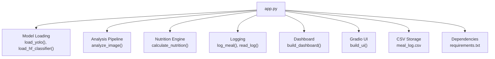
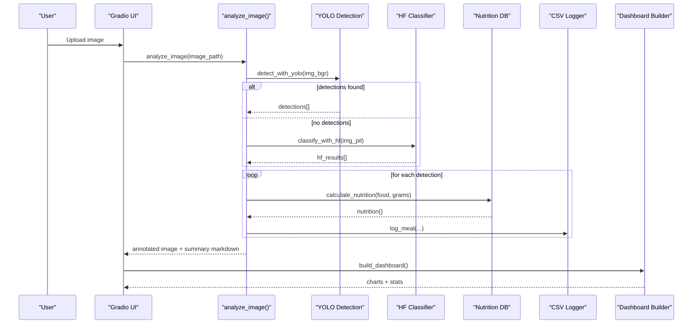
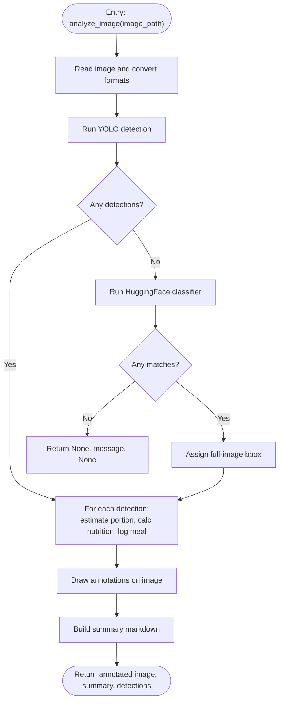
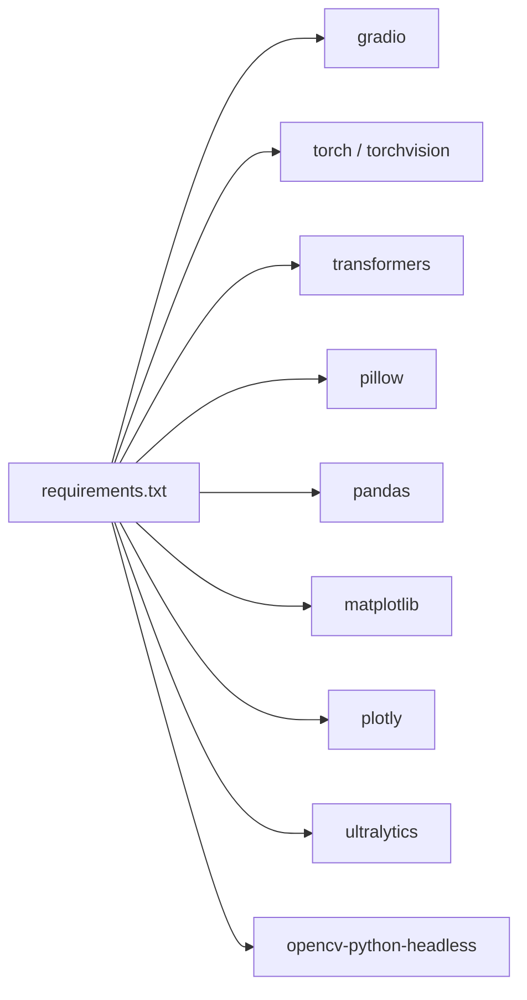

# API Reference

<cite>
**Referenced Files in This Document**
- [app.py](file://app.py)
- [requirements.txt](file://requirements.txt)
</cite>

## Table of Contents
1. [Introduction](#introduction)
2. [Project Structure](#project-structure)
3. [Core Components](#core-components)
4. [Architecture Overview](#architecture-overview)
5. [Detailed Component Analysis](#detailed-component-analysis)
6. [Dependency Analysis](#dependency-analysis)
7. [Performance Considerations](#performance-considerations)
8. [Troubleshooting Guide](#troubleshooting-guide)
9. [Conclusion](#conclusion)
10. [Appendices](#appendices)

## Introduction
This document provides a comprehensive API reference for NutriSnap AI’s internal functions and interfaces. It covers public functions for model loading, image analysis, nutrition calculation, logging, reading logs, and dashboard generation. It also documents the nutrition database structure, CSV schema, Gradio UI components, configuration options, environment variables, extension patterns, error handling, and debugging approaches.

## Project Structure
The application is implemented as a single-file Python module that integrates:
- Computer vision models (YOLOv8 and HuggingFace classifier fallback)
- A nutrition database for 50+ foods
- CSV-based meal logging
- A Gradio-based user interface with tabs for upload/analysis, dashboard, food log, and tips
- Plotly/Matplotlib for charts

**Diagram sources**
- [app.py:112-138](file://app.py#L112-L138)
- [app.py:284-352](file://app.py#L284-L352)
- [app.py:179-191](file://app.py#L179-L191)
- [app.py:153-176](file://app.py#L153-L176)
- [app.py:359-414](file://app.py#L359-L414)
- [app.py:466-530](file://app.py#L466-L530)
- [requirements.txt:1-11](file://requirements.txt#L1-L11)

**Section sources**
- [app.py:1-10](file://app.py#L1-L10)
- [requirements.txt:1-11](file://requirements.txt#L1-L11)

## Core Components
- Model loading:
  - load_yolo(): Loads YOLOv8n model for food detection.
  - load_hf_classifier(): Loads HuggingFace food classifier as fallback.
- Analysis pipeline:
  - analyze_image(image_path): Detects food items, estimates portions, calculates nutrition, annotates images, and returns results.
- Nutrition engine:
  - calculate_nutrition(food_name, grams): Computes calories, protein, carbs, fat for a given portion size based on per-100g values.
- Logging:
  - log_meal(food, calories, protein, carbs, fat, portion, confirmed=True): Appends a meal entry to CSV.
  - read_log(): Reads all entries from CSV into a DataFrame with consistent columns.
- Dashboard:
  - build_dashboard(): Generates daily calorie bar chart, macro distribution pie chart, weekly trend line chart, top foods horizontal bar chart, and summary stats.

**Section sources**
- [app.py:112-138](file://app.py#L112-L138)
- [app.py:179-191](file://app.py#L179-L191)
- [app.py:153-176](file://app.py#L153-L176)
- [app.py:284-352](file://app.py#L284-L352)
- [app.py:359-414](file://app.py#L359-L414)

## Architecture Overview
The system follows a modular pipeline within a single file:
- Initialization loads optional models (YOLOv8 and HuggingFace).
- User uploads an image via Gradio; the app runs detection/classification.
- Detected foods are matched to the nutrition database; portions are estimated using bounding box area ratios.
- Results are logged to CSV and visualized in the dashboard.

**Diagram sources**
- [app.py:284-352](file://app.py#L284-L352)
- [app.py:212-237](file://app.py#L212-L237)
- [app.py:240-264](file://app.py#L240-L264)
- [app.py:179-191](file://app.py#L179-L191)
- [app.py:153-176](file://app.py#L153-L176)
- [app.py:359-414](file://app.py#L359-L414)

## Detailed Component Analysis

### Function: load_yolo()
- Purpose: Load YOLOv8n model for food detection.
- Signature: load_yolo() -> bool
- Parameters: None
- Returns:
  - True if model loaded successfully
  - False if loading fails
- Error conditions:
  - Raises exceptions during import or model initialization; caught internally and returns False
- Notes:
  - Uses global state yolo_model
  - Requires ultralytics package

Usage example path:
- See initialization flow at main block where load_yolo() is called before launching UI.

**Section sources**
- [app.py:112-122](file://app.py#L112-L122)
- [app.py:537-543](file://app.py#L537-L543)

### Function: load_hf_classifier()
- Purpose: Load HuggingFace food classifier as fallback when YOLO detects nothing.
- Signature: load_hf_classifier() -> bool
- Parameters: None
- Returns:
  - True if model and processor loaded successfully
  - False if loading fails
- Error conditions:
  - Exceptions during transformers import or model download/load; caught and returns False
- Notes:
  - Uses global state hf_classifier, hf_processor
  - Requires torch, transformers packages

Usage example path:
- Called during startup alongside load_yolo().

**Section sources**
- [app.py:125-138](file://app.py#L125-L138)
- [app.py:537-543](file://app.py#L537-L543)

### Function: analyze_image(image_path)
- Purpose: Full analysis pipeline: detect food, estimate portions, calculate nutrition, annotate image, and return results.
- Signature: analyze_image(image_path) -> tuple[annotated_rgb, summary_md, detections_or_None]
- Parameters:
  - image_path: str — Path to image file
- Returns:
  - annotated_rgb: numpy array (RGB) with annotations
  - summary_md: str — Markdown table summarizing detected foods and totals
  - detections: list[dict] or None — List of detection dicts including food, bbox, confidence, nutrition fields, portion, grams; None if no food detected
- Error conditions:
  - If no food detected, returns None for annotated image and summary indicating no items found
  - Handles exceptions in detection/classification gracefully by returning empty lists
- Processing logic:
  - Converts image to required formats
  - Tries YOLO detection first; falls back to HuggingFace classifier
  - Estimates portion size based on bounding box area ratio relative to image
  - Calculates nutrition using per-100g database values
  - Logs each detected food to CSV
  - Draws bounding boxes and labels on image
  - Builds summary markdown with per-item and total nutrition

**Diagram sources**
- [app.py:284-352](file://app.py#L284-L352)
- [app.py:212-237](file://app.py#L212-L237)
- [app.py:240-264](file://app.py#L240-L264)
- [app.py:198-209](file://app.py#L198-L209)
- [app.py:179-191](file://app.py#L179-L191)
- [app.py:153-162](file://app.py#L153-L162)

**Section sources**
- [app.py:284-352](file://app.py#L284-L352)

### Function: calculate_nutrition(food_name, grams)
- Purpose: Compute nutrition values for a specified food and portion size.
- Signature: calculate_nutrition(food_name, grams) -> dict or None
- Parameters:
  - food_name: str — Food key (normalized to lowercase, spaces replaced with underscores)
  - grams: float/int — Portion weight in grams
- Returns:
  - dict with keys: calories, protein, carbs, fat (rounded to one decimal)
  - None if food not found in database
- Data source:
  - NUTRITION_DB contains per-100g values and typical_g for portion estimation
- Error conditions:
  - Unknown food returns None

Usage example path:
- Used within analyze_image() after detecting or classifying food.

**Section sources**
- [app.py:179-191](file://app.py#L179-L191)

### Function: log_meal(food, calories, protein, carbs, fat, portion, confirmed=True)
- Purpose: Append a meal entry to the CSV log file.
- Signature: log_meal(food, calories, protein, carbs, fat, portion, confirmed=True) -> None
- Parameters:
  - food: str — Food name
  - calories: number — Calories for this entry
  - protein: number — Protein in grams
  - carbs: number — Carbs in grams
  - fat: number — Fat in grams
  - portion: str — Portion label (e.g., Small, Medium, Large)
  - confirmed: bool — Whether the entry is confirmed (default True)
- Side effects:
  - Ensures CSV exists with headers
  - Appends a row with timestamp, food, nutrition, portion, and confirmation status
- Error conditions:
  - File write errors will propagate; ensure permissions and disk space

**Section sources**
- [app.py:153-162](file://app.py#L153-L162)
- [app.py:145-150](file://app.py#L145-L150)

### Function: read_log()
- Purpose: Read all meal log entries from CSV into a pandas DataFrame.
- Signature: read_log() -> pandas.DataFrame
- Returns:
  - DataFrame with columns: Date, Time, Food, Calories, Protein (g), Carbs (g), Fat (g), Portion, Confirmed
  - If CSV is empty or missing, returns an empty DataFrame with correct columns
- Behavior:
  - Auto-migrates missing columns by adding them with empty strings
  - Handles EmptyDataError gracefully

**Section sources**
- [app.py:165-176](file://app.py#L165-L176)
- [app.py:145-150](file://app.py#L145-L150)

### Function: build_dashboard()
- Purpose: Generate dashboard charts and summary statistics from meal log data.
- Signature: build_dashboard() -> tuple[fig_daily, fig_macro, fig_weekly, fig_top, stats_md]
- Returns:
  - fig_daily: Plotly figure — Daily calorie intake bar chart
  - fig_macro: Plotly figure — Macronutrient distribution pie chart
  - fig_weekly: Plotly figure — Weekly calorie trend line chart
  - fig_top: Plotly figure — Top foods eaten horizontal bar chart
  - stats_md: str — Summary text with total meals, total calories, average per meal
- Behavior:
  - Reads CSV via read_log()
  - Coerces numeric columns, handles missing data
  - Groups by date for daily totals
  - Aggregates macros for pie chart
  - Resamples weekly for trend
  - Counts food occurrences for top foods
- Error conditions:
  - If no data, returns None figures and a message indicating no data yet

**Section sources**
- [app.py:359-414](file://app.py#L359-L414)

## Dependency Analysis
External dependencies and their roles:
- gradio: UI framework for interactive web interface
- torch, torchvision: Required by HuggingFace classifier
- transformers: HuggingFace model loading and inference
- pillow: Image processing
- pandas: Data manipulation and CSV reading
- matplotlib: Chart rendering backend
- plotly: Interactive charts for dashboard
- ultralytics: YOLOv8 model support
- opencv-python-headless: Image manipulation and drawing

**Diagram sources**
- [requirements.txt:1-11](file://requirements.txt#L1-L11)

**Section sources**
- [requirements.txt:1-11](file://requirements.txt#L1-L11)

## Performance Considerations
- Model loading:
  - YOLOv8n is lightweight but still requires GPU acceleration for best performance; CPU usage may be slower.
  - HuggingFace classifier downloads and caches models on first run; subsequent runs are faster.
- Image processing:
  - Converting between PIL, NumPy, and OpenCV formats incurs overhead; minimize redundant conversions.
- Detection thresholds:
  - Confidence threshold for YOLO is set to 0.25; adjust if needed for precision/recall trade-offs.
- CSV operations:
  - Frequent append writes are efficient; consider batching if high-frequency logging is required.
- Dashboard generation:
  - Plotly figures are generated on demand; caching can be added if dataset grows large.

[No sources needed since this section provides general guidance]

## Troubleshooting Guide
Common issues and resolutions:
- Models fail to load:
  - Check internet connectivity for downloading models
  - Ensure required packages are installed per requirements.txt
  - Inspect printed error messages for specific failures
- No food detected:
  - Improve image quality: better lighting, clear view of the entire plate
  - Try different angles or closer shots
  - Verify that food items are among supported classes in COCO mapping or present in HuggingFace classifier labels
- CSV errors:
  - Ensure write permissions to current directory
  - Validate CSV format if manually edited
- Dashboard shows no data:
  - Analyze at least one meal to populate the log
  - Refresh dashboard tab to reload data

Debugging tips:
- Print statements are used throughout to report model load status and errors
- Temporary disable YOLO to test HuggingFace fallback behavior
- Validate CSV columns match expected schema

**Section sources**
- [app.py:112-138](file://app.py#L112-L138)
- [app.py:212-237](file://app.py#L212-L237)
- [app.py:240-264](file://app.py#L240-L264)
- [app.py:165-176](file://app.py#L165-L176)
- [app.py:359-414](file://app.py#L359-L414)

## Conclusion
NutriSnap AI provides a cohesive single-file solution combining computer vision, nutrition calculation, logging, and visualization. The API exposes clear functions for model loading, image analysis, nutrition computation, logging, and dashboard generation. Extensibility points include adding new foods to the nutrition database, integrating alternative classifiers, and customizing UI components. Robust error handling ensures graceful degradation when models or data are unavailable.

[No sources needed since this section summarizes without analyzing specific files]

## Appendices

### Nutrition Database Structure
- Location: In-memory dictionary NUTRITION_DB
- Keys: Lowercase food names (e.g., "apple", "banana")
- Values: Dictionary with per-100g nutritional values and typical serving size:
  - calories: number
  - protein: number (grams)
  - carbs: number (grams)
  - fat: number (grams)
  - typical_g: number (typical portion weight in grams)

Available food entries include fruits, vegetables, meats, dairy, grains, and prepared foods such as pizza, sushi, and ice cream.

**Section sources**
- [app.py:31-90](file://app.py#L31-L90)

### CSV File Format Specifications
- File name: meal_log.csv
- Columns:
  - Date: YYYY-MM-DD
  - Time: HH:MM:SS
  - Food: string
  - Calories: number
  - Protein (g): number
  - Carbs (g): number
  - Fat (g): number
  - Portion: string (Small, Medium, Large)
  - Confirmed: boolean (True/False)
- Behavior:
  - Automatically created with headers if missing
  - Missing columns auto-migrated to empty strings
  - Numeric coercion applied when generating dashboard

**Section sources**
- [app.py:99-100](file://app.py#L99-L100)
- [app.py:145-150](file://app.py#L145-L150)
- [app.py:165-176](file://app.py#L165-L176)

### Gradio UI Components and Events
- Tabs:
  - Upload & Analyze:
    - input_image: File component accepting images
    - analyze_btn: Button triggering analysis
    - output_image: Image component showing annotated result
    - output_md: Markdown component displaying summary
  - Dashboard:
    - dash_stats: Markdown for summary stats
    - chart_daily, chart_macro, chart_weekly, chart_top: Plot components
    - refresh_btn: Button to regenerate charts
  - Food Log:
    - log_table: Dataframe component showing meal history
    - log_refresh: Button to reload log
  - Nutrition Tips:
    - Static Markdown content with guidelines and recommendations
- Event handlers:
  - on_analyze(file): Calls analyze_image() and updates outputs
  - on_refresh_dashboard(): Calls build_dashboard() and updates charts/stats
  - on_refresh_log(): Calls read_log() and updates log table
- Startup:
  - demo.load triggers initial dashboard and log population

**Section sources**
- [app.py:466-530](file://app.py#L466-L530)

### Configuration Options and Environment Variables
- Model selection:
  - YOLOv8n model file: yolov8n.pt (loaded by load_yolo())
  - HuggingFace model: yvelos/beit-food-384 (loaded by load_hf_classifier())
- UI theme and layout:
  - CSS styles defined in CSS variable
  - Theme: gr.themes.Soft()
- Sharing:
  - demo.launch(share=True) enables public sharing link
- No explicit environment variables are used; configuration is embedded in code constants and function parameters.

**Section sources**
- [app.py:112-138](file://app.py#L112-L138)
- [app.py:421-428](file://app.py#L421-L428)
- [app.py:537-543](file://app.py#L537-L543)

### Extension Patterns and Integration Examples
- Add a new food item:
  - Insert a new key-value pair into NUTRITION_DB with per-100g values and typical_g
  - Optionally add COCO class mapping if using YOLO detection for that food
- Integrate external systems:
  - Replace or augment log_meal() to send data to a remote API or database
  - Extend analyze_image() to accept additional inputs (e.g., manual portion override)
  - Customize build_dashboard() to export reports or integrate with BI tools
- Enhance detection:
  - Adjust confidence thresholds in detect_with_yolo()
  - Modify classify_with_hf() to map more labels to DB keys

**Section sources**
- [app.py:31-90](file://app.py#L31-L90)
- [app.py:92-97](file://app.py#L92-L97)
- [app.py:153-162](file://app.py#L153-L162)
- [app.py:212-237](file://app.py#L212-L237)
- [app.py:240-264](file://app.py#L240-L264)
- [app.py:359-414](file://app.py#L359-L414)