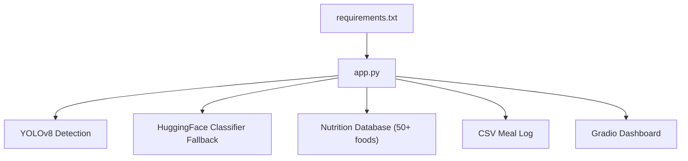
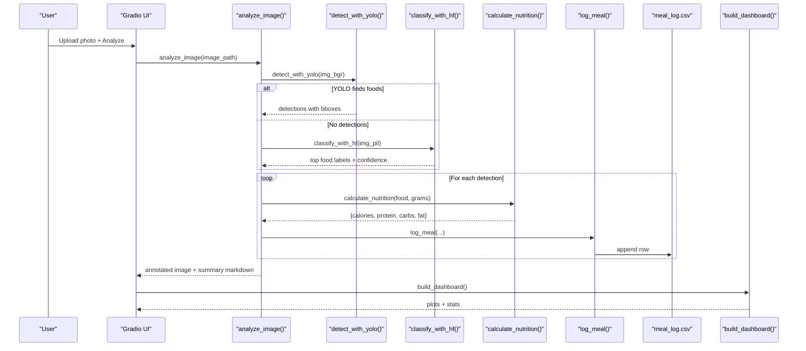
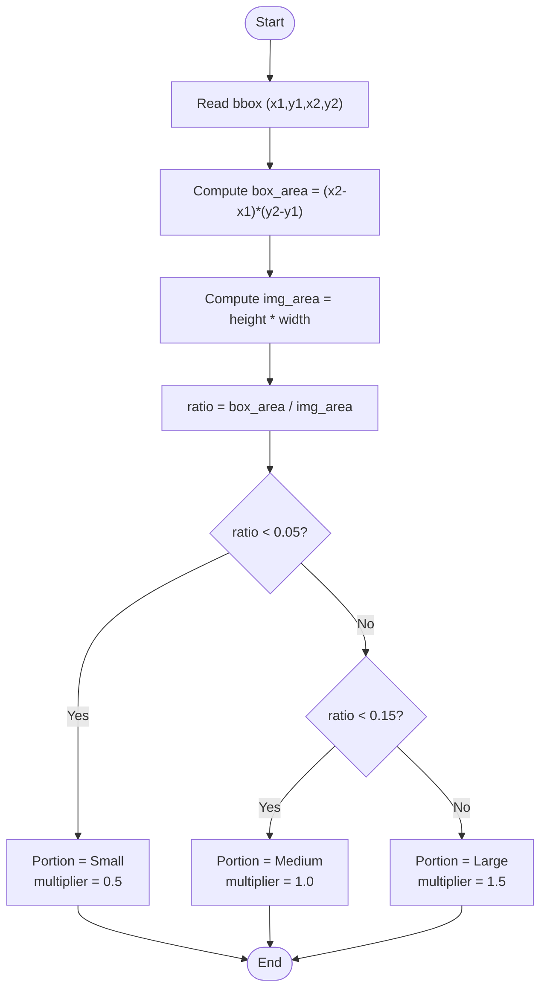

# Core Features

<cite>
**Referenced Files in This Document**
- [app.py](file://app.py)
- [requirements.txt](file://requirements.txt)
</cite>

## Table of Contents
1. [Introduction](#introduction)
2. [Project Structure](#project-structure)
3. [Core Components](#core-components)
4. [Architecture Overview](#architecture-overview)
5. [Detailed Component Analysis](#detailed-component-analysis)
6. [Dependency Analysis](#dependency-analysis)
7. [Performance Considerations](#performance-considerations)
8. [Troubleshooting Guide](#troubleshooting-guide)
9. [Conclusion](#conclusion)

## Introduction
NutriSnap AI is a single-file, interactive food tracking application that analyzes meal photos to detect foods, estimate portions, calculate nutrition, and visualize trends. It combines:
- YOLOv8 object detection for multi-food detection with bounding boxes
- A HuggingFace image classifier as a fallback when no objects are detected
- A built-in nutrition database (50+ foods) to compute calories and macronutrients
- A CSV-based meal log with automatic schema creation and migration support
- An interactive Gradio dashboard showing daily calorie tracking, macro distribution, weekly trends, and top food consumption patterns

The app runs locally via Python and can be launched directly from the command line.

## Project Structure
The project is intentionally minimal:
- app.py: All core logic, UI, and data handling in one file
- requirements.txt: External dependencies

**Diagram sources**
- [app.py:112-138](file://app.py#L112-L138)
- [app.py:145-176](file://app.py#L145-L176)
- [app.py:179-191](file://app.py#L179-L191)
- [app.py:359-414](file://app.py#L359-L414)
- [requirements.txt:1-11](file://requirements.txt#L1-L11)

**Section sources**
- [app.py:1-10](file://app.py#L1-L10)
- [requirements.txt:1-11](file://requirements.txt#L1-L11)

## Core Components
- Multi-model food detection pipeline: YOLOv8 first, HuggingFace classifier fallback
- Automatic portion estimation based on bounding box area ratios relative to image size
- Nutrition analysis using a built-in database of 50+ foods with per-100g values
- CSV-based meal logging with auto-schema creation and column migration
- Interactive dashboard with daily calories, macro distribution, weekly trends, and top foods

Key implementation references:
- Model loading and fallback: [app.py:112-138](file://app.py#L112-L138)
- Portion estimation algorithm: [app.py:198-209](file://app.py#L198-L209)
- Nutrition calculation: [app.py:179-191](file://app.py#L179-L191)
- CSV logging and migration: [app.py:145-176](file://app.py#L145-L176)
- Dashboard charts: [app.py:359-414](file://app.py#L359-L414)

**Section sources**
- [app.py:112-138](file://app.py#L112-L138)
- [app.py:179-209](file://app.py#L179-L209)
- [app.py:145-176](file://app.py#L145-L176)
- [app.py:359-414](file://app.py#L359-L414)

## Architecture Overview
The end-to-end flow starts with an uploaded image, attempts YOLOv8 detection, falls back to a HuggingFace classifier if needed, estimates portions, computes nutrition, logs meals to CSV, and renders annotated results and dashboard charts.

**Diagram sources**
- [app.py:284-352](file://app.py#L284-L352)
- [app.py:212-237](file://app.py#L212-L237)
- [app.py:240-264](file://app.py#L240-L264)
- [app.py:179-191](file://app.py#L179-L191)
- [app.py:153-162](file://app.py#L153-L162)
- [app.py:359-414](file://app.py#L359-L414)

## Detailed Component Analysis

### Multi-Model Food Detection System
- Primary detector: YOLOv8n model loaded at startup; detects multiple food items with bounding boxes and confidence scores. Only COCO food classes are accepted and filtered by a minimum confidence threshold.
- Fallback classifier: If YOLO returns no detections, a HuggingFace image classification model processes the full image and maps its top predictions to the built-in nutrition database keys.
- Annotation: Detected items are drawn on the image with colored boxes and labels including estimated calories.

Implementation highlights:
- YOLO loading and detection: [app.py:112-138](file://app.py#L112-L138), [app.py:212-237](file://app.py#L212-L237)
- HuggingFace fallback: [app.py:125-138](file://app.py#L125-L138), [app.py:240-264](file://app.py#L240-L264)
- Annotations: [app.py:267-281](file://app.py#L267-L281)

Accuracy expectations and limitations:
- YOLOv8 works best for common foods present in the COCO dataset subset used here. Complex or heavily occluded dishes may not be detected reliably.
- The HuggingFace fallback classifies the entire image; it may misattribute overlapping or mixed dishes.
- Confidence thresholds and class mapping constrain precision; low-confidence detections are ignored.

Supported food types:
- Foods mapped from COCO classes include fruits, vegetables, prepared meals, baked goods, meats, dairy, and staples such as rice, pasta, bread, pizza, sandwiches, sushi, and more. See the class mapping and database entries for specifics.

**Section sources**
- [app.py:92-97](file://app.py#L92-L97)
- [app.py:112-138](file://app.py#L112-L138)
- [app.py:212-237](file://app.py#L212-L237)
- [app.py:240-264](file://app.py#L240-L264)
- [app.py:267-281](file://app.py#L267-L281)

### Automatic Portion Estimation Algorithm
- Uses the ratio of the bounding box area to the total image area to categorize portions as Small, Medium, or Large.
- Each category maps to a multiplier applied to a typical serving weight (per food) to estimate grams consumed.
- Typical serving weights are defined per food in the nutrition database.

Algorithm flow:

**Diagram sources**
- [app.py:198-209](file://app.py#L198-L209)

Notes:
- Works best when the plate fills most of the frame and foods are clearly separated.
- Overlapping items or unusual camera angles can skew ratios.

**Section sources**
- [app.py:198-209](file://app.py#L198-L209)

### Nutritional Analysis Pipeline
- Built-in nutrition database provides per-100g values for 50+ foods including calories, protein, carbs, fat, and a typical serving weight.
- For each detected food, the system:
  - Estimates portion category and multiplier
  - Computes grams = typical_g * multiplier
  - Calculates nutrition by scaling per-100g values to the estimated grams
  - Logs the meal entry to CSV

Implementation references:
- Database definition: [app.py:31-90](file://app.py#L31-L90)
- Calculation function: [app.py:179-191](file://app.py#L179-L191)
- Integration into analysis pipeline: [app.py:312-332](file://app.py#L312-L332)

Customization possibilities:
- Add new foods to the database with realistic per-100g values and a sensible typical serving weight.
- Adjust portion thresholds or multipliers to better match your environment or camera setup.

**Section sources**
- [app.py:31-90](file://app.py#L31-L90)
- [app.py:179-191](file://app.py#L179-L191)
- [app.py:312-332](file://app.py#L312-L332)

### CSV-Based Meal Logging System
- Automatically creates meal_log.csv with headers if missing.
- Appends each analyzed meal with date, time, food name, calories, macros, portion label, and confirmation flag.
- Supports schema migration: if columns change, missing columns are added with empty values when reading.

Key behaviors:
- Auto-create and ensure headers: [app.py:145-151](file://app.py#L145-L151)
- Append rows: [app.py:153-162](file://app.py#L153-L162)
- Read with migration: [app.py:165-176](file://app.py#L165-L176)

Data integrity notes:
- Numeric fields are coerced to numbers during dashboard processing to handle legacy or malformed entries.

**Section sources**
- [app.py:145-176](file://app.py#L145-L176)

### Interactive Dashboard
The Gradio interface provides:
- Upload & Analyze tab: upload a photo, run detection, view annotated image and summary table
- Dashboard tab: refreshable charts
  - Daily calorie intake (bar chart)
  - Macronutrient distribution (pie chart)
  - Weekly calorie trend (line chart)
  - Top foods eaten (horizontal bar chart)
- Food Log tab: view all logged meals in a table
- Tips tab: guidance on RDI, best practices, and interpreting charts

Dashboard generation:
- Reads CSV, coerces numeric fields, aggregates daily/weekly totals, and builds Plotly figures.

References:
- Dashboard builder: [app.py:359-414](file://app.py#L359-L414)
- UI layout and events: [app.py:466-528](file://app.py#L466-L528)

Usage tips:
- Refresh the dashboard after analyzing new meals to update charts and statistics.
- Use the Food Log tab to verify entries and confirm accuracy.

**Section sources**
- [app.py:359-414](file://app.py#L359-L414)
- [app.py:466-528](file://app.py#L466-L528)

## Dependency Analysis
External libraries and their roles:
- gradio: Interactive web UI
- torch, torchvision: Required by transformers models
- transformers: HuggingFace image classification fallback
- pillow: Image I/O
- pandas: CSV read/write and data aggregation
- matplotlib: Chart backend (Agg)
- plotly: Interactive charts
- ultralytics: YOLOv8 model inference
- opencv-python-headless: Image processing and annotation

Runtime behavior:
- Models are loaded lazily at startup; failures are caught and logged without crashing the app.
- CSV operations are resilient to missing files and schema changes.

**Section sources**
- [requirements.txt:1-11](file://requirements.txt#L1-L11)
- [app.py:112-138](file://app.py#L112-L138)
- [app.py:165-176](file://app.py#L165-L176)

## Performance Considerations
- Model loading: YOLOv8 and HuggingFace models are loaded once at startup; avoid re-loading per request.
- Inference speed: YOLOv8n is lightweight but still benefits from GPU acceleration if available. CPU-only environments will be slower.
- Image size: Very large images increase memory usage and inference time; consider resizing before upload if needed.
- CSV growth: As meal logs grow, dashboard reads become heavier; periodically archive old logs if necessary.
- Concurrency: Gradio serves requests sequentially by default; heavy concurrent uploads may queue.

[No sources needed since this section provides general guidance]

## Troubleshooting Guide
Common issues and resolutions:
- YOLOv8 fails to load:
  - Symptom: Console prints failure message; detection returns empty list.
  - Action: Ensure internet access for model download or place yolov8n.pt locally; check ultralytics installation.
  - Reference: [app.py:112-122](file://app.py#L112-L122)
- HuggingFace fallback fails:
  - Symptom: Console prints error; fallback returns empty list.
  - Action: Verify transformers and torch installations; ensure network access for model cache.
  - Reference: [app.py:125-138](file://app.py#L125-L138)
- No food detected:
  - Symptom: Summary indicates no items found.
  - Action: Improve lighting, show the full plate, reduce clutter, try different angles.
  - Reference: [app.py:284-310](file://app.py#L284-L310)
- CSV errors or missing columns:
  - Symptom: Dashboard shows zeros or unexpected values.
  - Action: The app auto-migrates missing columns; verify meal_log.csv exists and has correct headers.
  - Reference: [app.py:145-176](file://app.py#L145-L176)
- Dashboard not updating:
  - Symptom: Charts do not reflect new meals.
  - Action: Click “Refresh Dashboard” or reload the page.
  - Reference: [app.py:513-523](file://app.py#L513-L523)

**Section sources**
- [app.py:112-138](file://app.py#L112-L138)
- [app.py:284-310](file://app.py#L284-L310)
- [app.py:145-176](file://app.py#L145-L176)
- [app.py:513-523](file://app.py#L513-L523)

## Conclusion
NutriSnap AI delivers a practical, self-contained solution for visual food tracking with a robust detection pipeline, automatic portion estimation, and a clear dashboard for insights. While accuracy depends on image quality and food variety, the combination of YOLOv8 and a HuggingFace fallback improves coverage. The CSV-based logging ensures persistence and portability, and the modular design allows easy customization of the nutrition database, portion thresholds, and visualization options.

[No sources needed since this section summarizes without analyzing specific files]