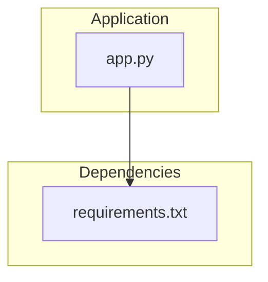
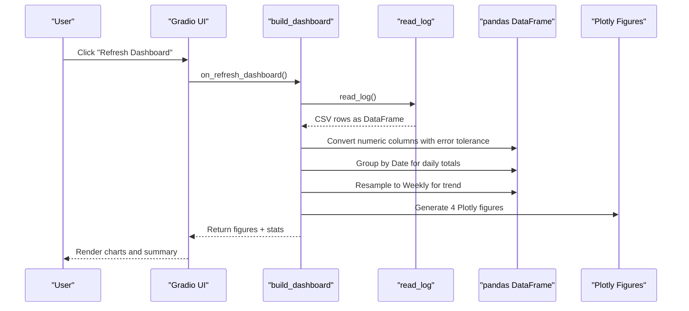
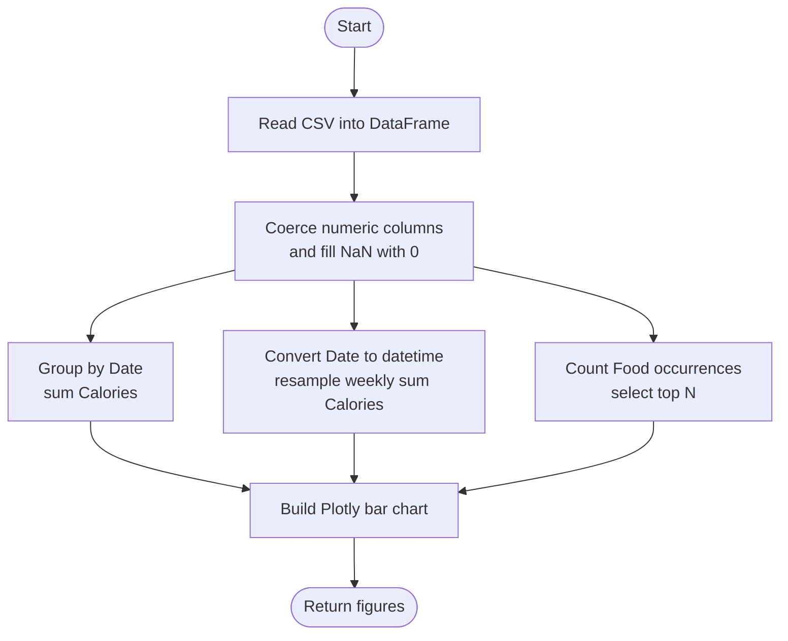
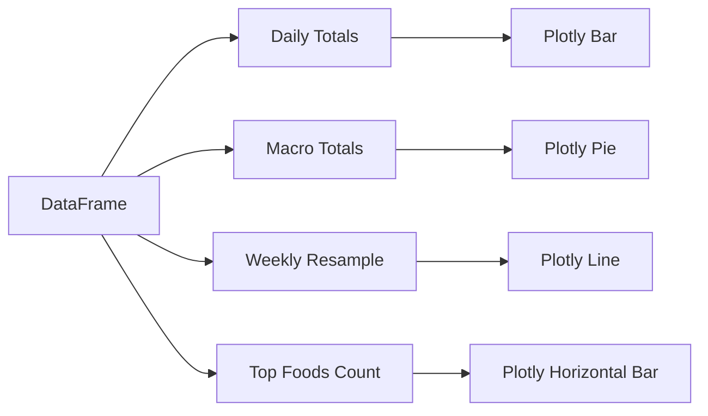
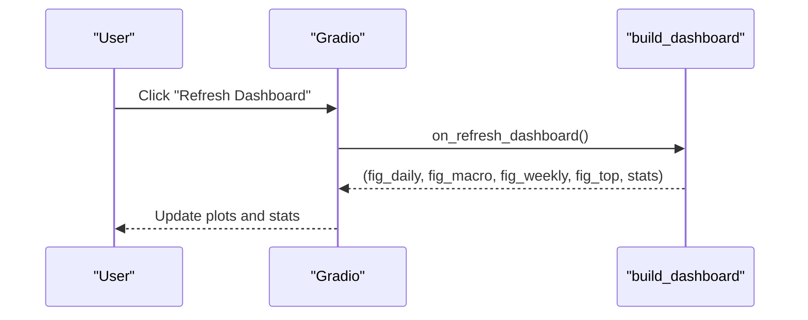
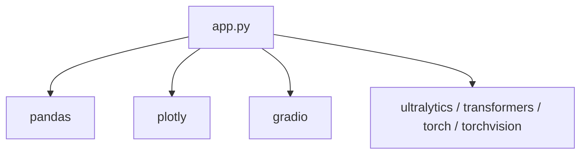

# Dashboard & Analytics

<cite>
**Referenced Files in This Document**
- [app.py](file://app.py)
- [requirements.txt](file://requirements.txt)
</cite>

## Table of Contents
1. [Introduction](#introduction)
2. [Project Structure](#project-structure)
3. [Core Components](#core-components)
4. [Architecture Overview](#architecture-overview)
5. [Detailed Component Analysis](#detailed-component-analysis)
6. [Dependency Analysis](#dependency-analysis)
7. [Performance Considerations](#performance-considerations)
8. [Troubleshooting Guide](#troubleshooting-guide)
9. [Conclusion](#conclusion)
10. [Appendices](#appendices)

## Introduction
This document explains the interactive dashboard and analytics system for NutriSnap AI, focusing on how meal logging data is transformed into four key visualizations: daily calorie intake (bar chart), macronutrient distribution (pie chart), weekly calorie trend (line chart), and top foods eaten (horizontal bar chart). It details the build_dashboard function that generates these charts using Plotly, the data processing pipeline that converts CSV logs to pandas DataFrames with robust numeric conversion, grouping by date, and resampling to weekly trends, and the summary statistics computed for total meals logged, cumulative calories, and average calories per meal. It also covers Gradio-based real-time updates via callbacks, performance considerations for large datasets, troubleshooting common visualization issues, and guidance for extending the dashboard with additional metrics.

## Project Structure
The application is implemented as a single-file Python module that integrates image analysis, CSV logging, and an interactive Gradio UI with Plotly-based charts. The project contains:
- A main application file implementing detection, logging, dashboard generation, and UI wiring.
- A requirements file listing runtime dependencies for ML models, data processing, visualization, and UI.

**Diagram sources**
- [app.py:1-24](file://app.py#L1-L24)
- [requirements.txt:1-11](file://requirements.txt#L1-L11)

**Section sources**
- [app.py:1-24](file://app.py#L1-L24)
- [requirements.txt:1-11](file://requirements.txt#L1-L11)

## Core Components
- CSV Logging and Reading: Ensures a CSV log exists, writes meal entries, reads all entries, and auto-migrates missing columns.
- Nutrition Calculation: Converts food names and portion sizes into nutritional values using an internal database.
- Image Analysis Pipeline: Detects or classifies food items, estimates portions, computes nutrition, annotates images, and logs results.
- Dashboard Generation: Builds four Plotly charts from the CSV log and computes summary statistics.
- Gradio UI: Provides tabs for upload/analysis, dashboard, food log, and tips; wires callbacks for real-time updates.

Key responsibilities and entry points:
- CSV I/O: ensure_csv, log_meal, read_log
- Nutrition: calculate_nutrition
- Analysis: analyze_image and helpers
- Dashboard: build_dashboard
- UI: build_ui and event handlers

**Section sources**
- [app.py:145-177](file://app.py#L145-L177)
- [app.py:179-191](file://app.py#L179-L191)
- [app.py:284-352](file://app.py#L284-L352)
- [app.py:359-414](file://app.py#L359-L414)
- [app.py:466-530](file://app.py#L466-L530)

## Architecture Overview
The system follows a clear separation between data ingestion (CSV), processing (pandas), visualization (Plotly), and user interaction (Gradio). The dashboard is refreshed on demand and at app load, pulling fresh data from the CSV log.

**Diagram sources**
- [app.py:359-414](file://app.py#L359-L414)
- [app.py:165-177](file://app.py#L165-L177)
- [app.py:466-530](file://app.py#L466-L530)

## Detailed Component Analysis

### Data Processing Pipeline
- CSV reading: Reads the meal log, ensures headers exist, and returns a DataFrame with consistent columns.
- Numeric conversion: Uses coercive conversion to handle non-numeric or malformed values gracefully, filling missing values with zeros.
- Daily aggregation: Groups by the Date column and sums Calories to produce daily totals for the bar chart.
- Weekly resampling: Converts Date to datetime, sets it as index, and resamples to weekly frequency to compute weekly calorie totals for the line chart.
- Top foods: Counts occurrences of each Food and selects the top entries for the horizontal bar chart.

**Diagram sources**
- [app.py:165-177](file://app.py#L165-L177)
- [app.py:359-414](file://app.py#L359-L414)

**Section sources**
- [app.py:165-177](file://app.py#L165-L177)
- [app.py:359-414](file://app.py#L359-L414)

### Chart Generation with Plotly
- Daily Calorie Intake (Bar Chart):
  - Input: Daily totals grouped by Date.
  - Styling: White template, fixed height, custom color sequence.
- Macronutrient Distribution (Pie Chart):
  - Input: Summed totals for Protein, Carbs, Fat across all meals.
  - Styling: White template, fixed height, distinct colors for each macro.
- Weekly Calorie Trend (Line Chart):
  - Input: Weekly resampled sums of Calories.
  - Styling: White template, fixed height, custom color sequence.
- Top Foods Eaten (Horizontal Bar Chart):
  - Input: Frequency counts of Food entries, limited to top N.
  - Styling: White template, fixed height, ordered by total ascending.

**Diagram sources**
- [app.py:359-414](file://app.py#L359-L414)

**Section sources**
- [app.py:359-414](file://app.py#L359-L414)

### Summary Statistics
- Total meals logged: Length of the DataFrame after cleaning.
- Cumulative calories: Sum of the Calories column.
- Average calories per meal: Mean of the Calories column.
These are formatted into a concise summary string displayed in the dashboard.

**Section sources**
- [app.py:406-414](file://app.py#L406-L414)

### Real-Time Updates Through Gradio Callbacks
- Refresh Dashboard: Button triggers a callback that calls build_dashboard and updates all four charts plus the summary text.
- Load on Tab Select: On app start, the dashboard tab loads charts and stats automatically.
- Food Log Refresh: Button reloads the latest CSV contents into the table view.

**Diagram sources**
- [app.py:466-530](file://app.py#L466-L530)
- [app.py:359-414](file://app.py#L359-L414)

**Section sources**
- [app.py:466-530](file://app.py#L466-L530)
- [app.py:359-414](file://app.py#L359-L414)

### Customization Options
- Chart styling:
  - Templates: plotly_white for clean backgrounds.
  - Colors: Custom color sequences applied consistently across charts.
  - Layout: Fixed heights for uniform appearance; category ordering for horizontal bars.
- Responsive layout:
  - Gradio Rows organize charts in two-by-two grids.
  - CSS styles center titles and constrain container width for readability.
- Extensibility:
  - Additional metrics can be added by computing new aggregates from the DataFrame and creating new Plotly figures.
  - New tabs or widgets can be wired with callbacks to display derived insights.

**Section sources**
- [app.py:359-414](file://app.py#L359-L414)
- [app.py:421-428](file://app.py#L421-L428)
- [app.py:466-530](file://app.py#L466-L530)

## Dependency Analysis
The dashboard relies on:
- Data processing: pandas for DataFrame operations, groupby, and resampling.
- Visualization: Plotly Express and Graph Objects for chart creation.
- UI: Gradio for interactive components and callbacks.
- Optional ML libraries: ultralytics, transformers, torch, torchvision for image analysis (not directly used in dashboard generation but part of the broader app).

**Diagram sources**
- [app.py:8-24](file://app.py#L8-L24)
- [requirements.txt:1-11](file://requirements.txt#L1-L11)

**Section sources**
- [app.py:8-24](file://app.py#L8-L24)
- [requirements.txt:1-11](file://requirements.txt#L1-L11)

## Performance Considerations
- Numeric coercion: Using coercive conversion prevents crashes from malformed numeric fields and ensures stable aggregations.
- Efficient aggregation: Grouping by Date and resampling weekly leverages pandas’ optimized operations.
- Limiting top foods: Restricting the number of top foods reduces rendering overhead for large datasets.
- Reusable templates: Consistent Plotly templates minimize re-rendering costs.
- Best practices for large datasets:
  - Pre-filter or paginate data if necessary before plotting.
  - Consider downsampling weekly or monthly views for very long histories.
  - Cache intermediate results if dashboard refreshes frequently.

[No sources needed since this section provides general guidance]

## Troubleshooting Guide
Common visualization issues and resolutions:
- Empty or missing data:
  - Symptom: No charts or placeholder message.
  - Cause: CSV has no rows or missing required columns.
  - Resolution: Ensure meal entries are logged; verify CSV headers match expected columns.
- Non-numeric values in numeric columns:
  - Symptom: Incorrect totals or empty charts.
  - Cause: Malformed entries in Calories, Protein, Carbs, or Fat.
  - Resolution: Coercive conversion fills invalid values with zero; validate input formatting during logging.
- Date parsing errors:
  - Symptom: Weekly trend not updating or showing incorrect dates.
  - Cause: Invalid or inconsistent date formats.
  - Resolution: Ensure Date column uses a standard format; coercive parsing drops invalid dates before resampling.
- Missing columns:
  - Symptom: Errors when accessing columns like Food or Calories.
  - Cause: CSV schema mismatch or migration issues.
  - Resolution: Auto-migration adds missing columns with default values; regenerate CSV headers if needed.
- Large dataset rendering slowdown:
  - Symptom: Slow dashboard refresh.
  - Cause: Too many data points plotted.
  - Resolution: Limit top foods, aggregate to coarser time windows, or filter by date range.

**Section sources**
- [app.py:165-177](file://app.py#L165-L177)
- [app.py:359-414](file://app.py#L359-L414)

## Conclusion
NutriSnap AI’s dashboard transforms meal log data into actionable insights through four core visualizations powered by Plotly and updated in real time via Gradio. The build_dashboard function orchestrates data cleaning, aggregation, and chart generation while maintaining robustness against data quality issues. With consistent styling, responsive layouts, and extensible design, the dashboard supports both immediate feedback and deeper nutritional analysis. Future enhancements can include additional metrics, filtering, and advanced analytics while preserving performance and usability.

[No sources needed since this section summarizes without analyzing specific files]

## Appendices

### API Reference: Key Functions
- read_log(): Reads CSV into a DataFrame with consistent columns and handles empty data.
- build_dashboard(): Generates four Plotly charts and summary statistics from the meal log.
- on_refresh_dashboard(): Gradio callback that triggers dashboard regeneration.

**Section sources**
- [app.py:165-177](file://app.py#L165-L177)
- [app.py:359-414](file://app.py#L359-L414)
- [app.py:513-515](file://app.py#L513-L515)