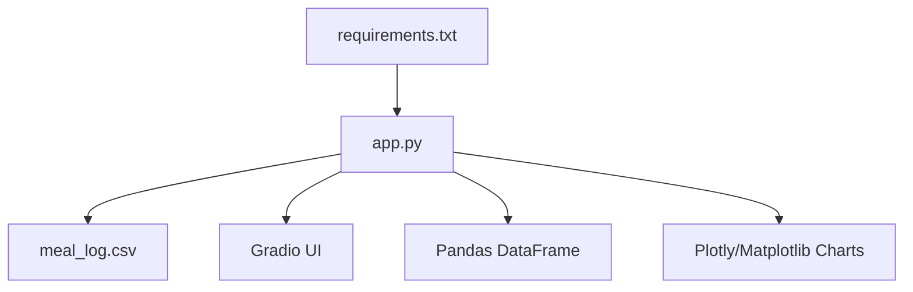
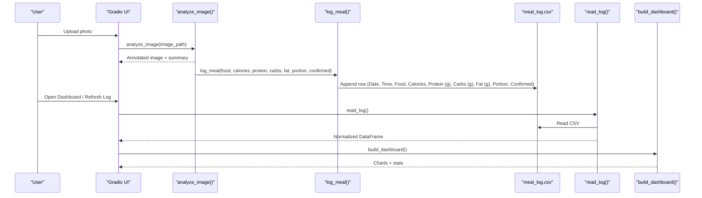
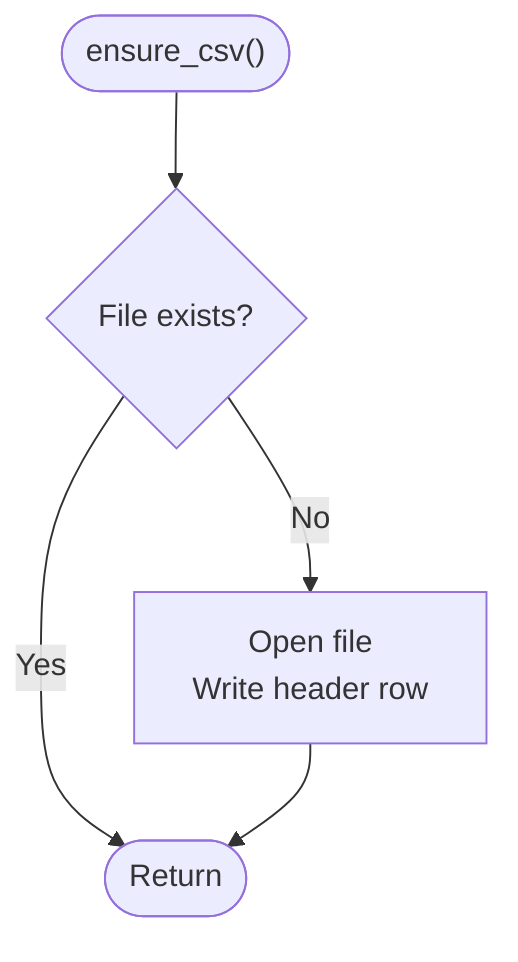
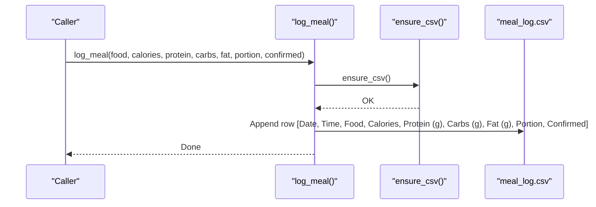
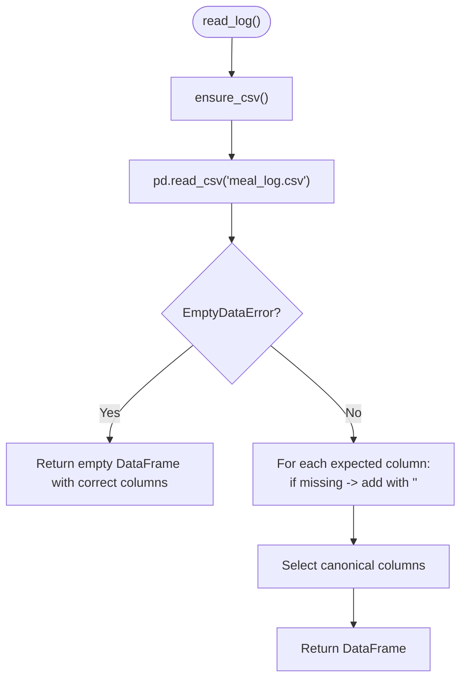
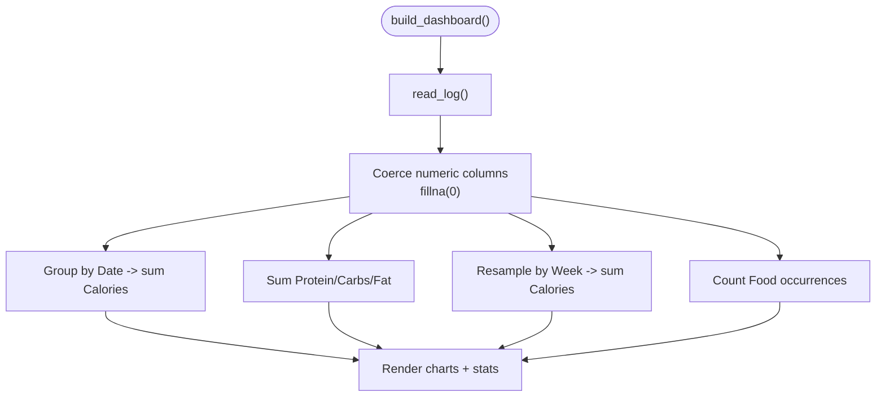
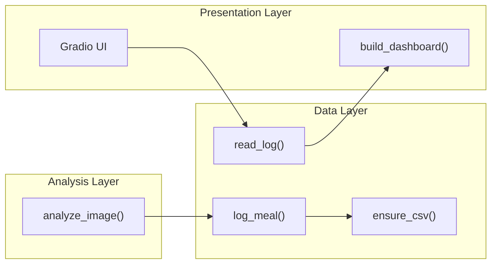

# Data Management

<cite>
**Referenced Files in This Document**
- [app.py](file://app.py)
- [requirements.txt](file://requirements.txt)
</cite>

## Table of Contents
1. [Introduction](#introduction)
2. [Project Structure](#project-structure)
3. [Core Components](#core-components)
4. [Architecture Overview](#architecture-overview)
5. [Detailed Component Analysis](#detailed-component-analysis)
6. [Dependency Analysis](#dependency-analysis)
7. [Performance Considerations](#performance-considerations)
8. [Troubleshooting Guide](#troubleshooting-guide)
9. [Conclusion](#conclusion)
10. [Appendices](#appendices)

## Introduction
This document explains NutriSnap AI’s data management system with a focus on its CSV-based meal logging and reading capabilities. It covers how the application ensures the presence of a properly structured CSV file, appends new meal entries with timestamps and nutritional values, reads and normalizes log data for dashboarding, and handles schema evolution and empty files. It also outlines error handling, data validation strategies, backup/export considerations, integration points, and performance guidance for large datasets.

## Project Structure
The application is implemented as a single-file Python module that includes:
- A built-in nutrition database and food detection/classification pipeline
- CSV-based persistence for meal logs
- A Gradio UI to analyze images, view dashboards, and inspect the meal log
- Dependencies declared in a requirements file

**Diagram sources**
- [app.py:99-101](file://app.py#L99-L101)
- [app.py:145-177](file://app.py#L145-L177)
- [app.py:359-414](file://app.py#L359-L414)
- [requirements.txt:1-11](file://requirements.txt#L1-L11)

**Section sources**
- [app.py:1-12](file://app.py#L1-L12)
- [app.py:99-101](file://app.py#L99-L101)
- [requirements.txt:1-11](file://requirements.txt#L1-L11)

## Core Components
- ensure_csv: Ensures the CSV file exists and has the correct headers before any write operations.
- log_meal: Appends a new meal entry with timestamp, food name, nutritional values, portion size, and confirmation status.
- read_log: Reads the CSV into a DataFrame, migrates missing columns by filling them with empty strings, and returns a normalized DataFrame with the expected column order.
- build_dashboard: Consumes read_log output, coerces numeric fields, and generates charts and summary statistics.

Key responsibilities:
- Persistence: CSV file creation and appending
- Schema migration: Handling missing columns gracefully
- Data normalization: Numeric coercion and consistent column ordering
- Dashboard consumption: Aggregation and visualization

**Section sources**
- [app.py:145-177](file://app.py#L145-L177)
- [app.py:359-414](file://app.py#L359-L414)

## Architecture Overview
At runtime, image analysis results are converted into meal entries and persisted to a CSV file. The dashboard and log views read from this file, normalize the schema, and render insights.

**Diagram sources**
- [app.py:284-352](file://app.py#L284-L352)
- [app.py:153-163](file://app.py#L153-L163)
- [app.py:165-177](file://app.py#L165-L177)
- [app.py:359-414](file://app.py#L359-L414)

## Detailed Component Analysis

### CSV File Structure
- File name: meal_log.csv
- Columns (in order): Date, Time, Food, Calories, Protein (g), Carbs (g), Fat (g), Portion, Confirmed
- Row semantics:
  - Date: YYYY-MM-DD
  - Time: HH:MM:SS
  - Food: Human-readable food name
  - Calories: Numeric (coerced to float where possible)
  - Protein (g): Numeric (coerced to float where possible)
  - Carbs (g): Numeric (coerced to float where possible)
  - Fat (g): Numeric (coerced to float where possible)
  - Portion: Text label (e.g., Small, Medium, Large)
  - Confirmed: Boolean-like flag indicating user confirmation

**Section sources**
- [app.py:99-101](file://app.py#L99-L101)
- [app.py:153-163](file://app.py#L153-L163)

### ensure_csv
- Purpose: Create meal_log.csv with the correct header row if it does not exist.
- Behavior: Checks file existence; if missing, opens the file in write mode and writes the header row using the canonical column list.
- Guarantees: Subsequent read/write operations can assume the header exists.

**Diagram sources**
- [app.py:145-151](file://app.py#L145-L151)

**Section sources**
- [app.py:145-151](file://app.py#L145-L151)

### log_meal
- Purpose: Append a single meal entry to the CSV.
- Inputs: food, calories, protein, carbs, fat, portion, confirmed (default True).
- Behavior:
  - Ensures CSV exists via ensure_csv.
  - Captures current date and time.
  - Appends a row with all fields in the defined order.
- Notes:
  - No explicit type conversion is performed at write time; values are written as provided.
  - Confirmation defaults to True when omitted.

**Diagram sources**
- [app.py:145-151](file://app.py#L145-L151)
- [app.py:153-163](file://app.py#L153-L163)

**Section sources**
- [app.py:153-163](file://app.py#L153-L163)

### read_log
- Purpose: Read the entire meal log into a DataFrame with a stable schema.
- Behavior:
  - Ensures CSV exists.
  - Attempts to read CSV into a DataFrame.
  - Auto-migration: For each expected column, if missing, adds it filled with an empty string.
  - Returns only the expected columns in the canonical order.
  - Handles empty files by returning an empty DataFrame with the correct columns.

**Diagram sources**
- [app.py:145-151](file://app.py#L145-L151)
- [app.py:165-177](file://app.py#L165-L177)

**Section sources**
- [app.py:165-177](file://app.py#L165-L177)

### Dashboard Data Normalization and Validation
- Numeric coercion: When building dashboards, numeric fields (Calories, Protein (g), Carbs (g), Fat (g)) are coerced to numeric types with non-numeric values replaced by zeros.
- Aggregations: Daily totals, macro distributions, weekly trends, and top foods are computed from the normalized DataFrame.
- Summary statistics: Total meals, total calories, and average per meal are calculated and displayed.

**Diagram sources**
- [app.py:359-414](file://app.py#L359-L414)

**Section sources**
- [app.py:359-414](file://app.py#L359-L414)

## Dependency Analysis
- External libraries used for data handling and visualization:
  - pandas: CSV I/O and DataFrame manipulation
  - plotly/matplotlib: Chart rendering
  - gradio: Web UI components
  - opencv-python-headless, pillow: Image processing
  - ultralytics, transformers, torch, torchvision: Model inference (optional fallbacks)
- Internal dependencies:
  - ensure_csv is called by log_meal and read_log
  - log_meal is invoked during image analysis
  - read_log feeds build_dashboard

**Diagram sources**
- [app.py:145-177](file://app.py#L145-L177)
- [app.py:284-352](file://app.py#L284-L352)
- [app.py:359-414](file://app.py#L359-L414)

**Section sources**
- [requirements.txt:1-11](file://requirements.txt#L1-L11)
- [app.py:145-177](file://app.py#L145-L177)
- [app.py:284-352](file://app.py#L284-L352)
- [app.py:359-414](file://app.py#L359-L414)

## Performance Considerations
- CSV append vs. batch writes:
  - Current implementation appends one row per meal. For high-frequency logging, consider batching writes or using a temporary buffer to reduce file open/close overhead.
- Pandas read patterns:
  - read_log loads the entire CSV into memory. For very large logs, consider chunked reading or sampling for dashboard previews.
- Numeric coercion cost:
  - Coercing many rows to numeric types can be expensive; pre-validate or cache normalized views if dashboard refreshes are frequent.
- Indexing and aggregation:
  - GroupBy and resample operations scale with dataset size. Consider maintaining incremental aggregates (e.g., daily totals) to avoid recomputation.
- File locking and concurrency:
  - If multiple processes write concurrently, introduce file-level locks or use a lightweight database to prevent corruption.

[No sources needed since this section provides general guidance]

## Troubleshooting Guide
- Empty or missing CSV:
  - ensure_csv creates the file with headers if missing.
  - read_log catches empty files and returns an empty DataFrame with the correct schema.
- Missing columns:
  - read_log auto-migrates by adding missing columns filled with empty strings, preserving backward compatibility.
- Non-numeric values:
  - Dashboard code coerces numeric columns to numbers and replaces invalid entries with zero to prevent chart failures.
- Write errors:
  - If writing fails due to permissions or disk issues, wrap log_meal calls with try/except and surface user-friendly messages.
- Duplicate or malformed rows:
  - Consider adding validation in log_meal to enforce expected formats (e.g., numeric ranges, valid dates/times).

**Section sources**
- [app.py:145-151](file://app.py#L145-L151)
- [app.py:165-177](file://app.py#L165-L177)
- [app.py:359-414](file://app.py#L359-L414)

## Conclusion
NutriSnap AI’s data management layer centers on a simple, robust CSV-based meal log with automatic schema migration and safe handling of empty or malformed data. The design enables straightforward persistence, easy export, and reliable dashboarding. For production-scale usage, consider migrating to a database for better concurrency, indexing, and query performance, while retaining CSV export for portability.

[No sources needed since this section summarizes without analyzing specific files]

## Appendices

### Backup Strategies
- Periodic copy: Schedule regular copies of meal_log.csv to a backup location or cloud storage.
- Versioned backups: Maintain dated snapshots (e.g., meal_log_YYYYMMDD.csv) to enable rollback.
- Atomic writes: Use a temporary file and atomic rename to minimize corruption risk during writes.

[No sources needed since this section provides general guidance]

### Data Export Capabilities
- CSV export: meal_log.csv is already in a standard format suitable for import into spreadsheets or analytics tools.
- Programmatic export: Use pandas to filter, aggregate, and export subsets (e.g., weekly summaries) to CSV or other formats.

[No sources needed since this section provides general guidance]

### Integration with External Systems
- Ingestion: Import CSV into BI tools (e.g., Power BI, Tableau) or data warehouses for advanced analytics.
- APIs: Expose a small API endpoint that reads meal_log.csv and serves JSON summaries for mobile apps or web dashboards.
- Sync: Push changes to a remote service periodically using scheduled jobs.

[No sources needed since this section provides general guidance]

### Potential Improvements for Database Migration
- Replace CSV with a relational database (SQLite, PostgreSQL) to support:
  - Concurrent writes with transactions
  - Efficient queries and indexes on Date, Food, and macros
  - Robust backups and replication
- Keep CSV as an export target for interoperability.
- Introduce migrations to evolve schema safely over time.

[No sources needed since this section provides general guidance]