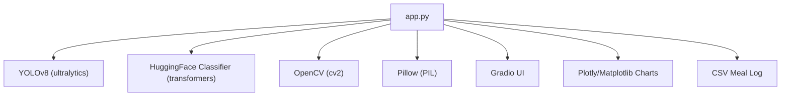
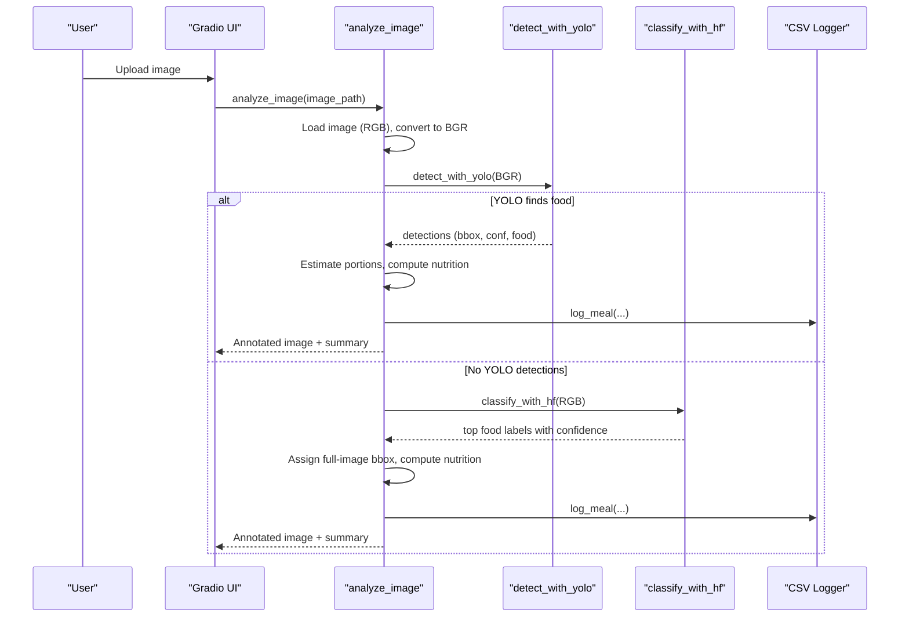
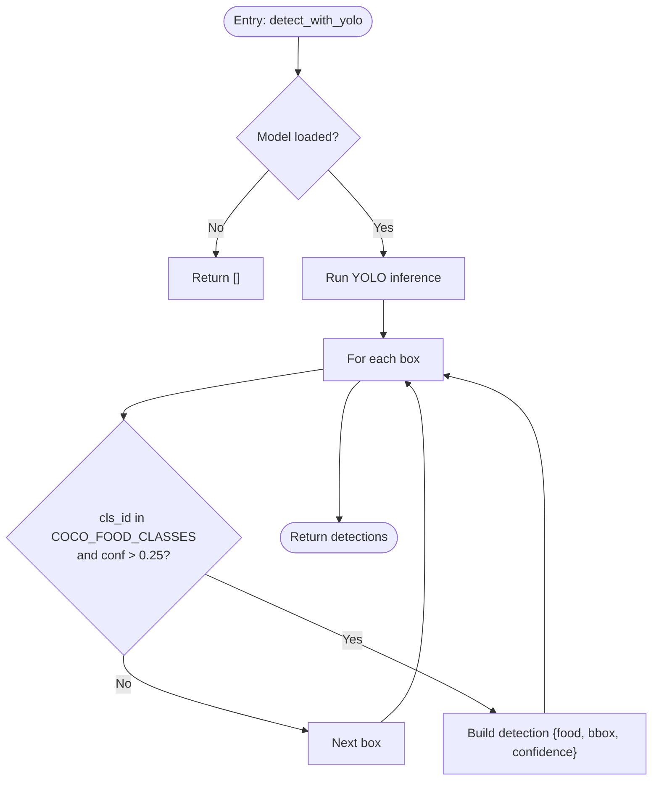
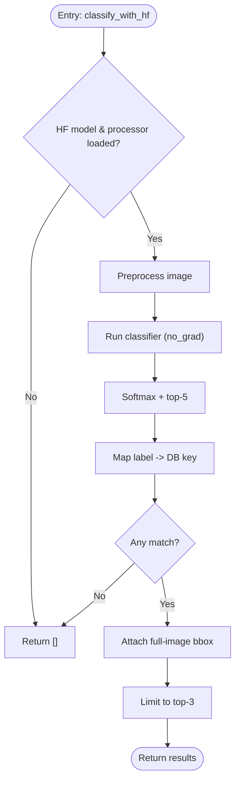
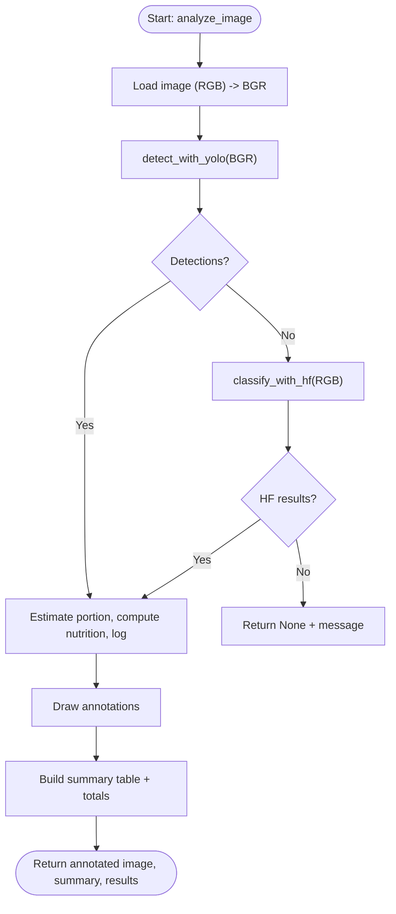
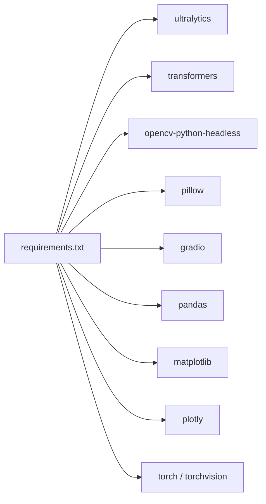

# Food Detection & Analysis

<cite>
**Referenced Files in This Document**
- [app.py](file://app.py)
- [requirements.txt](file://requirements.txt)
</cite>

## Table of Contents
1. [Introduction](#introduction)
2. [Project Structure](#project-structure)
3. [Core Components](#core-components)
4. [Architecture Overview](#architecture-overview)
5. [Detailed Component Analysis](#detailed-component-analysis)
6. [Dependency Analysis](#dependency-analysis)
7. [Performance Considerations](#performance-considerations)
8. [Troubleshooting Guide](#troubleshooting-guide)
9. [Conclusion](#conclusion)

## Introduction
This document explains NutriSnap AI’s food detection and analysis system, which combines a YOLOv8 object detector with a HuggingFace image classifier fallback to identify foods in meal photos, estimate portions, compute nutrition, and persist results. The pipeline is orchestrated by a single entry point that loads models once, processes images, and returns structured detections with annotations and summaries.

## Project Structure
The project is a minimal single-file application:
- app.py: Implements model loading, detection/classification pipelines, UI, logging, and dashboard generation.
- requirements.txt: Declares runtime dependencies for the UI, ML libraries, and visualization tools.

**Diagram sources**
- [app.py:107-138](file://app.py#L107-L138)
- [app.py:212-352](file://app.py#L212-L352)
- [app.py:359-414](file://app.py#L359-L414)
- [app.py:466-543](file://app.py#L466-L543)
- [requirements.txt:1-11](file://requirements.txt#L1-L11)

**Section sources**
- [app.py:1-544](file://app.py#L1-L544)
- [requirements.txt:1-11](file://requirements.txt#L1-L11)

## Core Components
- Model loaders:
  - YOLOv8n loader with graceful error handling and global caching.
  - HuggingFace BEiT-based food classifier loader with processor and model caching.
- Detection and classification:
  - detect_with_yolo: Runs YOLOv8 on BGR images, filters by COCO food classes and confidence threshold, extracts bounding boxes and scores.
  - classify_with_hf: Classifies full image when YOLO finds no food; maps top predictions to known foods and attaches a default full-image bounding box.
- Pipeline orchestration:
  - analyze_image: Loads image, converts RGB to BGR for OpenCV/YOLO, runs YOLO first, falls back to HuggingFace if needed, estimates portions, computes nutrition, logs meals, annotates image, and builds summary.
- UI and persistence:
  - Gradio interface triggers analysis and displays annotated images and markdown summaries.
  - CSV meal log records each detected food with nutrition and portion info.

**Section sources**
- [app.py:107-138](file://app.py#L107-L138)
- [app.py:212-264](file://app.py#L212-L264)
- [app.py:284-352](file://app.py#L284-L352)
- [app.py:466-543](file://app.py#L466-L543)

## Architecture Overview
The system follows a two-stage detection strategy:
1. Primary: YOLOv8 detects multiple food items with bounding boxes and confidence scores.
2. Fallback: If no detections meet criteria, a HuggingFace classifier predicts one or more food labels for the entire image.

**Diagram sources**
- [app.py:284-352](file://app.py#L284-L352)
- [app.py:212-264](file://app.py#L212-L264)
- [app.py:153-162](file://app.py#L153-L162)

## Detailed Component Analysis

### detect_with_yolo
- Input: NumPy array in BGR format.
- Behavior:
  - Returns empty list if model not loaded.
  - Runs inference without verbose output.
  - Iterates over boxes, reads class ID and confidence.
  - Filters by COCO food class mapping and confidence > 0.25.
  - Extracts bounding boxes and maps class IDs to food names.
- Output: List of detections with fields: food, bbox, confidence.

**Diagram sources**
- [app.py:212-237](file://app.py#L212-L237)

**Section sources**
- [app.py:212-237](file://app.py#L212-L237)

### classify_with_hf
- Input: PIL Image in RGB format.
- Behavior:
  - Returns empty list if model/processor not loaded.
  - Preprocesses image via HuggingFace processor.
  - Runs inference in evaluation mode without gradients.
  - Applies softmax and selects top-5 predictions.
  - Maps predicted labels to known foods in the nutrition database using substring matching.
  - Attaches a default full-image bounding box for downstream processing.
- Output: Up to three matched food entries with confidence.

**Diagram sources**
- [app.py:240-264](file://app.py#L240-L264)

**Section sources**
- [app.py:240-264](file://app.py#L240-L264)

### analyze_image
- Responsibilities:
  - Load image as RGB, convert to NumPy, then to BGR for OpenCV/YOLO.
  - Attempt YOLO detection first; if none found, run HuggingFace classifier fallback.
  - For each detection, estimate portion size based on bounding box area ratio, compute nutrition from a built-in database, and log to CSV.
  - Draw annotations on the image and build a Markdown summary table with totals.
- Error handling:
  - Returns None and a user-friendly message if no food is detected.
  - Catches exceptions in both YOLO and HF paths and continues gracefully.

**Diagram sources**
- [app.py:284-352](file://app.py#L284-L352)

**Section sources**
- [app.py:284-352](file://app.py#L284-L352)

### Portion Estimation and Nutrition Calculation
- Portion estimation uses the ratio of bounding box area to total image area:
  - Small (<5%): multiplier 0.5
  - Medium (5–15%): multiplier 1.0
  - Large (>15%): multiplier 1.5
- Nutrition calculation scales per-100g values from a curated database by grams derived from typical serving sizes and portion multiplier.

**Section sources**
- [app.py:198-209](file://app.py#L198-L209)
- [app.py:179-191](file://app.py#L179-L191)
- [app.py:312-331](file://app.py#L312-L331)

### COCO Food Classes Supported by YOLO
The system maps specific COCO class IDs to food names used by YOLOv8:
- banana, apple, sandwich, orange, broccoli, carrot, hot_dog, pizza, donut, cake

These are filtered during detection to ensure only relevant food categories are considered.

**Section sources**
- [app.py:92-97](file://app.py#L92-L97)

## Dependency Analysis
External libraries and their roles:
- ultralytics: Provides YOLOv8 model and inference API.
- transformers + torch: Provide HuggingFace image processor and classifier for fallback.
- opencv-python-headless: Image I/O and drawing utilities.
- pillow: Image loading and conversion.
- gradio: Web UI for uploading images and displaying results.
- pandas/matplotlib/plotly: Dashboard charts and data handling.
- csv/pandas: Persisting meal logs.

**Diagram sources**
- [requirements.txt:1-11](file://requirements.txt#L1-L11)

**Section sources**
- [requirements.txt:1-11](file://requirements.txt#L1-L11)
- [app.py:107-138](file://app.py#L107-L138)

## Performance Considerations
- Model loading:
  - Models are loaded once at startup and cached globally to avoid repeated initialization overhead.
- Inference settings:
  - YOLO runs with verbose disabled to reduce console noise and overhead.
  - HuggingFace classifier runs in evaluation mode without gradient computation.
- Thresholds:
  - YOLO detection uses a confidence threshold of 0.25 to filter low-confidence boxes.
- Image formats:
  - Conversion between RGB and BGR is performed explicitly to match library expectations (Pillow vs OpenCV/YOLO).
- Logging:
  - CSV writes occur per detection; consider batching or asynchronous writes for high-throughput scenarios.

[No sources needed since this section provides general guidance]

## Troubleshooting Guide
Common issues and resolutions:
- YOLO fails to load:
  - Symptom: No detections and error logged during load.
  - Action: Ensure ultralytics and yolov8n weights are available; check network access if downloading weights.
- HuggingFace classifier fails to load:
  - Symptom: Fallback unavailable; error logged during load.
  - Action: Verify transformers and torch are installed; ensure internet access to download model artifacts.
- No food detected:
  - Causes: Poor lighting, blurry image, food not in supported set, or confidence below threshold.
  - Actions: Improve photo quality, include the full plate, try different angles; verify food category coverage.
- Incorrect portion estimation:
  - Cause: Unusual camera distance or framing affecting bounding box area ratio.
  - Action: Adjust perspective so the food occupies a reasonable portion of the frame.
- CSV errors:
  - Cause: Permission issues or missing file headers.
  - Action: Ensure write permissions to the working directory; the app auto-creates headers if missing.

**Section sources**
- [app.py:112-138](file://app.py#L112-L138)
- [app.py:212-264](file://app.py#L212-L264)
- [app.py:284-352](file://app.py#L284-L352)

## Conclusion
NutriSnap AI employs a robust two-stage approach: YOLOv8 for precise multi-food detection with bounding boxes and confidence filtering, followed by a HuggingFace classifier fallback to capture cases where object detection does not trigger. The pipeline standardizes image formats, estimates portions from spatial cues, computes nutrition from a curated database, persists results, and presents annotated outputs through an interactive UI. With careful model loading, sensible thresholds, and clear error handling, the system delivers reliable food analysis suitable for everyday meal tracking.