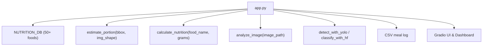
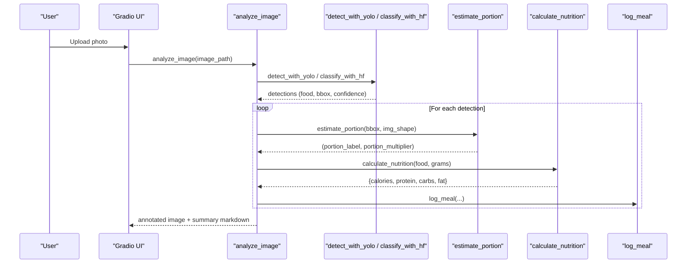
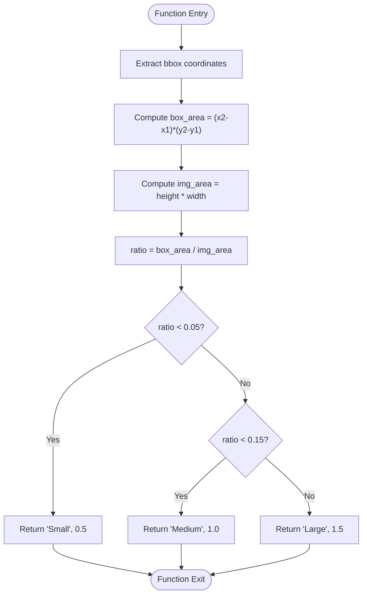
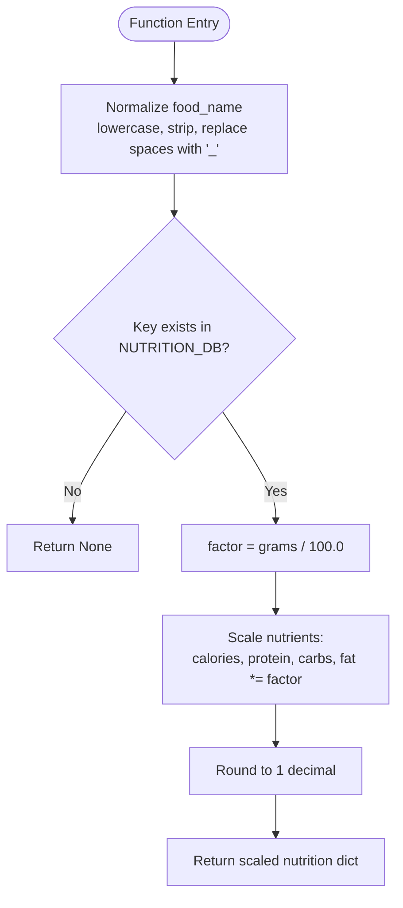
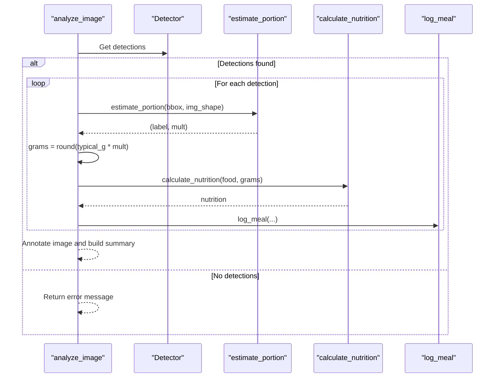

# Nutritional Calculation

<cite>
**Referenced Files in This Document**
- [app.py](file://app.py)
- [requirements.txt](file://requirements.txt)
</cite>

## Table of Contents
1. [Introduction](#introduction)
2. [Project Structure](#project-structure)
3. [Core Components](#core-components)
4. [Architecture Overview](#architecture-overview)
5. [Detailed Component Analysis](#detailed-component-analysis)
6. [Dependency Analysis](#dependency-analysis)
7. [Performance Considerations](#performance-considerations)
8. [Troubleshooting Guide](#troubleshooting-guide)
9. [Conclusion](#conclusion)
10. [Appendices](#appendices)

## Introduction
This document explains the nutritional calculation system used by NutriSnap AI to estimate portion sizes and compute per-meal nutrition from images. It focuses on two core functions:
- estimate_portion: estimates portion size using bounding box area ratios relative to the image, categorizing portions as Small, Medium, or Large with corresponding multipliers.
- calculate_nutrition: normalizes food names and computes nutrition values based on a built-in database of 50+ foods.

It also details the nutrition database structure, how grams are derived from typical serving sizes and portion multipliers, and how final nutritional values are computed via proportional scaling. Examples of supported foods, customization options for adding new foods, and accuracy considerations for portion estimation are included.

## Project Structure
The application is implemented as a single-file Python script that integrates computer vision detection, classification fallbacks, UI, logging, and dashboarding. The nutritional logic resides within this file alongside model loading, CSV logging, and UI components.

**Diagram sources**
- [app.py:27-90](file://app.py#L27-L90)
- [app.py:179-209](file://app.py#L179-L209)
- [app.py:284-352](file://app.py#L284-L352)

**Section sources**
- [app.py:1-10](file://app.py#L1-L10)
- [app.py:27-90](file://app.py#L27-L90)
- [requirements.txt:1-11](file://requirements.txt#L1-L11)

## Core Components
- NUTRITION_DB: A dictionary mapping normalized food keys to per-100g nutritional values (calories, protein, carbs, fat) and a typical_g value representing a standard serving size in grams.
- estimate_portion: Computes the ratio of a detected food’s bounding box area to the total image area and maps it to a portion category and multiplier.
- calculate_nutrition: Normalizes the food name and scales per-100g values to the provided gram amount.
- analyze_image: Orchestrates detection/classification, portion estimation, nutrition calculation, logging, and result visualization.

Key responsibilities:
- Portion estimation uses geometric cues from object detection to infer relative portion size.
- Nutrition calculation relies on a fixed per-100g reference and scales linearly with grams.
- Logging persists results to CSV for later analysis and dashboard generation.

**Section sources**
- [app.py:27-90](file://app.py#L27-L90)
- [app.py:179-209](file://app.py#L179-L209)
- [app.py:284-352](file://app.py#L284-L352)

## Architecture Overview
The end-to-end flow for nutritional calculation:

**Diagram sources**
- [app.py:284-352](file://app.py#L284-L352)
- [app.py:212-264](file://app.py#L212-L264)
- [app.py:179-209](file://app.py#L179-L209)
- [app.py:153-162](file://app.py#L153-L162)

## Detailed Component Analysis

### estimate_portion: Portion Size Estimation
Purpose:
- Estimate portion size by comparing the area of a detected food’s bounding box to the total image area.
- Categorize into Small (<5% ratio), Medium (5–15%), or Large (>15%) and return a corresponding multiplier (0.5x, 1.0x, 1.5x).

Algorithm overview:
- Compute box_area from bounding box coordinates.
- Compute img_area from image dimensions.
- Calculate ratio = box_area / img_area.
- Map ratio to portion category and multiplier.

**Diagram sources**
- [app.py:198-209](file://app.py#L198-L209)

Accuracy considerations:
- Works best when the food occupies a clear, distinct region in the frame.
- Overlapping items or background clutter can distort area ratios.
- Camera distance and perspective affect perceived area; consistent framing improves reliability.

**Section sources**
- [app.py:198-209](file://app.py#L198-L209)

### calculate_nutrition: Nutrition Computation
Purpose:
- Normalize food names to match database keys.
- Scale per-100g nutritional values to the given gram amount.

Normalization steps:
- Convert to lowercase.
- Strip leading/trailing spaces.
- Replace internal spaces with underscores.

Scaling logic:
- Retrieve per-100g values from NUTRITION_DB.
- Multiply each nutrient by factor = grams / 100.0.
- Round results to one decimal place.

**Diagram sources**
- [app.py:179-191](file://app.py#L179-L191)

Supported foods (examples):
- apple, banana, orange, broccoli, carrot, tomato, pizza, hamburger, sandwich, hot_dog, donut, cake, rice, pasta, chicken, steak, salmon, egg, bread, cheese, salad, lettuce, spinach, potato, fries, avocado, grapes, strawberry, blueberry, watermelon, mushroom, corn, onion, bell_pepper, cucumber, shrimp, tofu, beans, nuts, yogurt, milk, sushi, soup, chocolate, ice_cream, cereal, taco, bacon, sausage, pepperoni, lemon, pear, peach, mango, pineapple, coconut, celery, cauliflower.

**Section sources**
- [app.py:31-90](file://app.py#L31-L90)
- [app.py:179-191](file://app.py#L179-L191)

### analyze_image: Orchestration and Grams Derivation
Purpose:
- Detect or classify food items.
- Estimate portion size and derive grams.
- Compute nutrition and log results.

Deriving grams:
- For each detection, retrieve typical_g from NUTRITION_DB (default if missing).
- Multiply typical_g by the portion multiplier returned by estimate_portion.
- Round to nearest whole gram.

Computing final nutrition:
- Pass food name and derived grams to calculate_nutrition.
- Accumulate totals across all detections.
- Log each entry and annotate the image.

**Diagram sources**
- [app.py:284-352](file://app.py#L284-L352)
- [app.py:198-209](file://app.py#L198-L209)
- [app.py:179-191](file://app.py#L179-L191)
- [app.py:153-162](file://app.py#L153-L162)

**Section sources**
- [app.py:284-352](file://app.py#L284-L352)

## Dependency Analysis
External dependencies relevant to nutritional calculation:
- OpenCV (cv2) for image processing and annotation.
- NumPy for array operations.
- Pandas for CSV reading/writing and dashboard data handling.
- Matplotlib/Plotly for charts (dashboard).
- Gradio for UI.
- Ultralytics YOLOv8 for detection.
- HuggingFace Transformers for fallback classification.

These libraries support detection, classification, UI, logging, and visualization but do not alter the core nutritional calculation logic.

**Section sources**
- [app.py:8-23](file://app.py#L8-L23)
- [requirements.txt:1-11](file://requirements.txt#L1-L11)

## Performance Considerations
- Detection speed depends on model availability and hardware; YOLOv8 inference is typically fast on modern CPUs/GPUs.
- Image preprocessing and annotation add overhead; consider resizing inputs if needed.
- Database lookups are O(1) average due to dictionary hashing.
- Proportional scaling is constant-time per nutrient.
- CSV I/O is lightweight for moderate usage; batch operations can be optimized if logging volume increases.

[No sources needed since this section provides general guidance]

## Troubleshooting Guide
Common issues and resolutions:
- No food detected:
  - Ensure clear, well-lit photos with the full plate visible.
  - Verify models loaded successfully; check console logs for errors during initialization.
- Incorrect portion estimation:
  - Avoid extreme camera angles or overlapping items that distort bounding box areas.
  - Use consistent framing and distance for more reliable ratios.
- Unknown food name:
  - Add entries to NUTRITION_DB using normalized keys (lowercase, no spaces, underscores for multi-word names).
  - Provide realistic typical_g values aligned with common serving sizes.
- CSV issues:
  - Ensure write permissions to the working directory.
  - Validate column headers if manually editing the CSV.

**Section sources**
- [app.py:112-138](file://app.py#L112-L138)
- [app.py:145-176](file://app.py#L145-L176)
- [app.py:284-310](file://app.py#L284-L310)

## Conclusion
NutriSnap AI’s nutritional calculation system combines simple geometric heuristics with a robust, per-100g nutrition database to estimate portion sizes and compute accurate nutritional values. The estimate_portion function translates visual cues into practical portion categories, while calculate_nutrition ensures consistent scaling across diverse foods. With straightforward customization options and clear logging, the system supports both immediate use and long-term dietary tracking.

[No sources needed since this section summarizes without analyzing specific files]

## Appendices

### Nutrition Database Structure
Each food entry includes:
- calories: per 100g energy content.
- protein: per 100g protein content.
- carbs: per 100g carbohydrate content.
- fat: per 100g fat content.
- typical_g: a representative serving size in grams used to derive actual grams before scaling.

Example entries (non-exhaustive):
- apple, banana, orange, broccoli, carrot, tomato, pizza, hamburger, sandwich, hot_dog, donut, cake, rice, pasta, chicken, steak, salmon, egg, bread, cheese, salad, lettuce, spinach, potato, fries, avocado, grapes, strawberry, blueberry, watermelon, mushroom, corn, onion, bell_pepper, cucumber, shrimp, tofu, beans, nuts, yogurt, milk, sushi, soup, chocolate, ice_cream, cereal, taco, bacon, sausage, pepperoni, lemon, pear, peach, mango, pineapple, coconut, celery, cauliflower.

**Section sources**
- [app.py:31-90](file://app.py#L31-L90)

### Customization: Adding New Foods
To add a new food:
- Choose a normalized key (lowercase, underscores instead of spaces).
- Provide per-100g values for calories, protein, carbs, fat.
- Set a realistic typical_g reflecting a common serving size.
- Insert the entry into NUTRITION_DB.

After updating the database, the existing pipeline will automatically recognize and calculate nutrition for the new food.

**Section sources**
- [app.py:31-90](file://app.py#L31-L90)
- [app.py:179-191](file://app.py#L179-L191)

### Accuracy Considerations for Portion Estimation
- Consistent framing: Keep the camera at a similar distance and angle to improve ratio stability.
- Clear visibility: Ensure the entire food item is in view and not obscured.
- Minimal clutter: Reduce background distractions to avoid misleading area ratios.
- Realistic expectations: Area-based estimation approximates portion size; adjust mentally if the detected area does not reflect actual serving size.

[No sources needed since this section provides general guidance]