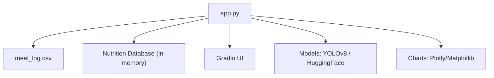
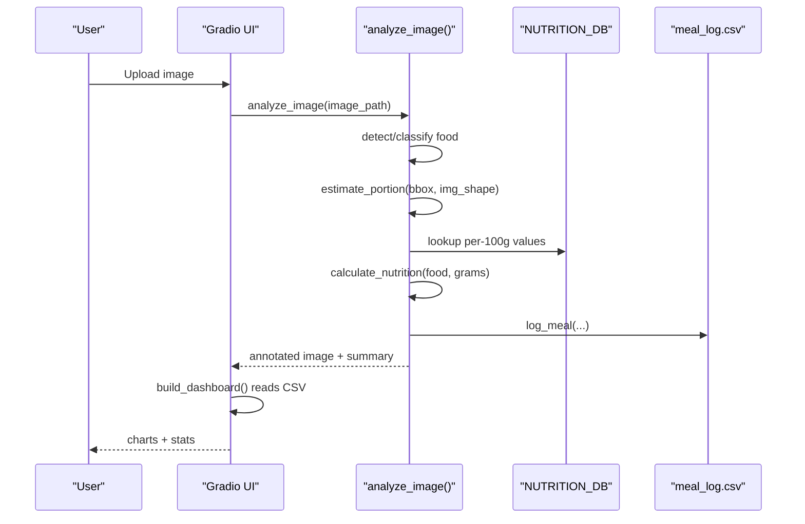
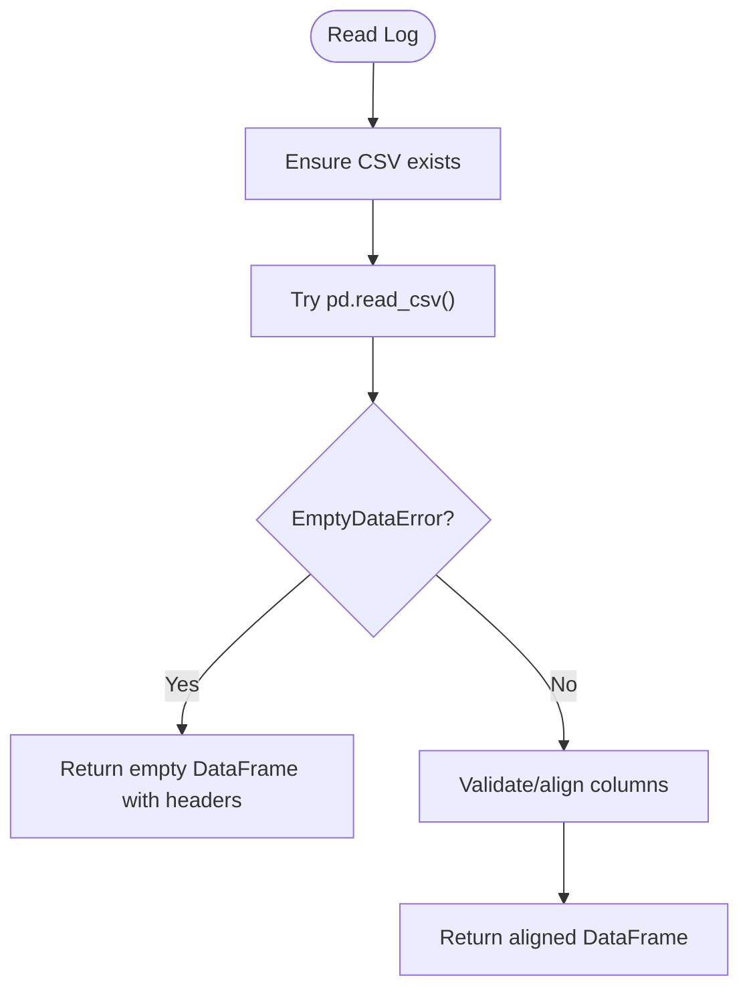
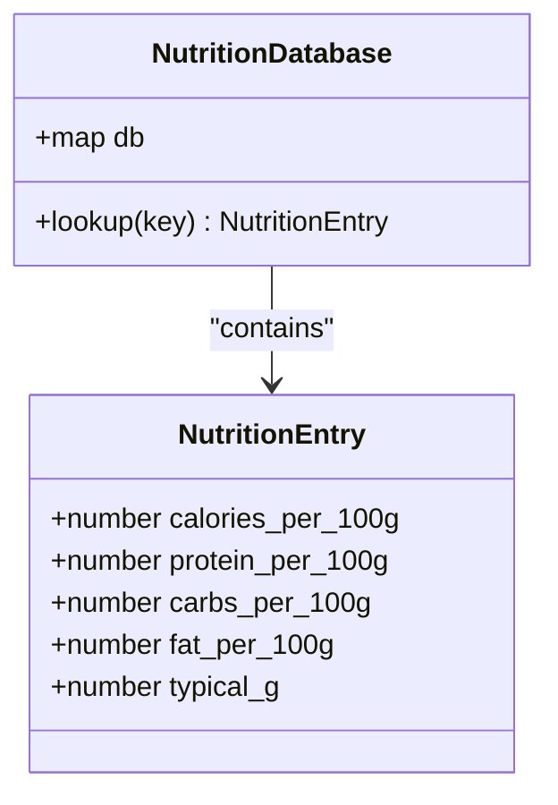
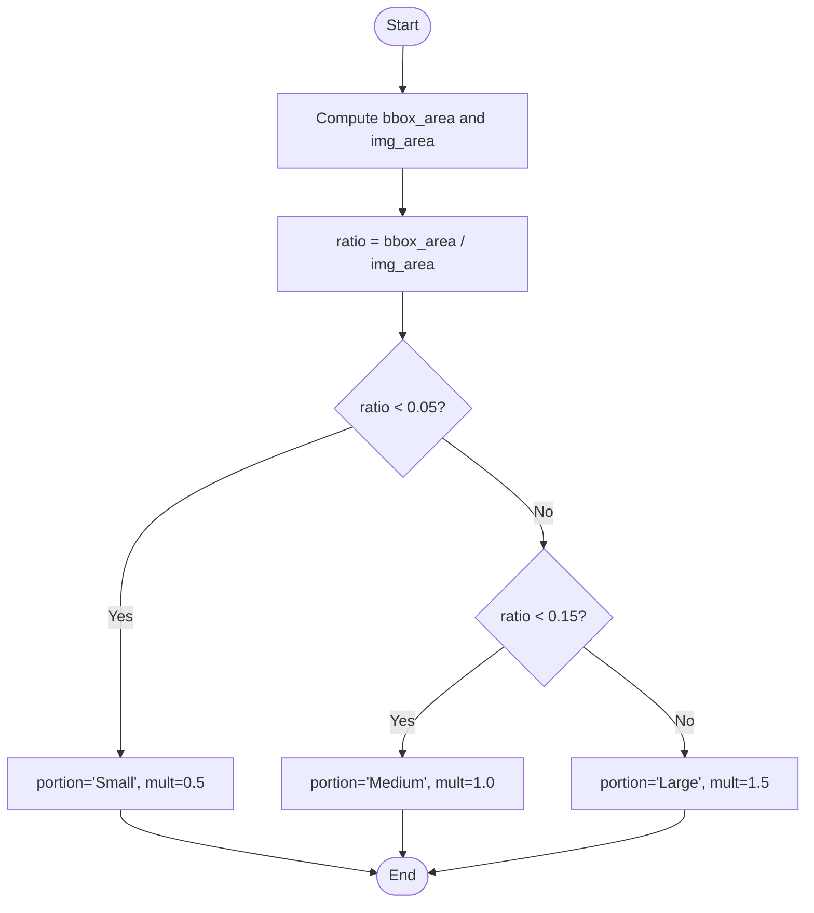
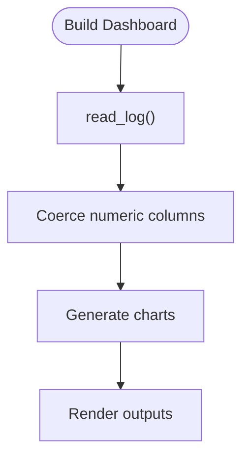
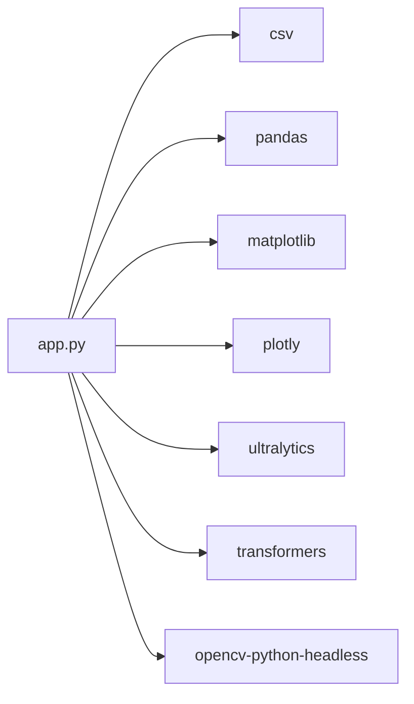

# Data Management

<cite>
**Referenced Files in This Document**
- [app.py](file://app.py)
- [requirements.txt](file://requirements.txt)
</cite>

## Table of Contents
1. [Introduction](#introduction)
2. [Project Structure](#project-structure)
3. [Core Components](#core-components)
4. [Architecture Overview](#architecture-overview)
5. [Detailed Component Analysis](#detailed-component-analysis)
6. [Dependency Analysis](#dependency-analysis)
7. [Performance Considerations](#performance-considerations)
8. [Troubleshooting Guide](#troubleshooting-guide)
9. [Conclusion](#conclusion)
10. [Appendices](#appendices)

## Introduction
This document explains the data management system of NutriSnap AI, focusing on how meal logs are stored and processed via CSV files, how the nutrition database is structured, and how portion estimation influences nutritional calculations. It also provides guidance for extending the food database, customizing serving sizes, modifying nutritional values, and handling backups and privacy considerations.

## Project Structure
The application is implemented as a single-file Python script with external dependencies declared in a requirements file. The core data management logic (CSV creation, reading, logging, and nutrition calculation) resides within the main application file.

**Diagram sources**
- [app.py:1-544](file://app.py#L1-L544)

**Section sources**
- [app.py:1-544](file://app.py#L1-L544)
- [requirements.txt:1-11](file://requirements.txt#L1-L11)

## Core Components
- CSV-based meal log storage with automatic header creation and schema validation.
- In-memory nutrition database containing 50+ foods with standardized per-100g values and typical serving weights.
- Portion estimation algorithm that scales typical serving weights based on detected bounding box area relative to image size.
- Functions to read, write, and validate CSV data with robust error handling for empty files and missing columns.
- Dashboard generation from logged data for daily calories, macro distribution, weekly trends, and top foods.

**Section sources**
- [app.py:27-100](file://app.py#L27-L100)
- [app.py:145-191](file://app.py#L145-L191)
- [app.py:198-209](file://app.py#L198-L209)
- [app.py:359-414](file://app.py#L359-L414)

## Architecture Overview
The data flow begins when an image is uploaded through the Gradio UI. The app detects or classifies food items, estimates portions, calculates nutrition using the in-memory database, logs results to CSV, and renders dashboard charts from the CSV data.

**Diagram sources**
- [app.py:284-352](file://app.py#L284-L352)
- [app.py:198-209](file://app.py#L198-L209)
- [app.py:179-191](file://app.py#L179-L191)
- [app.py:153-176](file://app.py#L153-L176)
- [app.py:359-414](file://app.py#L359-L414)

## Detailed Component Analysis

### CSV Meal Log System
- File path and schema:
  - File name: meal_log.csv
  - Columns: Date, Time, Food, Calories, Protein (g), Carbs (g), Fat (g), Portion, Confirmed
- Automatic creation:
  - If the file does not exist, it is created with headers before any writes.
- Logging:
  - Each analyzed meal is appended with current date/time, food name, calculated macros, estimated portion label, and confirmation flag.
- Reading with validation:
  - Reads all entries; if columns are missing, they are auto-migrated by adding empty columns to match the expected schema.
  - Handles empty files gracefully by returning an empty DataFrame with correct headers.

**Diagram sources**
- [app.py:145-176](file://app.py#L145-L176)

**Section sources**
- [app.py:99-100](file://app.py#L99-L100)
- [app.py:145-176](file://app.py#L145-L176)

### Nutrition Database Structure
- Format:
  - Dictionary keyed by lowercase food names.
  - Each entry includes per-100g values for calories, protein, carbs, fat, plus a typical_g field representing a common serving weight in grams.
- Scope:
  - Contains 50+ food items covering fruits, vegetables, proteins, grains, dairy, and prepared foods.
- Usage:
  - Used by the portion estimator to scale typical servings and by the nutrition calculator to compute actual macros for the estimated grams.

**Diagram sources**
- [app.py:31-90](file://app.py#L31-L90)

**Section sources**
- [app.py:31-90](file://app.py#L31-L90)

### Portion Estimation Algorithm
- Input:
  - Bounding box coordinates and image dimensions.
- Logic:
  - Computes ratio of bounding box area to total image area.
  - Maps ratio thresholds to portion labels and multipliers:
    - Small: multiplier 0.5
    - Medium: multiplier 1.0
    - Large: multiplier 1.5
- Effect on nutrition:
  - Multiplier scales the typical serving weight (typical_g) to grams, which then scales per-100g values to obtain final macros.

**Diagram sources**
- [app.py:198-209](file://app.py#L198-L209)

**Section sources**
- [app.py:198-209](file://app.py#L198-L209)

### Data Reading and Error Handling
- Empty files:
  - Returns an empty DataFrame with the correct column set to avoid downstream errors.
- Missing columns:
  - Auto-migrates by adding any missing columns with empty values to align with the expected schema.
- Numeric conversion:
  - Dashboard functions coerce numeric fields to numbers, filling invalid entries with zeros to ensure chart rendering.

**Diagram sources**
- [app.py:359-414](file://app.py#L359-L414)
- [app.py:165-176](file://app.py#L165-L176)

**Section sources**
- [app.py:165-176](file://app.py#L165-L176)
- [app.py:359-414](file://app.py#L359-L414)

### CSV Export/Import Capabilities
- Export:
  - The CSV file is continuously updated by the application whenever meals are analyzed and logged. Users can open the file directly to export data.
- Import:
  - The application reads the CSV at runtime; users may edit or append rows externally as long as the schema matches.
- Schema alignment:
  - On read, missing columns are automatically added to maintain compatibility even if the file was edited outside the app.

**Section sources**
- [app.py:145-176](file://app.py#L145-L176)
- [app.py:359-414](file://app.py#L359-L414)

### Data Backup and Recovery Procedures
- Backup:
  - Copy the meal_log.csv file periodically to a safe location (e.g., cloud storage or version-controlled folder).
- Recovery:
  - Replace the active meal_log.csv with a previously backed-up copy to restore history.
- Integrity:
  - Ensure the CSV retains the required columns; the app will auto-add missing ones but having consistent headers simplifies recovery.

[No sources needed since this section provides general guidance]

### Data Privacy Considerations
- Local storage:
  - Meal logs are stored locally in a CSV file on the device running the app.
- Sharing:
  - Avoid sharing the CSV publicly unless you remove or anonymize personal details such as timestamps or identifiable food descriptions.
- Access control:
  - Restrict file system access to authorized users to protect sensitive dietary information.

[No sources needed since this section provides general guidance]

## Dependency Analysis
External libraries used by the data management components include CSV handling, data manipulation, visualization, and model inference.

**Diagram sources**
- [app.py:8-23](file://app.py#L8-L23)
- [requirements.txt:1-11](file://requirements.txt#L1-L11)

**Section sources**
- [requirements.txt:1-11](file://requirements.txt#L1-L11)

## Performance Considerations
- CSV operations:
  - Append-only writes minimize overhead during meal logging.
  - Reading the entire CSV into memory is acceptable for typical usage; consider pagination or aggregation for very large datasets.
- Dashboard generation:
  - Numeric coercion and groupby operations are efficient for moderate dataset sizes.
- Model inference:
  - Detection/classification runs once per upload; caching models avoids repeated loading overhead.

[No sources needed since this section provides general guidance]

## Troubleshooting Guide
- CSV issues:
  - If the CSV is empty or malformed, the reader returns an empty DataFrame with correct headers; verify that edits preserve the exact column names.
- Missing columns:
  - The app auto-adds missing columns; however, keep the original order and names to avoid confusion in exports.
- Numeric parsing:
  - Non-numeric entries in macro columns are coerced to zero; clean the CSV to ensure accurate dashboards.
- Model failures:
  - If detection fails, the app falls back to a classifier; ensure dependencies are installed and models can load.

**Section sources**
- [app.py:165-176](file://app.py#L165-L176)
- [app.py:359-414](file://app.py#L359-L414)
- [app.py:112-138](file://app.py#L112-L138)

## Conclusion
NutriSnap AI’s data management system centers around a simple yet robust CSV-based meal log, supported by an in-memory nutrition database and a practical portion estimation algorithm. The design ensures reliable data persistence, graceful error handling, and clear visualization of dietary trends. Extending the database and customizing serving sizes is straightforward, while backup and privacy practices help maintain data integrity and confidentiality.

[No sources needed since this section summarizes without analyzing specific files]

## Appendices

### Appendix A: CSV File Format Example
- File name: meal_log.csv
- Headers: Date, Time, Food, Calories, Protein (g), Carbs (g), Fat (g), Portion, Confirmed
- Example row format:
  - 2024-01-01, 12:30:00, Apple, 93.6, 0.5, 25.2, 0.4, Medium, True

[No sources needed since this section provides general guidance]

### Appendix B: Extending the Nutrition Database
- Add new food items:
  - Insert a new key-value pair into the nutrition database with per-100g values for calories, protein, carbs, fat, and a typical_g serving weight.
- Modify existing entries:
  - Update per-100g values or typical_g to reflect revised nutritional information or preferred serving sizes.
- Impact:
  - Changes immediately affect subsequent analyses and logged entries due to the in-memory structure.

**Section sources**
- [app.py:31-90](file://app.py#L31-L90)

### Appendix C: Customizing Serving Sizes
- Adjust typical_g:
  - Change the typical serving weight for a food item to better match user habits or regional norms.
- Manual override:
  - While the app estimates portions automatically, users can conceptually adjust expectations based on the portion label (Small/Medium/Large) and corresponding multipliers.

**Section sources**
- [app.py:31-90](file://app.py#L31-L90)
- [app.py:198-209](file://app.py#L198-L209)

### Appendix D: Data Manipulation Techniques
- Reading and cleaning:
  - Use pandas to load the CSV, coerce numeric columns, and handle missing values before analysis.
- Aggregation:
  - Group by date to compute daily totals; resample by week for trend analysis.
- Exporting insights:
  - Write aggregated results to new CSVs or generate reports for sharing.

**Section sources**
- [app.py:359-414](file://app.py#L359-L414)