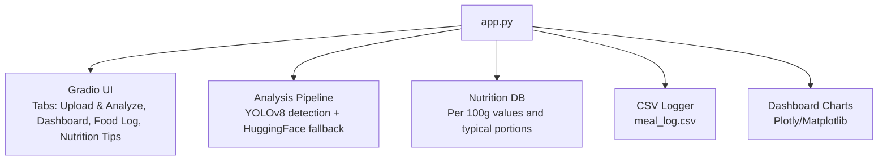
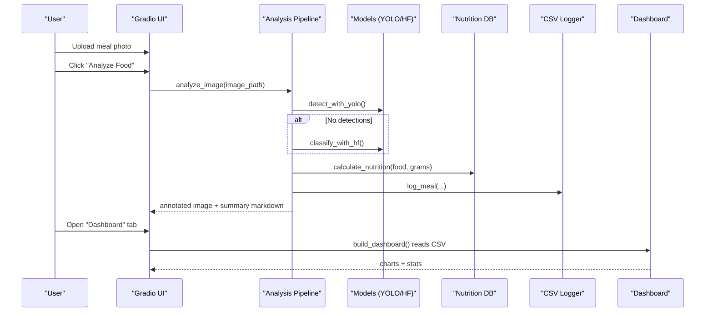
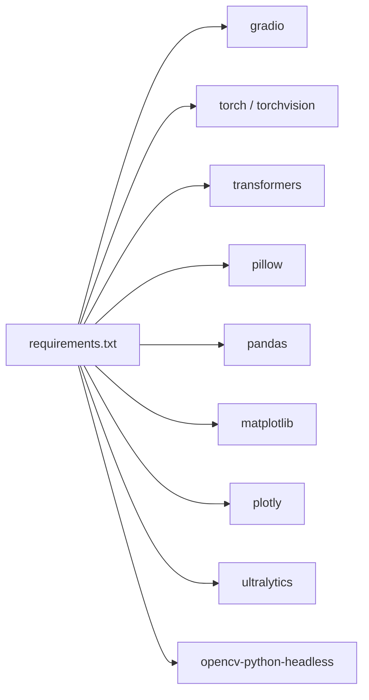

# Getting Started

<cite>
**Referenced Files in This Document**
- [app.py](file://app.py)
- [requirements.txt](file://requirements.txt)
</cite>

## Table of Contents
1. [Introduction](#introduction)
2. [Project Structure](#project-structure)
3. [Core Components](#core-components)
4. [Architecture Overview](#architecture-overview)
5. [Detailed Component Analysis](#detailed-component-analysis)
6. [Dependency Analysis](#dependency-analysis)
7. [Performance Considerations](#performance-considerations)
8. [Troubleshooting Guide](#troubleshooting-guide)
9. [Conclusion](#conclusion)
10. [Appendices](#appendices)

## Introduction
NutriSnap AI is a single-file, browser-based food tracking application that lets you take or upload a photo of your meal and instantly receive:
- Annotated images highlighting detected foods
- A nutritional summary (calories, protein, carbs, fat)
- Automatic logging to a CSV file for later review
- A dashboard with charts showing daily calories, macro distribution, weekly trends, and top foods

You can run the app locally with Python and use it entirely in your web browser via Gradio.

## Project Structure
The project is intentionally minimal:
- app.py: The entire application logic, UI, analysis pipeline, and data persistence
- requirements.txt: Dependencies needed to run the app

**Diagram sources**
- [app.py:1-544](file://app.py#L1-L544)

**Section sources**
- [app.py:1-544](file://app.py#L1-L544)
- [requirements.txt:1-11](file://requirements.txt#L1-L11)

## Core Components
- User Interface (Gradio): Four tabs for uploading photos, viewing results, exploring dashboards, and reading nutrition tips.
- Detection Pipeline: Primary detection using YOLOv8; if no food is found, a HuggingFace image classifier is used as a fallback.
- Nutrition Estimation: Uses an internal database of foods with per-100g macros and typical portion sizes to estimate grams and macros from bounding boxes.
- Data Persistence: Each analyzed meal is appended to a CSV file for history and dashboard visualization.
- Dashboard: Plotly charts for daily calories, macro distribution, weekly trends, and top foods.

**Section sources**
- [app.py:103-192](file://app.py#L103-L192)
- [app.py:194-353](file://app.py#L194-L353)
- [app.py:359-415](file://app.py#L359-L415)
- [app.py:466-530](file://app.py#L466-L530)

## Architecture Overview
High-level flow from user input to insights:

**Diagram sources**
- [app.py:284-353](file://app.py#L284-L353)
- [app.py:359-415](file://app.py#L359-L415)
- [app.py:466-530](file://app.py#L466-L530)

## Detailed Component Analysis

### Quick Start Tutorial
1. Install dependencies:
   - Ensure Python is installed
   - Install packages listed in requirements.txt
2. Run the application:
   - Execute the main script to start the Gradio server
3. Use the app:
   - Go to the “Upload & Analyze” tab
   - Upload a photo of your meal
   - Click “Analyze Food”
   - View the annotated image and nutritional summary
4. Explore your data:
   - Switch to “Dashboard” to see charts
   - Check “Food Log” for a table of all logged meals
   - Read “Nutrition Tips” for guidance

Notes:
- The app will attempt to load YOLOv8 first; if unavailable, it falls back to a HuggingFace classifier.
- Results are automatically saved to a CSV file named meal_log.csv in the working directory.

**Section sources**
- [requirements.txt:1-11](file://requirements.txt#L1-L11)
- [app.py:537-544](file://app.py#L537-L544)
- [app.py:145-177](file://app.py#L145-L177)
- [app.py:466-530](file://app.py#L466-L530)

### User Interface Navigation
- Upload & Analyze:
  - Upload a meal photo
  - Click “Analyze Food” to get annotated results and a nutritional summary
- Dashboard:
  - Daily Calories bar chart
  - Macro Distribution pie chart
  - Weekly Calorie Trend line chart
  - Top Foods horizontal bar chart
  - Summary stats (total meals, total calories, average per meal)
- Food Log:
  - Table of all logged meals with date, time, food, macros, portion, and confirmation status
- Nutrition Tips:
  - Recommended daily intake guidelines
  - Tracking best practices
  - How to interpret dashboard charts
  - Healthy eating reminders

**Section sources**
- [app.py:466-530](file://app.py#L466-L530)
- [app.py:430-463](file://app.py#L430-L463)

### Basic Workflow: Upload, Analyze, View Results
1. Upload a clear photo of your meal
2. Click “Analyze Food”
3. Review:
   - Annotated image with bounding boxes around detected foods
   - Nutritional summary table including portion size, grams, and macros
   - Totals for calories, protein, carbs, and fat
4. Your meal is automatically logged to the CSV file

**Section sources**
- [app.py:284-353](file://app.py#L284-L353)
- [app.py:153-177](file://app.py#L153-L177)

### Tips for Effective Food Photos
- Good lighting: Avoid dark or blurry images
- Full plate visibility: Include the entire meal so all items are visible
- Close-up but not too close: Capture enough detail without cropping out surrounding context
- Minimize clutter: Keep backgrounds simple to help detection algorithms focus on food

These tips align with the app’s guidance for best accuracy and consistent portion estimation.

**Section sources**
- [app.py:430-463](file://app.py#L430-L463)

### Interpreting Annotated Images and Summaries
- Annotated image:
  - Colored rectangles highlight detected foods
  - Labels show food name and estimated calories for that item
- Nutritional summary:
  - For each detected food: portion size (Small/Medium/Large), estimated grams, and macros
  - Totals row aggregates calories, protein, carbs, and fat across all items
- Portion estimation:
  - Based on bounding box area relative to the image
  - Small/Medium/Large multipliers adjust typical portion weights

**Section sources**
- [app.py:198-210](file://app.py#L198-L210)
- [app.py:267-282](file://app.py#L267-L282)
- [app.py:312-353](file://app.py#L312-L353)

### Examples: Logging Breakfast, Lunch, Dinner
- Breakfast:
  - Photo of cereal with milk and fruit
  - Expect multiple items detected; summary shows each with portion and macros
- Lunch:
  - Photo of sandwich and salad
  - Items may be detected separately; totals reflect combined macros
- Dinner:
  - Photo of pasta with chicken and vegetables
  - Multiple components contribute to totals; verify portion labels make sense

After analyzing, check:
- “Food Log” tab for entries
- “Dashboard” for updated charts and stats

**Section sources**
- [app.py:466-530](file://app.py#L466-L530)
- [app.py:359-415](file://app.py#L359-L415)

### Understanding Portion Sizes and Nutritional Values
- Portion sizes are estimated from image area ratios:
  - Small: multiplier ~0.5x typical weight
  - Medium: multiplier ~1.0x typical weight
  - Large: multiplier ~1.5x typical weight
- Typical weights come from the internal nutrition database
- Macros are scaled proportionally based on estimated grams

If a result seems off, consider retaking the photo with better framing or clearer visibility of the food.

**Section sources**
- [app.py:198-210](file://app.py#L198-L210)
- [app.py:179-192](file://app.py#L179-L192)
- [app.py:312-353](file://app.py#L312-L353)

### Initial Data Exploration
- CSV file:
  - meal_log.csv is created automatically with headers for Date, Time, Food, Calories, Protein (g), Carbs (g), Fat (g), Portion, Confirmed
  - You can open it in any spreadsheet tool to explore entries
- Dashboard visualizations:
  - Daily Calories: bar chart by date
  - Macro Distribution: pie chart of protein, carbs, fat totals
  - Weekly Trend: line chart aggregating calories by week
  - Top Foods: horizontal bar chart of most frequently logged foods

**Section sources**
- [app.py:99-101](file://app.py#L99-L101)
- [app.py:145-177](file://app.py#L145-L177)
- [app.py:359-415](file://app.py#L359-L415)

## Dependency Analysis
External libraries and their roles:
- gradio: Web UI framework for tabs, buttons, plots, and file uploads
- torch, torchvision, transformers: Enable HuggingFace image classification fallback
- pillow: Image handling
- pandas: CSV reading/writing and data manipulation
- matplotlib: Chart rendering backend
- plotly: Interactive charts for dashboard
- ultralytics: YOLOv8 model loading and inference
- opencv-python-headless: Image processing and annotation drawing

**Diagram sources**
- [requirements.txt:1-11](file://requirements.txt#L1-L11)

**Section sources**
- [requirements.txt:1-11](file://requirements.txt#L1-L11)
- [app.py:8-25](file://app.py#L8-L25)

## Performance Considerations
- Model loading:
  - YOLOv8 loads once at startup; subsequent analyses are faster
  - HuggingFace classifier loads only if needed (fallback)
- Image processing:
  - Conversions between PIL, NumPy, and OpenCV formats occur during analysis
- Dashboard generation:
  - Charts are built from CSV data; refresh updates visuals
- Tips:
  - Use reasonably sized images to reduce processing time
  - Ensure sufficient RAM/GPU resources if running models locally

[No sources needed since this section provides general guidance]

## Troubleshooting Guide
- Models fail to load:
  - If YOLOv8 cannot load, the app prints a message and proceeds without it
  - If HuggingFace classifier fails to load, detection relies solely on YOLOv8
  - In both cases, ensure internet access for model downloads and sufficient disk space
- No food detected:
  - Try a clearer photo with good lighting and full plate visibility
  - The app will return a message indicating no food items were detected
- CSV issues:
  - The app auto-creates the CSV with correct headers if missing
  - If columns change, the reader auto-migrates by adding missing columns
- Dashboard empty:
  - Requires at least one analyzed meal to generate charts
  - Refresh the dashboard after analyzing a meal

**Section sources**
- [app.py:112-138](file://app.py#L112-L138)
- [app.py:284-311](file://app.py#L284-L311)
- [app.py:145-177](file://app.py#L145-L177)
- [app.py:359-415](file://app.py#L359-L415)

## Conclusion
NutriSnap AI offers a streamlined way to track meals visually and numerically. By uploading a photo, you receive immediate feedback through annotated images and nutritional summaries, with automatic logging and interactive dashboards to monitor your habits over time. Follow the quick start steps, capture effective photos, and explore the dashboard to gain insights into your diet.

[No sources needed since this section summarizes without analyzing specific files]

## Appendices

### Appendix A: Step-by-Step First Analysis
1. Install dependencies from requirements.txt
2. Run the application script
3. Navigate to “Upload & Analyze”
4. Upload a meal photo and click “Analyze Food”
5. Review annotated image and nutritional summary
6. Visit “Dashboard” to see charts and “Food Log” for history

**Section sources**
- [requirements.txt:1-11](file://requirements.txt#L1-L11)
- [app.py:537-544](file://app.py#L537-L544)
- [app.py:466-530](file://app.py#L466-L530)

### Appendix B: Understanding the CSV File
- Columns include Date, Time, Food, Calories, Protein (g), Carbs (g), Fat (g), Portion, Confirmed
- Each analyzed meal adds a new row
- You can open the CSV in Excel, Google Sheets, or any text editor to explore entries

**Section sources**
- [app.py:99-101](file://app.py#L99-L101)
- [app.py:153-177](file://app.py#L153-L177)