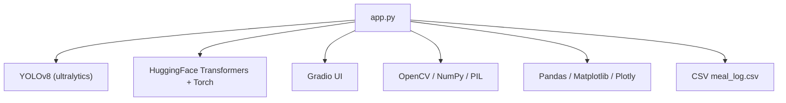
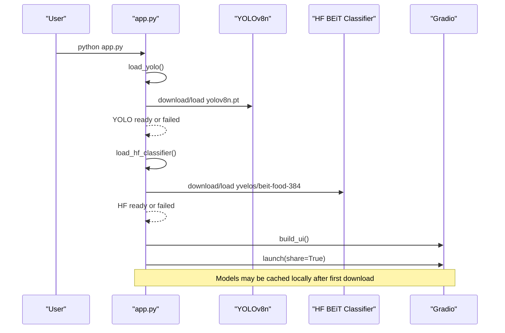
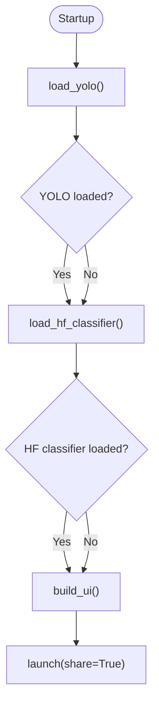
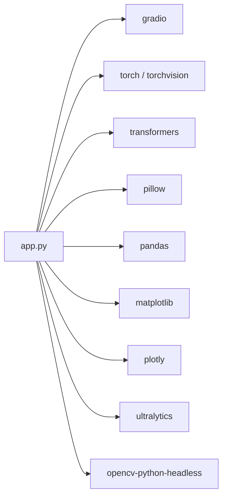

# Installation & Setup

<cite>
**Referenced Files in This Document**
- [app.py](file://app.py)
- [requirements.txt](file://requirements.txt)
</cite>

## Table of Contents
1. [Introduction](#introduction)
2. [Project Structure](#project-structure)
3. [Core Components](#core-components)
4. [Architecture Overview](#architecture-overview)
5. [Detailed Component Analysis](#detailed-component-analysis)
6. [Dependency Analysis](#dependency-analysis)
7. [Performance Considerations](#performance-considerations)
8. [Troubleshooting Guide](#troubleshooting-guide)
9. [Conclusion](#conclusion)
10. [Appendices](#appendices)

## Introduction
NutriSnap AI is a single-file application that analyzes food images to estimate nutrition and track meals. It uses YOLOv8 for object detection, a HuggingFace BEiT image classifier as a fallback, and Gradio for the web interface. The app also logs results to CSV and provides dashboard charts.

This guide covers prerequisites, installation steps, model loading behavior at startup, environment setup across platforms, verification, and troubleshooting common issues.

## Project Structure
The repository contains:
- app.py: Main application script that loads models, builds the UI, and serves the web app.
- requirements.txt: Python dependencies required by the application.

**Diagram sources**
- [app.py:107-138](file://app.py#L107-L138)
- [app.py:212-264](file://app.py#L212-L264)
- [app.py:466-543](file://app.py#L466-L543)
- [requirements.txt:1-11](file://requirements.txt#L1-L11)

**Section sources**
- [app.py:1-10](file://app.py#L1-L10)
- [requirements.txt:1-11](file://requirements.txt#L1-L11)

## Core Components
- Model loaders:
  - YOLOv8n detector via ultralytics.
  - HuggingFace BEiT classifier via transformers and torch.
- Image analysis pipeline:
  - Detects food items with YOLO; falls back to HF classifier if needed.
  - Estimates portion size from bounding box area relative to image size.
  - Calculates nutrition using an internal database and logs to CSV.
- UI and serving:
  - Gradio Blocks interface with tabs for upload/analysis, dashboard, log, and tips.
  - Serves the app with share=True to enable public sharing.

Key responsibilities are implemented within app.py. Dependencies are declared in requirements.txt.

**Section sources**
- [app.py:107-138](file://app.py#L107-L138)
- [app.py:198-352](file://app.py#L198-L352)
- [app.py:466-543](file://app.py#L466-L543)
- [requirements.txt:1-11](file://requirements.txt#L1-L11)

## Architecture Overview
At runtime, the application:
1. Loads YOLOv8n and HuggingFace BEiT models during startup.
2. Builds the Gradio UI.
3. Launches the server with share=True to create a public link.

**Diagram sources**
- [app.py:537-543](file://app.py#L537-L543)
- [app.py:112-138](file://app.py#L112-L138)

## Detailed Component Analysis

### Prerequisites
- Python: Use a recent Python 3.x interpreter recommended by PyTorch and Gradio.
- System libraries:
  - OpenCV headless backend is used; ensure your system has basic display/library support if you later switch to full OpenCV.
  - GPU acceleration (optional): If available, PyTorch will use CUDA automatically when installed with GPU support. CPU-only installs are also supported.

No additional system packages are strictly required beyond what pip installs for the listed dependencies.

**Section sources**
- [requirements.txt:1-11](file://requirements.txt#L1-L11)
- [app.py:14-23](file://app.py#L14-L23)

### Installation Steps
1. Create a virtual environment (recommended):
   - Windows: python -m venv .venv
   - macOS/Linux: python3 -m venv .venv
2. Activate the environment:
   - Windows: .venv\Scripts\activate
   - macOS/Linux: source .venv/bin/activate
3. Install dependencies:
   - pip install -r requirements.txt
4. Start the application:
   - python app.py

Notes:
- On first run, models will be downloaded automatically if not present locally.
- Ensure stable internet access during initial model downloads.

**Section sources**
- [requirements.txt:1-11](file://requirements.txt#L1-L11)
- [app.py:537-543](file://app.py#L537-L543)

### Model Loading Process at Startup
During startup, the application:
- Attempts to load YOLOv8n via ultralytics. If successful, it prints a success message; otherwise, it logs a failure and continues without YOLO.
- Attempts to load the HuggingFace BEiT classifier (yvelos/beit-food-384). If successful, it sets the processor and model to evaluation mode; otherwise, it logs a failure and continues without HF.

Behavior:
- If both fail, the app still starts but cannot detect food.
- If only one fails, the other can still be used for analysis.

**Diagram sources**
- [app.py:112-138](file://app.py#L112-L138)
- [app.py:537-543](file://app.py#L537-L543)

**Section sources**
- [app.py:112-138](file://app.py#L112-L138)
- [app.py:537-543](file://app.py#L537-L543)

### Network Connectivity and Model Downloads
- YOLOv8n model file is fetched on first use by ultralytics.
- HuggingFace BEiT model files are fetched via transformers on first use.
- If downloads fail due to network restrictions or firewall rules, the app will continue without those models. You can retry later when connectivity improves.

Tips:
- Ensure outbound HTTPS is allowed.
- If behind a proxy, configure your environment so pip and the model downloaders can reach their endpoints.

**Section sources**
- [app.py:112-138](file://app.py#L112-L138)

### GPU vs CPU Performance
- PyTorch and ultralytics will leverage GPU if a compatible CUDA-enabled PyTorch is installed and a supported GPU is detected.
- CPU-only installations will work but may be slower for inference.
- For best performance on supported systems, install the GPU-enabled version of PyTorch matching your CUDA toolkit.

Memory considerations:
- Large images and batched processing increase memory usage.
- If you encounter out-of-memory errors, reduce image resolution or avoid running other heavy processes simultaneously.

**Section sources**
- [requirements.txt:1-11](file://requirements.txt#L1-L11)
- [app.py:212-264](file://app.py#L212-L264)

### Web Access and share=True
- The app launches with share=True, which creates a publicly accessible temporary URL for the Gradio interface.
- Use this link to test the app from any device with internet access.
- For local-only access, modify the launch call to disable sharing.

Note: Public links are intended for development/testing. Do not expose sensitive data through shared links.

**Section sources**
- [app.py:537-543](file://app.py#L537-L543)

### Platform-Specific Notes
- Windows:
  - Use python -m venv and activate via .venv\Scripts\activate.
  - Ensure Visual C++ redistributables are installed if you install GPU-enabled PyTorch.
- macOS:
  - Use python3 -m venv and activate via source .venv/bin/activate.
  - Apple Silicon users should install the default PyTorch wheel; it includes optimized CPU/Metal support.
- Linux:
  - Use python3 -m venv and activate via source .venv/bin/activate.
  - For GPU support, install the appropriate CUDA toolkit and drivers, then install the matching PyTorch GPU wheel.

**Section sources**
- [requirements.txt:1-11](file://requirements.txt#L1-L11)

## Dependency Analysis
The application depends on:
- gradio: Web UI framework.
- torch, torchvision: Deep learning runtime and utilities.
- transformers: HuggingFace model loading and inference.
- pillow: Image handling.
- pandas: Data manipulation for logging and dashboards.
- matplotlib: Chart rendering (headless mode).
- plotly: Interactive charts.
- ultralytics: YOLOv8 model loading and inference.
- opencv-python-headless: Computer vision operations without GUI dependencies.

**Diagram sources**
- [requirements.txt:1-11](file://requirements.txt#L1-L11)
- [app.py:14-23](file://app.py#L14-L23)

**Section sources**
- [requirements.txt:1-11](file://requirements.txt#L1-L11)
- [app.py:14-23](file://app.py#L14-L23)

## Performance Considerations
- First-run latency: Expect delays while models are downloaded and cached locally.
- Inference speed:
  - GPU accelerates both YOLO and HF classification where supported.
  - CPU-only runs are functional but slower.
- Memory:
  - Large images increase memory usage.
  - Close other memory-intensive applications if you see slowdowns or OOM errors.
- Disk space:
  - Models are cached in platform-specific directories managed by ultralytics and huggingface_hub.

[No sources needed since this section provides general guidance]

## Troubleshooting Guide

Common issues and resolutions:

- Dependency conflicts or import errors
  - Symptom: ImportError or module not found when starting the app.
  - Resolution:
    - Reinstall dependencies in a clean virtual environment: pip install -r requirements.txt.
    - Pin versions if necessary to resolve conflicts.
    - Ensure your Python version matches the wheels provided by PyTorch and other packages.

- Model download failures
  - Symptom: Errors indicating network timeouts or permission issues during model loading.
  - Resolution:
    - Verify internet connectivity and firewall settings.
    - Retry after some time; models are cached after successful download.
    - If behind a proxy, configure environment variables for pip and model downloaders.

- No detections returned
  - Symptom: Uploaded images yield no food items.
  - Resolution:
    - Check console output for model loading status.
    - If YOLO failed to load, try again with better connectivity or retry later.
    - If HF classifier failed, ensure transformers and torch are correctly installed.
    - Provide clearer photos with good lighting and visible plates.

- Out-of-memory or slow inference
  - Symptom: Crashes or very slow processing.
  - Resolution:
    - Use a GPU-enabled PyTorch installation if available.
    - Reduce image resolution or close other heavy applications.
    - Avoid running multiple instances simultaneously.

- Cannot access the web UI
  - Symptom: No browser window opens or link does not work.
  - Resolution:
    - Confirm the terminal shows a Gradio URL.
    - If using share=True, ensure outbound internet is allowed.
    - For local-only access, disable sharing in the launch configuration.

- CSV log not created or empty
  - Symptom: Dashboard shows no data.
  - Resolution:
    - Analyze at least one image to generate entries.
    - Ensure write permissions in the working directory.

**Section sources**
- [app.py:112-138](file://app.py#L112-L138)
- [app.py:212-264](file://app.py#L212-L264)
- [app.py:537-543](file://app.py#L537-L543)

## Conclusion
You now have everything needed to install, configure, and run NutriSnap AI. After installing dependencies and launching the app, models will be downloaded on first use. Use the generated public link to interact with the UI, analyze food images, and view nutritional insights. Refer to the troubleshooting section if you encounter common setup or runtime issues.

[No sources needed since this section summarizes without analyzing specific files]

## Appendices

### Verification Steps
- Run the application:
  - python app.py
- Expected behavior:
  - Console prints model loading messages.
  - A Gradio URL appears in the terminal.
  - Opening the URL shows the UI where you can upload images and see results.
- Validate functionality:
  - Upload a clear photo of a meal.
  - Click “Analyze Food” and verify annotated output and summary table.
  - Refresh the dashboard and food log to confirm data persistence.

**Section sources**
- [app.py:537-543](file://app.py#L537-L543)