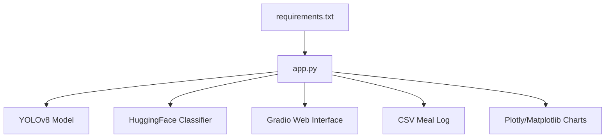
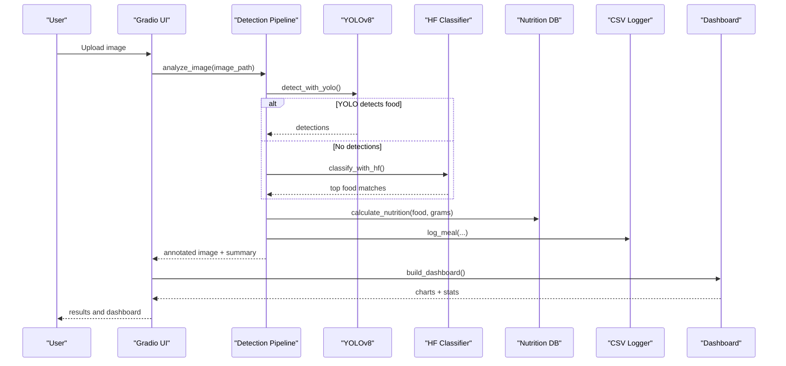
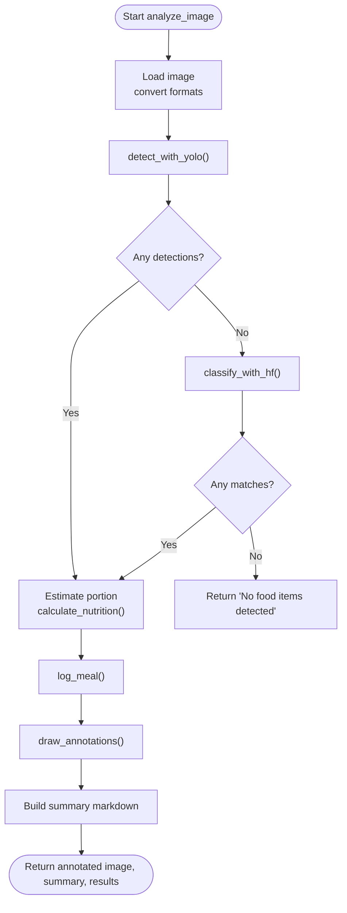
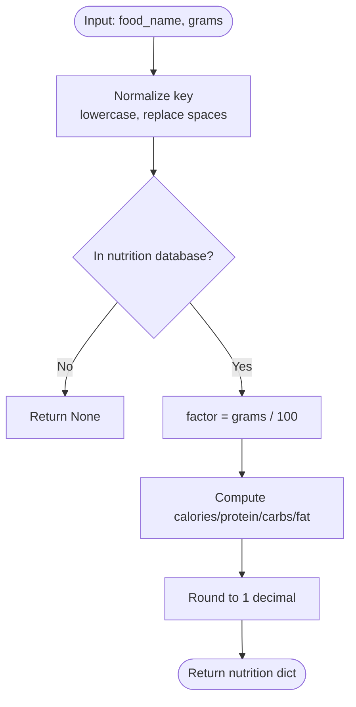
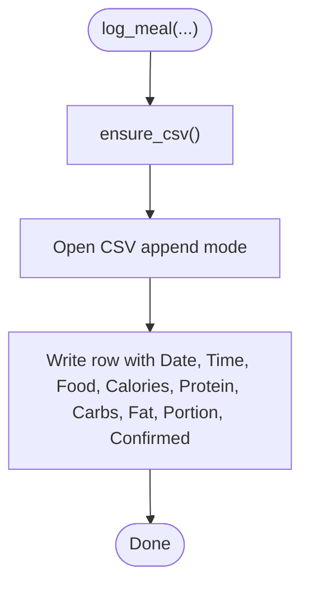
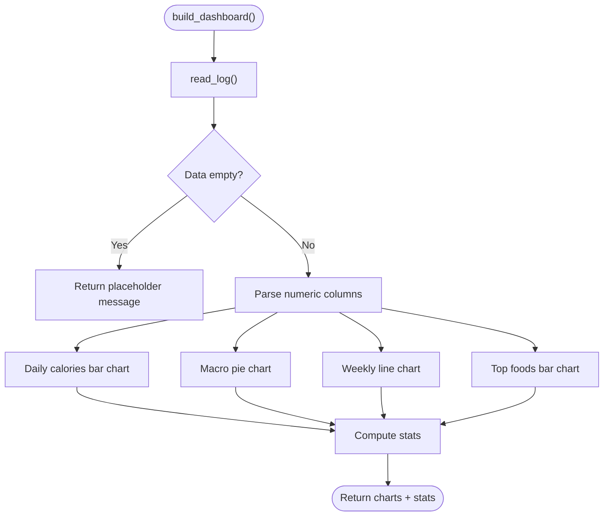
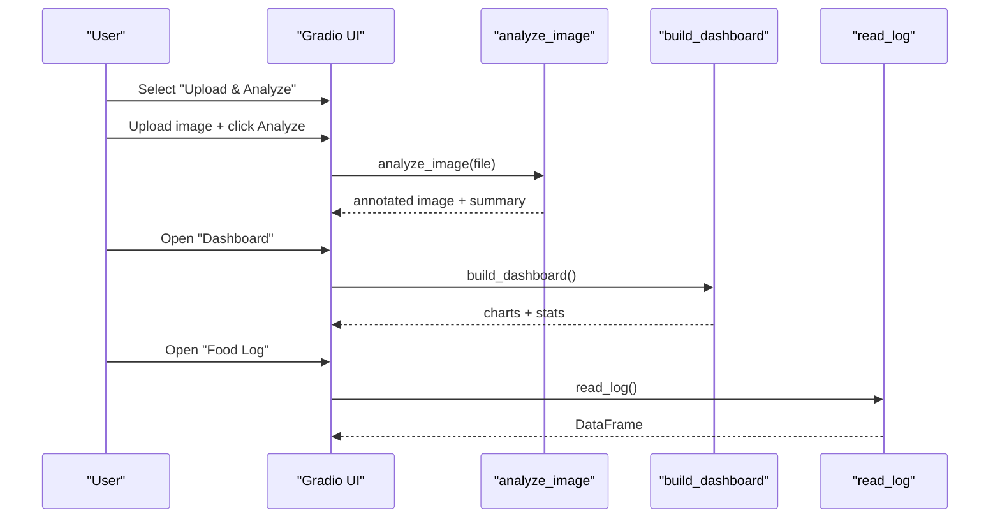
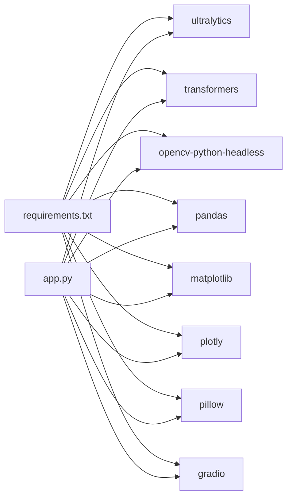

# Project Overview

<cite>
**Referenced Files in This Document**
- [app.py](file://app.py)
- [requirements.txt](file://requirements.txt)
</cite>

## Table of Contents
1. [Introduction](#introduction)
2. [Project Structure](#project-structure)
3. [Core Components](#core-components)
4. [Architecture Overview](#architecture-overview)
5. [Detailed Component Analysis](#detailed-component-analysis)
6. [Dependency Analysis](#dependency-analysis)
7. [Performance Considerations](#performance-considerations)
8. [Troubleshooting Guide](#troubleshooting-guide)
9. [Conclusion](#conclusion)
10. [Appendices](#appendices)

## Introduction
NutriSnap AI is an AI-powered food tracking application that automatically detects and analyzes food items from photos to provide nutritional information. It combines a detection pipeline with a nutrition database to estimate portions, compute macronutrients, and log meals into a CSV file for later review. A Gradio-based web interface provides an interactive dashboard with real-time visualization of daily calories, macro distribution, weekly trends, and top foods.

Conceptual overview:
- Computer vision basics: The app uses object detection to locate food items in images and, when needed, a classifier to identify the most likely food category.
- Nutrition science basics: Each detected food maps to a nutrition database entry with per-100g values; portion estimation scales these values to approximate grams based on image area.

Technical overview:
- Single-file modular architecture: All components (models, analysis pipeline, logging, dashboard, UI) are implemented in one cohesive script for simplicity and ease of deployment.
- Detection pipeline: YOLOv8 runs first for multi-food detection; if no detections meet thresholds, a HuggingFace food classifier serves as a fallback.
- Dashboard analytics: Plotly charts visualize meal logs over time and aggregate macros.

Practical examples:
- Quick meal logging: Upload a photo of your plate, click Analyze Food, and the app annotates the image, estimates portions, calculates nutrition, and logs the meal.
- Progress tracking: Open the Dashboard tab to see daily calorie intake, macro distribution, weekly trends, and top foods; refresh to update after new entries.

**Section sources**
- [app.py:1-6](file://app.py#L1-L6)
- [app.py:28-90](file://app.py#L28-L90)
- [app.py:194-353](file://app.py#L194-L353)
- [app.py:359-414](file://app.py#L359-L414)
- [app.py:466-530](file://app.py#L466-L530)

## Project Structure
The project is intentionally minimal:
- app.py: Contains all logic—model loading, detection pipeline, nutrition calculations, CSV logging, dashboard generation, and Gradio UI.
- requirements.txt: Declares runtime dependencies for models, visualization, and the web interface.

**Diagram sources**
- [app.py:107-138](file://app.py#L107-L138)
- [app.py:145-176](file://app.py#L145-L176)
- [app.py:359-414](file://app.py#L359-L414)
- [app.py:466-530](file://app.py#L466-L530)
- [requirements.txt:1-11](file://requirements.txt#L1-L11)

**Section sources**
- [app.py:1-6](file://app.py#L1-L6)
- [requirements.txt:1-11](file://requirements.txt#L1-L11)

## Core Components
- Detection pipeline: Orchestrates YOLOv8 detection and HuggingFace classifier fallback to identify food items and bounding boxes.
- Nutrition database: A built-in dictionary mapping food keys to per-100g nutritional values and typical serving sizes.
- Portion estimation: Infers small/medium/large portions by comparing bounding box area to total image area.
- CSV-based meal logging: Persists each analyzed item with date, time, nutrients, portion, and confirmation status.
- Dashboard analytics: Generates interactive charts for daily calories, macro distribution, weekly trends, and top foods.
- Gradio web interface: Provides tabs for upload/analysis, dashboard, food log, and nutrition tips.

Key implementation highlights:
- Multi-model detection: YOLOv8 for COCO-class foods; HF classifier for broader coverage when YOLO finds nothing.
- Robust fallbacks: Graceful handling when models fail to load or detect.
- Data persistence: CSV auto-creation and migration support for schema changes.
- Visualization: Plotly figures for responsive dashboards; Matplotlib used in headless mode for compatibility.

**Section sources**
- [app.py:28-90](file://app.py#L28-L90)
- [app.py:107-138](file://app.py#L107-L138)
- [app.py:145-176](file://app.py#L145-L176)
- [app.py:179-191](file://app.py#L179-L191)
- [app.py:198-210](file://app.py#L198-L210)
- [app.py:212-264](file://app.py#L212-L264)
- [app.py:284-353](file://app.py#L284-L353)
- [app.py:359-414](file://app.py#L359-L414)
- [app.py:466-530](file://app.py#L466-L530)

## Architecture Overview
High-level flow:
- User uploads a photo via Gradio.
- The detection pipeline attempts YOLOv8 detection; if none found, it falls back to HuggingFace classification.
- Detected items are mapped to the nutrition database; portions are estimated; nutrition is calculated and logged.
- Annotated image and summary are returned to the user; dashboard updates reflect cumulative data.

**Diagram sources**
- [app.py:284-353](file://app.py#L284-L353)
- [app.py:212-264](file://app.py#L212-L264)
- [app.py:179-191](file://app.py#L179-L191)
- [app.py:153-176](file://app.py#L153-L176)
- [app.py:359-414](file://app.py#L359-L414)
- [app.py:466-530](file://app.py#L466-L530)

## Detailed Component Analysis

### Detection Pipeline
- Primary detector: YOLOv8 identifies multiple food items with bounding boxes and confidence scores. Only COCO-class foods within a threshold are accepted.
- Fallback classifier: If no detections pass thresholds, the HuggingFace food classifier returns top candidates matched against the nutrition database.
- Annotation: Bounding boxes and labels are drawn on the image for visual feedback.

**Diagram sources**
- [app.py:284-353](file://app.py#L284-L353)
- [app.py:212-237](file://app.py#L212-L237)
- [app.py:240-264](file://app.py#L240-L264)
- [app.py:198-210](file://app.py#L198-L210)
- [app.py:179-191](file://app.py#L179-L191)
- [app.py:153-162](file://app.py#L153-L162)
- [app.py:267-281](file://app.py#L267-L281)

**Section sources**
- [app.py:212-264](file://app.py#L212-L264)
- [app.py:267-281](file://app.py#L267-L281)
- [app.py:284-353](file://app.py#L284-L353)

### Nutrition Database and Calculations
- Database structure: Keys map to per-100g values for calories, protein, carbs, fat, and a typical gram weight for portion scaling.
- Calculation method: Scales per-100g values by the estimated grams derived from portion estimation.

**Diagram sources**
- [app.py:179-191](file://app.py#L179-L191)
- [app.py:28-90](file://app.py#L28-L90)

**Section sources**
- [app.py:28-90](file://app.py#L28-L90)
- [app.py:179-191](file://app.py#L179-L191)

### CSV-Based Meal Logging
- Auto-creation: Ensures CSV exists with headers before writing.
- Migration: Adds missing columns if schema changes.
- Append-only writes: Each analyzed item adds a row with timestamp, food, nutrients, portion, and confirmation flag.

**Diagram sources**
- [app.py:145-162](file://app.py#L145-L162)
- [app.py:165-176](file://app.py#L165-L176)

**Section sources**
- [app.py:145-176](file://app.py#L145-L176)

### Dashboard Analytics
- Daily calories: Bar chart aggregating calories by date.
- Macro distribution: Pie chart showing total protein, carbs, and fat.
- Weekly trend: Line chart resampled by week.
- Top foods: Horizontal bar chart of most frequently logged foods.
- Stats summary: Total meals, total calories, average per meal.

**Diagram sources**
- [app.py:359-414](file://app.py#L359-L414)
- [app.py:165-176](file://app.py#L165-L176)

**Section sources**
- [app.py:359-414](file://app.py#L359-L414)

### Gradio Web Interface
- Tabs:
  - Upload & Analyze: Image input, analyze button, annotated output, and summary markdown.
  - Dashboard: Refreshable charts and summary statistics.
  - Food Log: Interactive table displaying the CSV meal history.
  - Nutrition Tips: Guidance and best practices.
- Event handlers: Wire UI actions to analysis, dashboard refresh, and log refresh functions.

**Diagram sources**
- [app.py:466-530](file://app.py#L466-L530)
- [app.py:284-353](file://app.py#L284-L353)
- [app.py:359-414](file://app.py#L359-L414)
- [app.py:165-176](file://app.py#L165-L176)

**Section sources**
- [app.py:466-530](file://app.py#L466-L530)

## Dependency Analysis
External libraries and their roles:
- ultralytics: YOLOv8 model inference for object detection.
- transformers + torch: HuggingFace image processor and classifier for fallback food identification.
- opencv-python-headless: Image processing and annotation drawing.
- pandas: CSV reading/writing and data manipulation for dashboard analytics.
- matplotlib: Headless plotting backend compatibility.
- plotly: Interactive dashboard charts.
- pillow: Image loading and conversion.
- gradio: Web UI framework for interactive experience.

**Diagram sources**
- [requirements.txt:1-11](file://requirements.txt#L1-L11)
- [app.py:8-23](file://app.py#L8-L23)

**Section sources**
- [requirements.txt:1-11](file://requirements.txt#L1-L11)
- [app.py:8-23](file://app.py#L8-L23)

## Performance Considerations
- Model loading: YOLOv8 and HuggingFace models are loaded once at startup to avoid repeated initialization overhead.
- Threshold tuning: Confidence thresholds control false positives/negatives; adjust as needed for your dataset.
- Image size: Large images increase inference time; consider resizing before upload if performance is critical.
- Batch vs single: Current design processes one image at a time; batching would require refactoring.
- Headless plotting: Matplotlib uses Agg backend to avoid GUI dependencies in server environments.

[No sources needed since this section provides general guidance]

## Troubleshooting Guide
Common issues and resolutions:
- Models fail to load: Check internet connectivity and environment variables; ensure required packages are installed.
- No food detected: Improve lighting, include full plate, reduce clutter; try different angles; verify that the food class is supported by YOLOv8 or the HF classifier.
- Incorrect portion estimation: Adjust mental expectations; portion estimation is heuristic based on bounding box area relative to image size.
- CSV not updating: Ensure write permissions to the working directory; check that the CSV file exists and is not locked by another process.
- Dashboard empty: Analyze at least one meal to populate the CSV; then refresh the dashboard.

**Section sources**
- [app.py:112-138](file://app.py#L112-L138)
- [app.py:212-237](file://app.py#L212-L237)
- [app.py:240-264](file://app.py#L240-L264)
- [app.py:198-210](file://app.py#L198-L210)
- [app.py:145-176](file://app.py#L145-L176)
- [app.py:359-414](file://app.py#L359-L414)

## Conclusion
NutriSnap AI delivers a streamlined, single-file solution for AI-powered food tracking. Its detection pipeline leverages YOLOv8 with a HuggingFace fallback, while the nutrition database and portion estimation translate visual detections into actionable nutritional insights. The Gradio interface and dashboard analytics make it easy to log meals quickly and track progress over time. For developers, the modular design within a single script simplifies maintenance and extension; for users, it offers an intuitive way to understand dietary patterns and improve eating habits.

[No sources needed since this section summarizes without analyzing specific files]

## Appendices

### Practical Use Cases
- Quick meal logging:
  - Take a clear photo of your meal.
  - Upload to the app and click Analyze Food.
  - Review the annotated image and summary; confirm or adjust portions mentally.
  - Open the Food Log tab to verify the entry.
- Progress tracking:
  - Navigate to the Dashboard tab.
  - Observe daily calories, macro distribution, weekly trends, and top foods.
  - Refresh after new entries to see updated analytics.

[No sources needed since this section provides general guidance]