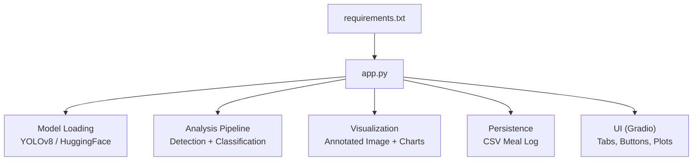
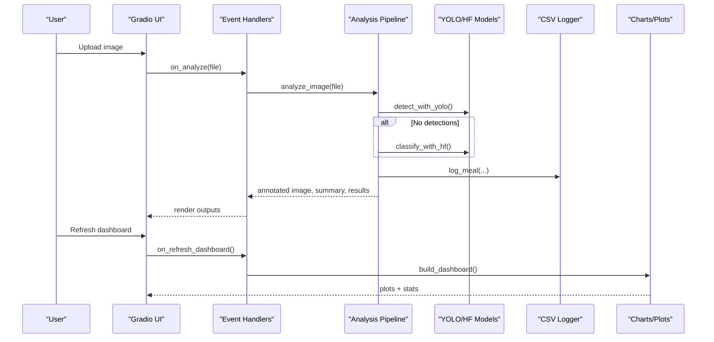
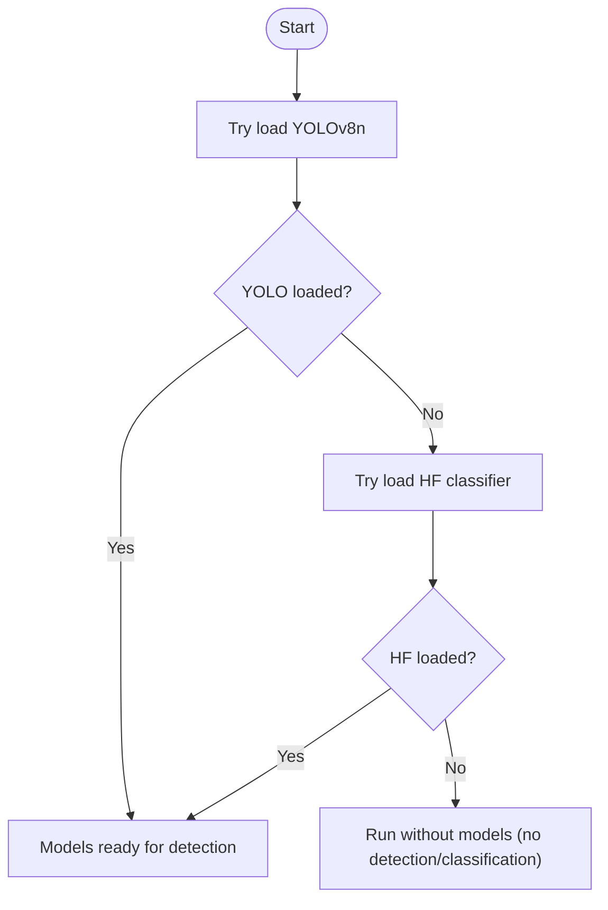
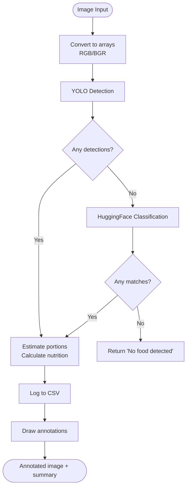
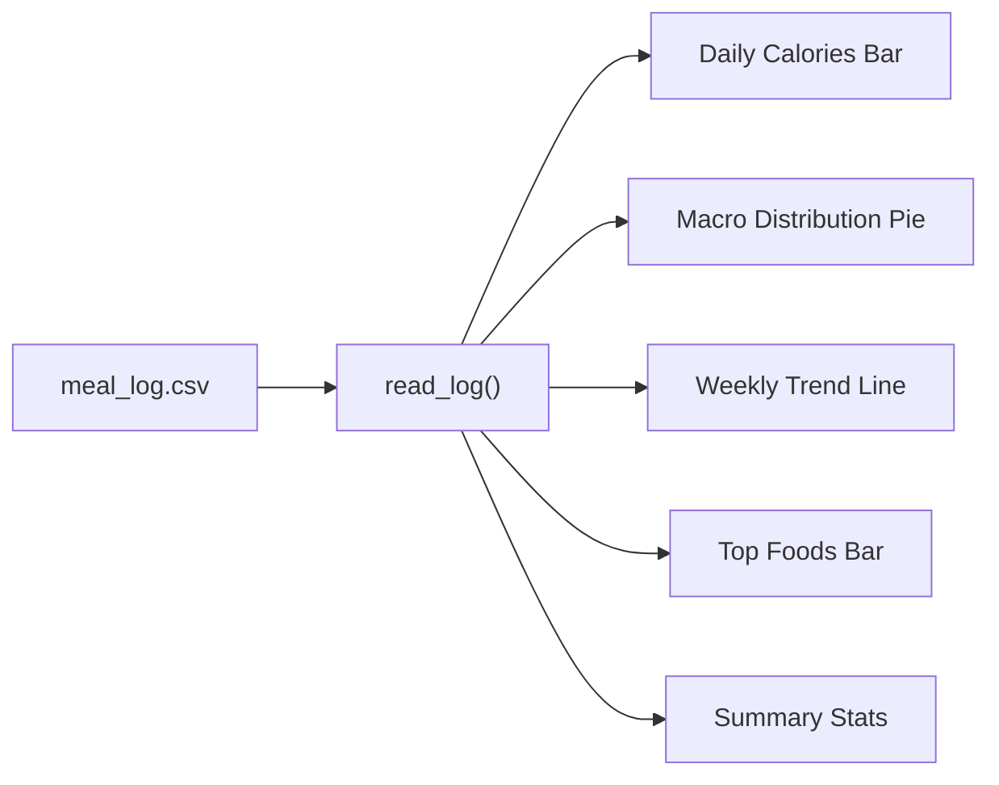
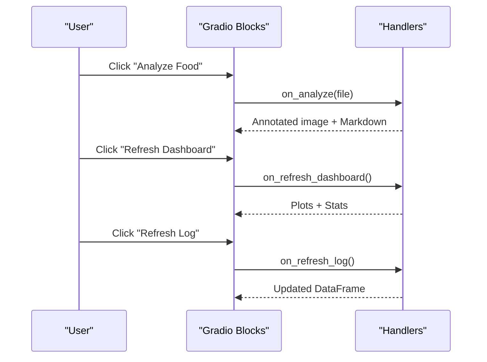
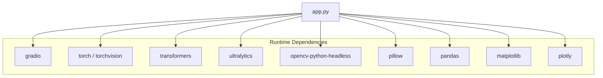

# Technical Architecture

<cite>
**Referenced Files in This Document**
- [app.py](file://app.py)
- [requirements.txt](file://requirements.txt)
</cite>

## Table of Contents
1. [Introduction](#introduction)
2. [Project Structure](#project-structure)
3. [Core Components](#core-components)
4. [Architecture Overview](#architecture-overview)
5. [Detailed Component Analysis](#detailed-component-analysis)
6. [Dependency Analysis](#dependency-analysis)
7. [Performance Considerations](#performance-considerations)
8. [Troubleshooting Guide](#troubleshooting-guide)
9. [Conclusion](#conclusion)

## Introduction
NutriSnap AI is a single-file, modular application that combines computer vision, machine learning, and a web-based user interface to analyze food images and estimate nutritional content. It uses YOLOv8 for multi-object detection with a graceful fallback to a HuggingFace image classifier when detection fails or is unavailable. The UI is built with Gradio and provides real-time annotated results, a dashboard with charts, and a persistent meal log.

Key goals:
- Provide an end-to-end pipeline from image upload to nutrition estimation and visualization.
- Ensure robustness via model fallbacks and error handling.
- Offer an intuitive, event-driven UI with live updates and historical tracking.

## Project Structure
The project is intentionally minimal and self-contained:
- app.py: Contains all logic including model loading, analysis pipeline, logging, dashboard generation, and the Gradio UI.
- requirements.txt: Declares runtime dependencies for ML, visualization, and UI components.

**Diagram sources**
- [app.py:103-138](file://app.py#L103-L138)
- [app.py:194-352](file://app.py#L194-L352)
- [app.py:359-414](file://app.py#L359-L414)
- [app.py:466-530](file://app.py#L466-L530)
- [requirements.txt:1-11](file://requirements.txt#L1-L11)

**Section sources**
- [app.py:1-544](file://app.py#L1-L544)
- [requirements.txt:1-11](file://requirements.txt#L1-L11)

## Core Components
- Model Loading System:
  - Loads YOLOv8n for object detection; if unavailable or failing, falls back to a HuggingFace food classifier.
  - Maintains global references to models and processors to avoid repeated initialization.
- Food Analysis Pipeline:
  - Converts images, runs detection/classification, estimates portion sizes, calculates nutrition, logs meals, and annotates images.
- Dashboard and Visualization:
  - Generates daily calorie bars, macro distribution pie chart, weekly trend line, and top foods bar chart using Plotly.
- Event-Driven UI:
  - Gradio Blocks with tabs for Upload & Analyze, Dashboard, Food Log, and Tips.
  - Callbacks handle analysis, dashboard refresh, and log refresh.
- Persistence:
  - CSV-based meal log with automatic header creation and migration support.

**Section sources**
- [app.py:103-138](file://app.py#L103-L138)
- [app.py:145-191](file://app.py#L145-L191)
- [app.py:194-352](file://app.py#L194-L352)
- [app.py:359-414](file://app.py#L359-L414)
- [app.py:466-530](file://app.py#L466-L530)

## Architecture Overview
The system follows a layered architecture within a single file:
- Presentation Layer: Gradio UI with tabs and interactive controls.
- Application Layer: Event handlers orchestrating analysis and dashboard updates.
- Domain Layer: Food analysis pipeline (detection/classification, portion estimation, nutrition calculation).
- Infrastructure Layer: Model loaders, CSV persistence, and external libraries.

**Diagram sources**
- [app.py:466-530](file://app.py#L466-L530)
- [app.py:194-352](file://app.py#L194-L352)
- [app.py:145-191](file://app.py#L145-L191)
- [app.py:359-414](file://app.py#L359-L414)

## Detailed Component Analysis

### Model Loading System with Graceful Fallbacks
- YOLOv8 Loader:
  - Attempts to load ultralytics YOLOv8n model; returns success/failure status.
  - If failed, application continues without detection capability.
- HuggingFace Classifier Fallback:
  - Loads a pre-trained food classification model and processor.
  - Used when YOLO detects no food items or when YOLO is unavailable.
- Global State:
  - Keeps loaded models in module-level variables to avoid reinitialization overhead.

**Diagram sources**
- [app.py:103-138](file://app.py#L103-L138)

**Section sources**
- [app.py:103-138](file://app.py#L103-L138)

### Food Analysis Pipeline
- Input Handling:
  - Opens image, converts to numpy array and OpenCV format for processing.
- Detection Path:
  - Runs YOLOv8 detection; filters by COCO food classes and confidence threshold.
  - Extracts bounding boxes and maps class IDs to food names.
- Fallback Classification:
  - If no detections, uses HuggingFace classifier to identify top food labels.
  - Maps labels to internal nutrition database keys.
- Portion Estimation:
  - Estimates portion size based on bounding box area relative to image dimensions.
  - Uses typical gram weights per food to compute grams.
- Nutrition Calculation:
  - Scales per-100g values from the nutrition database to estimated grams.
- Logging:
  - Persists each detected item with calculated macros to CSV.
- Annotation:
  - Draws bounding boxes and labels on the image for visual feedback.

**Diagram sources**
- [app.py:194-352](file://app.py#L194-L352)

**Section sources**
- [app.py:194-352](file://app.py#L194-L352)

### Dashboard and Visualization
- Data Source:
  - Reads the CSV meal log and ensures column consistency.
- Charts:
  - Daily calories (bar), macro distribution (pie), weekly trend (line), top foods (horizontal bar).
- Summary Stats:
  - Aggregates total meals, total calories, and average calories per meal.

**Diagram sources**
- [app.py:359-414](file://app.py#L359-L414)

**Section sources**
- [app.py:359-414](file://app.py#L359-L414)

### Event-Driven UI with Gradio
- Tabs:
  - Upload & Analyze: Image input, analyze button, annotated output, markdown summary.
  - Dashboard: Refreshable plots and stats.
  - Food Log: Interactive table showing history.
  - Tips: Static guidance and best practices.
- Callbacks:
  - on_analyze: Triggers full analysis pipeline and renders results.
  - on_refresh_dashboard: Regenerates charts and stats.
  - on_refresh_log: Reloads and displays the latest CSV data.
- Initialization:
  - On app load, dashboard and log are populated automatically.

**Diagram sources**
- [app.py:466-530](file://app.py#L466-L530)

**Section sources**
- [app.py:466-530](file://app.py#L466-L530)

### Data Processing and Visualization Layers
- Data Processing:
  - Image conversion, detection/classification, portion estimation, nutrition scaling.
- Visualization:
  - OpenCV-based annotation for immediate feedback.
  - Plotly-based charts for historical insights.
- Integration Points:
  - CSV logger bridges analysis results with dashboard and log views.

**Section sources**
- [app.py:194-352](file://app.py#L194-L352)
- [app.py:359-414](file://app.py#L359-L414)

## Dependency Analysis
External dependencies define the technology stack:
- UI: gradio
- ML: torch, torchvision, transformers, ultralytics
- Vision: opencv-python-headless, pillow
- Data/Visualization: pandas, matplotlib, plotly

**Diagram sources**
- [requirements.txt:1-11](file://requirements.txt#L1-L11)
- [app.py:8-23](file://app.py#L8-L23)

**Section sources**
- [requirements.txt:1-11](file://requirements.txt#L1-L11)
- [app.py:8-23](file://app.py#L8-L23)

## Performance Considerations
- Model Loading:
  - Models are loaded once at startup to avoid repeated initialization costs.
  - Graceful fallback ensures operation even if one model fails.
- Inference Optimization:
  - YOLO runs with verbose disabled to reduce overhead.
  - HuggingFace inference uses no_grad context to minimize memory usage.
- Image Processing:
  - Minimal conversions between PIL, NumPy, and OpenCV formats.
  - Bounding box-based portion estimation avoids heavy segmentation.
- Visualization:
  - Matplotlib uses non-interactive backend (Agg) for server-side rendering.
  - Plotly charts are generated on demand and cached implicitly by Gradio state.
- Resource Management:
  - Avoids unnecessary model reloads.
  - CSV operations are lightweight and append-only for logging.

[No sources needed since this section provides general guidance]

## Troubleshooting Guide
- Model Load Failures:
  - If YOLO fails to load, the system will attempt HuggingFace classification during analysis.
  - If both fail, analysis returns a message indicating no food detected.
- No Detections:
  - Poor lighting, obscured food, or unfamiliar items may result in no detections.
  - Encourage users to take clear, well-lit photos with the entire plate visible.
- CSV Issues:
  - Automatic header creation and column migration ensure compatibility across versions.
  - Empty files are handled gracefully by returning an empty DataFrame.
- Dashboard Not Updating:
  - Use the refresh buttons to regenerate charts and tables.
  - Ensure meal entries exist in the CSV before viewing trends.

**Section sources**
- [app.py:103-138](file://app.py#L103-L138)
- [app.py:145-191](file://app.py#L145-L191)
- [app.py:194-352](file://app.py#L194-L352)
- [app.py:359-414](file://app.py#L359-L414)

## Conclusion
NutriSnap AI demonstrates a cohesive, single-file architecture that integrates computer vision, machine learning, and a responsive web interface. Its design emphasizes robustness through model fallbacks, clarity via stepwise pipeline processing, and usability through an event-driven UI. The system balances performance and simplicity, making it suitable for personal use and easy extension. Future enhancements could include configurable thresholds, additional food categories, and more sophisticated portion estimation techniques.

[No sources needed since this section summarizes without analyzing specific files]