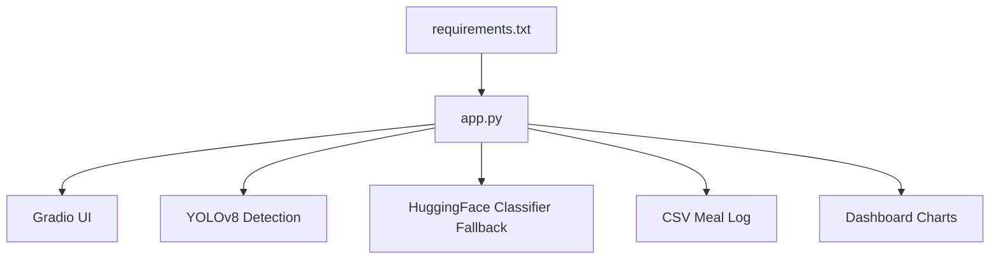
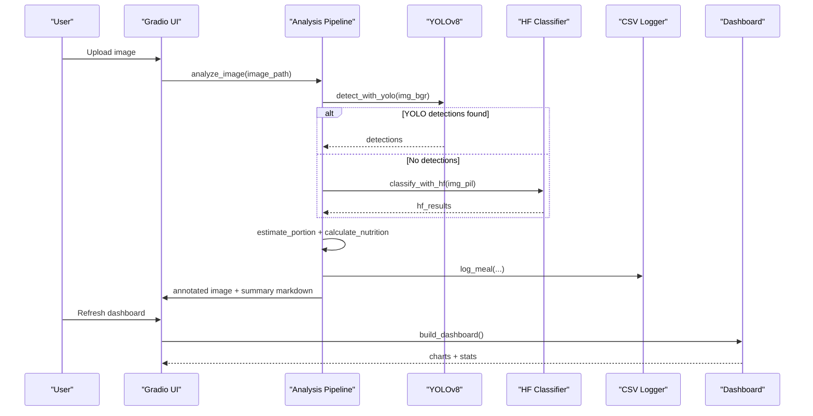
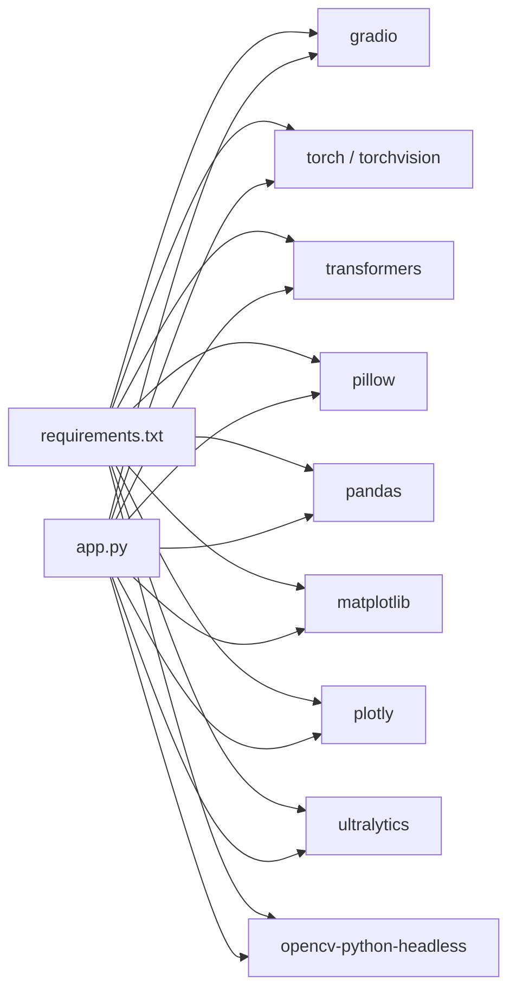

# Troubleshooting

<cite>
**Referenced Files in This Document**
- [app.py](file://app.py)
- [requirements.txt](file://requirements.txt)
</cite>

## Table of Contents
1. [Introduction](#introduction)
2. [Project Structure](#project-structure)
3. [Core Components](#core-components)
4. [Architecture Overview](#architecture-overview)
5. [Detailed Component Analysis](#detailed-component-analysis)
6. [Dependency Analysis](#dependency-analysis)
7. [Performance Considerations](#performance-considerations)
8. [Troubleshooting Guide](#troubleshooting-guide)
9. [Conclusion](#conclusion)
10. [Appendices](#appendices)

## Introduction
This document provides comprehensive troubleshooting guidance for NutriSnap AI, a single-file application that detects food in images, estimates portions, calculates nutrition, logs meals to CSV, and renders an interactive dashboard via Gradio. It covers installation issues (dependency conflicts, model downloads, GPU/CPU compatibility), runtime errors (model loading, image processing, CSV corruption), accuracy improvement strategies, performance optimization, debugging techniques, platform-specific notes, and frequently asked questions with step-by-step resolutions.

## Project Structure
NutriSnap AI is implemented as a single Python script with a minimal dependency list:
- app.py: Main application logic including model loading, detection pipeline, CSV logging, dashboard generation, and Gradio UI.
- requirements.txt: Declares required packages for the application.

**Diagram sources**
- [app.py:1-544](file://app.py#L1-L544)
- [requirements.txt:1-11](file://requirements.txt#L1-L11)

**Section sources**
- [app.py:1-544](file://app.py#L1-L544)
- [requirements.txt:1-11](file://requirements.txt#L1-L11)

## Core Components
- Model Loading: YOLOv8n model for multi-food detection; HuggingFace classifier as fallback when YOLO finds no items.
- Image Processing: OpenCV and PIL used to read, convert, and annotate images.
- Nutrition Calculation: In-memory database maps detected foods to per-100g macros and typical portion grams; portion estimation uses bounding box area ratios.
- Logging: CSV file meal_log.csv stores daily entries with date/time, food, macros, portion, and confirmation flag.
- Dashboard: Plotly-based charts visualize daily calories, macro distribution, weekly trends, and top foods.
- UI: Gradio Blocks provide tabs for upload/analysis, dashboard, log table, and tips.

Key responsibilities and locations:
- Model loading functions and fallback logic: [app.py:112-138](file://app.py#L112-L138)
- Detection and classification pipelines: [app.py:212-264](file://app.py#L212-L264)
- Portion estimation and nutrition calculation: [app.py:198-191](file://app.py#L198-L191), [app.py:179-191](file://app.py#L179-L191)
- CSV I/O and migration handling: [app.py:145-176](file://app.py#L145-L176)
- Dashboard generation: [app.py:359-414](file://app.py#L359-L414)
- UI event handlers: [app.py:466-530](file://app.py#L466-L530)

**Section sources**
- [app.py:112-138](file://app.py#L112-L138)
- [app.py:179-191](file://app.py#L179-L191)
- [app.py:198-210](file://app.py#L198-L210)
- [app.py:212-264](file://app.py#L212-L264)
- [app.py:284-352](file://app.py#L284-L352)
- [app.py:359-414](file://app.py#L359-L414)
- [app.py:466-530](file://app.py#L466-L530)

## Architecture Overview
The end-to-end flow starts with user upload, proceeds through detection/classification, then nutrition calculation, logging, annotation, and dashboard updates.

**Diagram sources**
- [app.py:284-352](file://app.py#L284-L352)
- [app.py:359-414](file://app.py#L359-L414)
- [app.py:466-530](file://app.py#L466-L530)

## Detailed Component Analysis

### Installation and Dependency Issues
Common problems and resolutions:
- Missing or incompatible packages: Ensure all dependencies from requirements.txt are installed in a clean environment. Use a virtual environment to avoid system-wide conflicts.
- Torch/OpenCV compatibility: The app uses torch, torchvision, transformers, ultralytics, opencv-python-headless, pillow, pandas, matplotlib, plotly, and gradio. Mismatches between CUDA-enabled torch and your GPU drivers can cause import or runtime failures. Prefer CPU-only torch if GPU support is problematic.
- Ultralytics model download failures: The first run attempts to download yolov8n.pt. Network restrictions or firewall rules may block this. Pre-download the model or configure proxy settings accordingly.
- Transformers cache and model downloads: The HF classifier downloads yvelos/beit-food-384 on first use. If downloads fail due to network issues, ensure internet access or pre-cache models.

Resolution steps:
- Create a fresh virtual environment and install requirements:
  - python -m venv .venv
  - source .venv/bin/activate (Linux/macOS) or .venv\Scripts\activate (Windows)
  - pip install -r requirements.txt
- If GPU-related errors occur, install CPU-only torch:
  - pip uninstall torch torchvision
  - pip install torch torchvision --index-url https://download.pytorch.org/whl/cpu
- For slow or blocked downloads, set proxies or mirror URLs as needed by your environment.

**Section sources**
- [requirements.txt:1-11](file://requirements.txt#L1-L11)
- [app.py:112-138](file://app.py#L112-L138)

### Runtime Errors: Model Loading Failures
Symptoms:
- YOLO fails to load or detect; HF classifier fails to load.
- Errors during first-run model downloads.

Diagnosis:
- Check console output for messages indicating model load success/failure.
- Verify internet connectivity and disk space for model caches.
- Confirm correct torch version matches your hardware (CPU vs GPU).

Resolutions:
- Reinstall torch with appropriate index for CPU-only builds if GPU is unavailable or drivers are mismatched.
- Clear model caches if corrupted:
  - Ultralytics cache directory under ~/.cache/ultralytics
  - Transformers cache under ~/.cache/huggingface
- Retry launching the app after clearing caches.

**Section sources**
- [app.py:112-138](file://app.py#L112-L138)

### Runtime Errors: Image Processing Errors
Symptoms:
- Errors opening images, converting color spaces, or drawing annotations.
- Blank or incorrect outputs after analysis.

Diagnosis:
- Validate input image format and path.
- Inspect image dimensions and channel order (RGB/BGR conversions).
- Check for corrupted or unsupported image files.

Resolutions:
- Ensure images are valid and readable by PIL and OpenCV.
- Avoid extremely large images; consider resizing before analysis if memory constraints exist.
- Re-upload images if they appear corrupted or incomplete.

**Section sources**
- [app.py:284-352](file://app.py#L284-L352)

### Runtime Errors: CSV File Corruption
Symptoms:
- Dashboard shows no data or malformed charts.
- Reading log returns empty DataFrame or errors.

Diagnosis:
- Check meal_log.csv exists and has expected headers.
- Validate numeric columns for Calories, Protein (g), Carbs (g), Fat (g).
- Look for mixed types or missing values causing coercion issues.

Resolutions:
- Delete or rename meal_log.csv to regenerate with correct headers on next run.
- Manually fix malformed rows ensuring consistent column order and numeric formats.
- Use the app’s built-in migration logic which fills missing columns with empty strings when reading.

**Section sources**
- [app.py:145-176](file://app.py#L145-L176)
- [app.py:359-414](file://app.py#L359-L414)

### Poor Detection Accuracy
Causes:
- Low-quality images (blurry, dark, cluttered backgrounds).
- Foods not represented well in YOLO COCO classes or HF classifier training data.
- Unfavorable lighting or extreme angles.

Recommendations:
- Lighting: Use bright, even lighting; avoid harsh shadows and backlighting.
- Image quality: Focus on clear, high-resolution photos; include the full plate; minimize background clutter.
- Food type limitations: The app relies on YOLO COCO food classes and a general food classifier; highly specific dishes or non-standard presentations may not be recognized accurately.

Expected behavior:
- If YOLO finds no items, the app falls back to the HF classifier and assigns a full-image bounding box for visualization.

**Section sources**
- [app.py:212-264](file://app.py#L212-L264)
- [app.py:284-352](file://app.py#L284-L352)

### Performance Optimization
Slow analysis times:
- Reduce image resolution before analysis if you control preprocessing.
- Disable verbose outputs to reduce overhead.
- Ensure models are cached locally to avoid repeated downloads.

Memory usage reduction:
- Use CPU-only torch if GPU memory is constrained.
- Close unused applications to free RAM.
- Avoid analyzing very large images; consider downsampling.

Model caching strategies:
- Ultralytics caches models in ~/.cache/ultralytics; keep them there to speed up subsequent runs.
- Transformers caches models in ~/.cache/huggingface; pre-download and store models to avoid network delays.

**Section sources**
- [app.py:112-138](file://app.py#L112-L138)
- [app.py:284-352](file://app.py#L284-L352)

### Debugging Approaches
Detection pipeline:
- Inspect console logs for YOLO and HF classifier load/detection messages.
- Validate detections by checking returned lists and confidence thresholds.

Nutrition calculations:
- Verify food keys match the internal database mapping; unknown foods return None and are skipped.
- Confirm portion estimation logic based on bounding box area relative to image size.

Dashboard generation:
- Ensure CSV has correct headers and numeric values; the app coerces and fills missing values.
- Refresh dashboard to recompute charts from updated log data.

Logging techniques:
- Observe print statements prefixed with [NutriSnap] for status and error messages.
- Check meal_log.csv contents to verify logged entries and timestamps.

**Section sources**
- [app.py:112-138](file://app.py#L112-L138)
- [app.py:179-191](file://app.py#L179-L191)
- [app.py:212-264](file://app.py#L212-L264)
- [app.py:359-414](file://app.py#L359-L414)

### Platform-Specific Issues
Windows:
- Path separators and permissions: Ensure the working directory allows writing meal_log.csv.
- Antivirus/firewall blocking model downloads: Allow outbound connections for model retrieval.
- CUDA setup: If using GPU, confirm NVIDIA drivers and CUDA toolkit versions compatible with torch.

macOS:
- Homebrew/OpenCV: Using opencv-python-headless avoids GUI backend issues on headless systems.
- Python environment: Use venv to isolate dependencies and avoid conflicts with system Python.

Linux:
- Headless environments: opencv-python-headless is suitable for servers without display servers.
- Package managers: Install system-level dependencies only if required by underlying libraries; prefer pip-managed packages.

**Section sources**
- [requirements.txt:1-11](file://requirements.txt#L1-L11)
- [app.py:1-544](file://app.py#L1-L544)

## Dependency Analysis
The application depends on several key libraries for vision, ML inference, UI, and data visualization.

**Diagram sources**
- [requirements.txt:1-11](file://requirements.txt#L1-L11)
- [app.py:1-544](file://app.py#L1-L544)

**Section sources**
- [requirements.txt:1-11](file://requirements.txt#L1-L11)
- [app.py:1-544](file://app.py#L1-L544)

## Performance Considerations
- Prefer CPU-only torch in constrained environments to avoid GPU driver mismatches.
- Cache models locally to reduce startup time and network latency.
- Limit image sizes to balance accuracy and speed.
- Use the built-in fallback mechanism to maintain functionality when primary detection fails.
- Monitor memory usage and close unnecessary processes to prevent slowdowns.

[No sources needed since this section provides general guidance]

## Troubleshooting Guide

### Common Installation Issues
- Dependency conflicts:
  - Symptom: Import errors or package incompatibilities.
  - Resolution: Use a clean virtual environment and reinstall requirements.txt.
- Model download failures:
  - Symptom: First-run hangs or errors downloading yolov8n.pt or HF model.
  - Resolution: Check network/proxy settings; clear caches; retry launch.
- GPU/CPU compatibility:
  - Symptom: CUDA errors or device mismatch.
  - Resolution: Switch to CPU-only torch; update drivers if using GPU.

**Section sources**
- [requirements.txt:1-11](file://requirements.txt#L1-L11)
- [app.py:112-138](file://app.py#L112-L138)

### Runtime Errors
- Model loading failures:
  - Symptom: Console prints failure messages; no detections.
  - Resolution: Reinstall torch; clear caches; verify internet access.
- Image processing errors:
  - Symptom: Exceptions when opening or annotating images.
  - Resolution: Validate image integrity; use supported formats; avoid oversized images.
- CSV file corruption:
  - Symptom: Dashboard shows no data; parsing errors.
  - Resolution: Regenerate CSV by deleting or renaming meal_log.csv; ensure numeric columns.

**Section sources**
- [app.py:145-176](file://app.py#L145-L176)
- [app.py:284-352](file://app.py#L284-L352)

### Poor Detection Accuracy
- Lighting recommendations:
  - Use bright, even lighting; avoid shadows and backlighting.
- Image quality guidelines:
  - Capture clear, focused images; include the entire plate; minimize clutter.
- Food type limitations:
  - Recognized foods align with YOLO COCO classes and HF classifier capabilities; highly specific or unusual dishes may not be detected reliably.

**Section sources**
- [app.py:212-264](file://app.py#L212-L264)
- [app.py:284-352](file://app.py#L284-L352)

### Performance Optimization Techniques
- Slow analysis times:
  - Reduce image resolution; ensure models are cached; disable verbose outputs.
- Memory usage reduction:
  - Use CPU-only torch; avoid large images; free system memory.
- Model caching strategies:
  - Keep Ultralytics and Transformers caches intact; pre-download models.

**Section sources**
- [app.py:112-138](file://app.py#L112-L138)
- [app.py:284-352](file://app.py#L284-L352)

### Debugging Approaches
- Detection pipeline:
  - Check console logs for load/detection messages; validate detection lists and confidence thresholds.
- Nutrition calculations:
  - Verify food keys map to the internal database; unknown foods are skipped.
- Dashboard generation:
  - Ensure CSV headers and numeric values are correct; refresh dashboard to recompute charts.
- Logging techniques:
  - Observe [NutriSnap] print statements; inspect meal_log.csv for entries and timestamps.

**Section sources**
- [app.py:112-138](file://app.py#L112-L138)
- [app.py:179-191](file://app.py#L179-L191)
- [app.py:212-264](file://app.py#L212-L264)
- [app.py:359-414](file://app.py#L359-L414)

### Platform-Specific Issues
- Windows:
  - Permissions and antivirus: Allow writing meal_log.csv and model downloads.
  - CUDA setup: Ensure compatible drivers and toolkits if using GPU.
- macOS:
  - Environment isolation: Use venv; headless OpenCV avoids GUI backend issues.
- Linux:
  - Headless systems: opencv-python-headless is recommended; rely on pip packages.

**Section sources**
- [requirements.txt:1-11](file://requirements.txt#L1-L11)
- [app.py:1-544](file://app.py#L1-L544)

### Frequently Asked Questions (FAQ)
- Q: Why does my first run take long?
  - A: Models are downloaded and cached. Subsequent runs will be faster.
- Q: How do I switch to CPU-only mode?
  - A: Reinstall torch with CPU index to avoid GPU dependencies.
- Q: What should I do if the dashboard shows no data?
  - A: Ensure meal_log.csv exists with correct headers; delete/rename it to regenerate; refresh dashboard.
- Q: Why are some foods not detected?
  - A: They may not match YOLO COCO classes or HF classifier categories; improve image quality and lighting.
- Q: How can I improve accuracy?
  - A: Use clear, well-lit images; include the full plate; avoid cluttered backgrounds.
- Q: Where are models cached?
  - A: Ultralytics under ~/.cache/ultralytics; Transformers under ~/.cache/huggingface.
- Q: How do I reset the meal log?
  - A: Delete or rename meal_log.csv; the app regenerates it with proper headers on next run.

[No sources needed since this section summarizes common issues and solutions]

## Conclusion
NutriSnap AI provides a streamlined workflow for food detection, nutrition estimation, logging, and visualization. Most issues stem from environment setup, model downloads, image quality, and CSV integrity. By following the troubleshooting steps, optimizing performance, and applying best practices for image capture, users can achieve reliable results across platforms.

[No sources needed since this section summarizes without analyzing specific files]

## Appendices

### Quick Start Checklist
- Create virtual environment and install requirements.
- Launch app and allow model downloads on first run.
- Upload a clear, well-lit image of a meal.
- Review annotated result and summary.
- Refresh dashboard to view trends and statistics.

[No sources needed since this section provides general guidance]