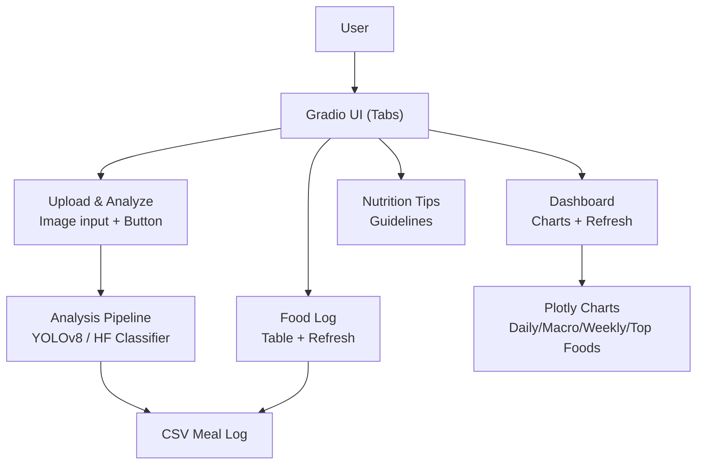
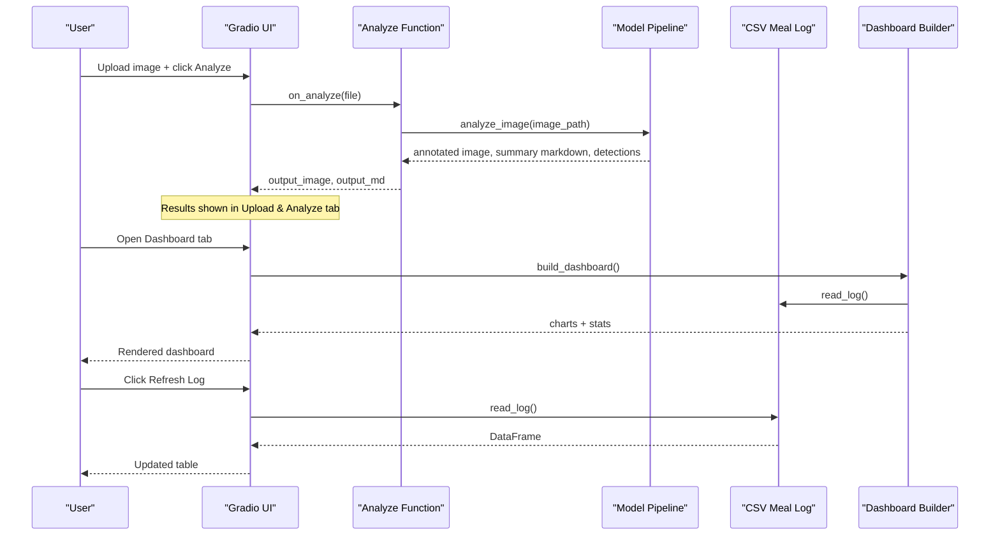

# User Interface Guide

<cite>
**Referenced Files in This Document**
- [app.py](file://app.py)
- [requirements.txt](file://requirements.txt)
</cite>

## Table of Contents
1. [Introduction](#introduction)
2. [Project Structure](#project-structure)
3. [Core Components](#core-components)
4. [Architecture Overview](#architecture-overview)
5. [Detailed Component Analysis](#detailed-component-analysis)
6. [Dependency Analysis](#dependency-analysis)
7. [Performance Considerations](#performance-considerations)
8. [Troubleshooting Guide](#troubleshooting-guide)
9. [Conclusion](#conclusion)
10. [Appendices](#appendices)

## Introduction
This guide explains the user interface of NutriSnap AI, a Gradio-based web application for food tracking and nutrition analysis. It covers the tabbed layout, how to upload and analyze images, interpret dashboard charts, review your food log, and use nutrition tips. It also includes UI customization notes, responsive design considerations, accessibility features, troubleshooting guidance, browser compatibility, and mobile usage tips.

## Project Structure
The application is implemented as a single-file Gradio app that:
- Accepts meal photos and analyzes them using YOLOv8 with a HuggingFace classifier fallback
- Logs meals to a CSV file and renders interactive dashboards
- Provides a tabbed UI with Upload & Analyze, Dashboard, Food Log, and Nutrition Tips tabs

**Diagram sources**
- [app.py:466-530](file://app.py#L466-L530)
- [app.py:284-353](file://app.py#L284-L353)
- [app.py:359-414](file://app.py#L359-L414)

**Section sources**
- [app.py:1-10](file://app.py#L1-L10)
- [app.py:466-530](file://app.py#L466-L530)

## Core Components
- Tabbed Interface: Four main tabs—Upload & Analyze, Dashboard, Food Log, Nutrition Tips.
- Image Upload & Analysis: Accepts image files, runs detection/classification, annotates results, and logs meals.
- Dashboard: Displays daily calories, macro distribution, weekly trends, and top foods charts; refreshable.
- Food Log: Shows historical meal data in a table; refreshable.
- Nutrition Tips: Static guidelines and best practices.

Key behaviors:
- The app initializes models at startup and loads dashboard and log data on page load.
- Buttons trigger analysis or refresh actions that update outputs without full page reloads.

**Section sources**
- [app.py:466-530](file://app.py#L466-L530)
- [app.py:537-543](file://app.py#L537-L543)

## Architecture Overview
The UI orchestrates user interactions and routes them to backend functions that perform model inference, data logging, and chart generation.

**Diagram sources**
- [app.py:507-528](file://app.py#L507-L528)
- [app.py:284-353](file://app.py#L284-L353)
- [app.py:359-414](file://app.py#L359-L414)

## Detailed Component Analysis

### Upload & Analyze Tab
Purpose:
- Accept a meal photo and return an annotated image plus a summary of detected foods, portions, and nutrition totals.

Supported inputs:
- Image files via a file uploader configured for images only.

Workflow:
- When you click Analyze Food, the app:
  - Loads the image and converts it for processing
  - Attempts multi-food detection with YOLOv8
  - If no detections, falls back to a HuggingFace image classifier
  - Estimates portion sizes based on bounding box area relative to the image
  - Calculates nutrition values from a built-in database
  - Logs each detected item to the CSV meal log
  - Draws annotations on the image and returns both the annotated image and a summary table

Output:
- Annotated image showing detected items with labels and confidence
- Markdown summary listing each food, portion size, grams, calories, protein, carbs, fat, and totals

Notes:
- If no food is detected, a message prompts you to try a clearer photo.

**Section sources**
- [app.py:473-485](file://app.py#L473-L485)
- [app.py:507-520](file://app.py#L507-L520)
- [app.py:284-353](file://app.py#L284-L353)

### Dashboard Tab
Purpose:
- Visualize your nutrition progress with four charts and summary statistics.

Charts:
- Daily Calories: Bar chart of total calories per day
- Macro Distribution: Pie chart of total protein, carbs, and fat
- Weekly Trend: Line chart of weekly calorie totals
- Top Foods: Horizontal bar chart of most frequently eaten foods

Interpretation guidance:
- Compare daily calories against recommended intake to avoid over- or under-eating
- Aim for a balanced macro split (roughly 25% protein, 50% carbs, 25% fat)
- Look for consistency in weekly trends rather than perfection
- Use top foods to identify variety gaps in your diet

Refresh:
- Click Refresh Dashboard to regenerate charts from the latest CSV data
- On page load, the dashboard automatically loads current data

Summary stats:
- Total meals logged, total calories, and average calories per meal

**Section sources**
- [app.py:486-495](file://app.py#L486-L495)
- [app.py:359-414](file://app.py#L359-L414)
- [app.py:521-527](file://app.py#L521-L527)

### Food Log Tab
Purpose:
- Review historical meal entries in a table format.

Features:
- Displays columns including date, time, food, calories, protein, carbs, fat, portion, and confirmation status
- Refresh button updates the table with the latest CSV contents
- Automatically migrates missing columns if the CSV schema changes

Usage:
- Click Refresh Log to pull the latest entries from the CSV file

**Section sources**
- [app.py:497-500](file://app.py#L497-L500)
- [app.py:145-176](file://app.py#L145-L176)
- [app.py:516-523](file://app.py#L516-L523)

### Nutrition Tips Tab
Purpose:
- Provide dietary guidelines and best practices to help you make informed choices.

Content highlights:
- Recommended daily intake for adults by gender
- Tracking best practices (log immediately, clear photos, include full plate, review portions)
- How to interpret dashboard metrics
- Healthy eating reminders (vegetables, whole grains, hydration, limiting processed foods, lean protein)

**Section sources**
- [app.py:502-504](file://app.py#L502-L504)
- [app.py:430-463](file://app.py#L430-L463)

## Dependency Analysis
External libraries used by the UI and its workflows:
- Gradio: Web UI framework
- Plotly and Matplotlib: Chart rendering
- Pandas: Data handling for CSV and charts
- OpenCV and Pillow: Image processing and annotation
- Ultralytics (YOLOv8): Primary food detection model
- Transformers and Torch: Fallback image classification

These dependencies are declared in the requirements file and imported within the application.

**Section sources**
- [requirements.txt:1-11](file://requirements.txt#L1-L11)
- [app.py:8-23](file://app.py#L8-L23)

## Performance Considerations
- Model loading occurs at startup; ensure sufficient memory and GPU resources if available for faster inference.
- Large images may increase processing time; consider uploading reasonably sized photos.
- The dashboard regenerates charts on refresh; frequent refreshes will recompute aggregations.
- CSV operations are lightweight but can be affected by very large log files.

[No sources needed since this section provides general guidance]

## Troubleshooting Guide
Common issues and resolutions:
- No food detected:
  - Ensure the photo clearly shows the entire plate with good lighting
  - Try a different angle or background
  - The app will prompt you to try a clearer photo when no items are found
- Models fail to load:
  - Check internet connectivity for downloading models
  - Verify required packages are installed as listed in requirements
- Dashboard not updating:
  - Click Refresh Dashboard to reload charts from the latest CSV
  - Confirm that meals have been logged via the Upload & Analyze tab
- Food Log empty or outdated:
  - Click Refresh Log to pull the latest CSV data
  - Ensure the CSV file exists and is writable by the app

Browser compatibility:
- Works in modern browsers that support HTML5 file uploads and JavaScript
- For best performance, use up-to-date versions of Chrome, Firefox, Safari, or Edge

Mobile usage:
- The interface is responsive and adapts to smaller screens
- On mobile, ensure stable network access for model downloads and uploads
- Consider using a larger screen for detailed chart interpretation

Accessibility:
- The UI uses semantic elements and descriptive labels for components
- Keyboard navigation is supported through standard Gradio controls
- Color choices aim for readability; charts use distinct colors for clarity

**Section sources**
- [app.py:507-520](file://app.py#L507-L520)
- [app.py:521-528](file://app.py#L521-L528)
- [app.py:112-138](file://app.py#L112-L138)

## Conclusion
NutriSnap AI’s Gradio interface provides an intuitive, tabbed experience for capturing meals, analyzing nutrition, visualizing trends, and learning healthy habits. Use the Upload & Analyze tab to capture meals, explore the Dashboard for insights, review your history in the Food Log, and consult Nutrition Tips for guidance. Keep your environment updated and follow the troubleshooting tips to ensure smooth operation across devices and browsers.

[No sources needed since this section summarizes without analyzing specific files]

## Appendices

### UI Customization Notes
- Theme and styling:
  - The app uses a soft theme and custom CSS to center the title, style the subtitle, constrain container width, add card-like visuals, and hide the footer
- Layout:
  - Tabs organize functionality into focused sections
  - Rows and columns align inputs, outputs, and buttons consistently

**Section sources**
- [app.py:421-428](file://app.py#L421-L428)
- [app.py:466-530](file://app.py#L466-L530)

### Supported File Types and Formats
- Image uploads:
  - The uploader accepts image files only
  - Typical formats handled by the underlying image libraries include common raster formats such as JPEG, PNG, and others supported by Pillow

**Section sources**
- [app.py:478-479](file://app.py#L478-L479)
- [app.py:291-293](file://app.py#L291-L293)

### Mobile and Responsive Design Considerations
- The Gradio container is constrained to a maximum width for readability on larger screens
- On smaller screens, the layout stacks vertically for usability
- Touch-friendly buttons and clear labels improve interaction on mobile devices

**Section sources**
- [app.py:421-428](file://app.py#L421-L428)
- [app.py:466-530](file://app.py#L466-L530)