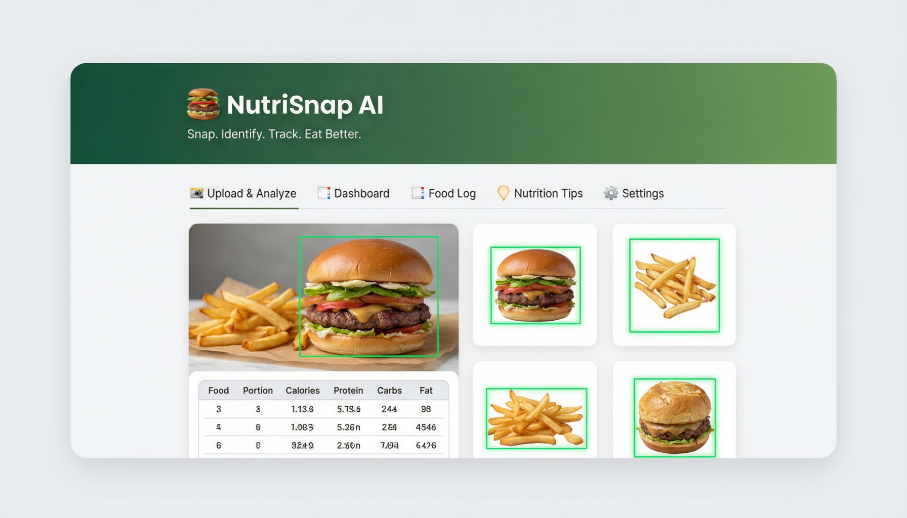
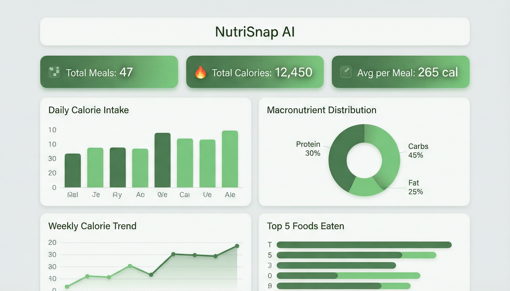
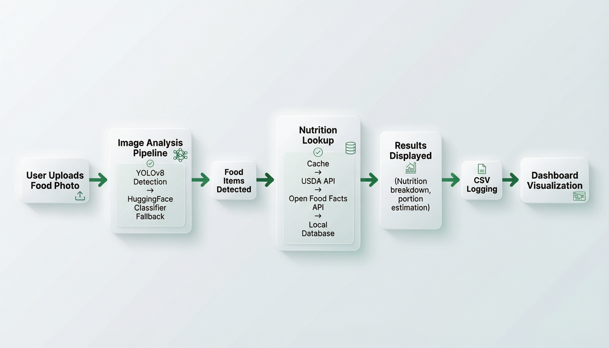

# 🍔 NutriSnap AI

> **AI-powered food recognition & nutrition tracking — snap a photo, identify foods, log meals, and visualize your diet.**

[](https://python.org)
[](https://docs.ultralytics.com/)
[](https://gradio.app)
[](https://huggingface.co/yvelos/beit-food-384)
[](#license)

---

## Table of Contents

- [Prerequisites](#prerequisites)
- [Overview](#overview)
- [Quick Start](#quick-start)
- [Screenshots & UI Description](#screenshots--ui-description)
- [Features](#features)
- [Tech Stack](#tech-stack)
- [Installation & Setup](#installation--setup)
- [Configuration](#configuration)
- [Usage](#usage)
- [First Launch — What to Expect](#first-launch--what-to-expect)
- [Nutrition Lookup Flow](#nutrition-lookup-flow)
- [API Endpoints (Fallback Server)](#api-endpoints-fallback-server)
- [File Structure](#file-structure)
- [Architecture](#architecture)
- [Dependencies](#dependencies)
- [Troubleshooting](#troubleshooting)
- [Getting Help](#getting-help)
- [License](#license)

---

## Prerequisites

Before you begin, make sure you have:

| Requirement | Details |
|-------------|---------|
| **Python 3.9+** | [Download from python.org](https://www.python.org/downloads/) — check the box **"Add Python to PATH"** during installation on Windows |
| **pip** | Comes bundled with Python — no separate install needed |
| **Internet connection** | Required for downloading dependencies (~2 GB) and AI models (~350 MB) |
| **~3 GB disk space** | For PyTorch, Transformers, and model weights |

Verify Python is installed:

```bash
python3 --version   # macOS/Linux
python --version    # Windows
```

You should see something like `Python 3.11.5`. If not, see the [Troubleshooting](#troubleshooting) section for platform-specific install tips.

---

## Overview

NutriSnap AI is a **food tracking application** that combines computer vision with nutrition databases to deliver automatic meal analysis from photos. Upload a picture of your plate and the app will:

1. **Detect** individual food items using YOLOv8 object detection (10 COCO food classes)
2. **Classify** foods using a HuggingFace Beit vision transformer as a fallback (`yvelos/beit-food-384`)
3. **Estimate** portion sizes based on bounding box area relative to image size (Small / Medium / Large)
4. **Look up** nutrition data through a 5-step fallback chain (cache → USDA API → Open Food Facts → local database → error)
5. **Log** every meal with timestamps to a CSV file
6. **Visualize** your eating patterns through an interactive dashboard with 4 charts and 3 summary cards

The app runs as a **Gradio web interface** by default, with a fully functional **fallback HTML/CSS/JS interface** that auto-activates if Gradio is unavailable or via the `--fallback` CLI flag.

---

## Quick Start

> **First time?** Check the [Prerequisites](#prerequisites) section below to make sure you have Python 3.9+ installed.

### macOS / Linux — Automatic (Recommended)

The `start.sh` script handles everything: it checks for Python, creates a virtual environment, installs all dependencies, and launches the app.

```bash
# 1. Open Terminal and navigate to the project folder
cd /path/to/NutriSnapAI

# 2. Make the script executable (first time only)
chmod +x start.sh

# 3. Run it
./start.sh
```

> To force the fallback HTML interface: `./start.sh --fallback`

### Windows — Automatic (Recommended)

The `start.bat` script handles everything automatically.

```cmd
# 1. Open Command Prompt (cmd.exe) and navigate to the project folder
cd C:\path\to\NutriSnapAI

# 2. Run the script
start.bat
```

> **Tip:** You can also double-click `start.bat` in File Explorer to launch the app.
>
> To force the fallback HTML interface: `start.bat --fallback`

### Manual Setup (Any Platform)

If you prefer to run commands yourself:

```bash
# 1. Navigate to the project folder
cd /path/to/NutriSnapAI

# 2. Create a virtual environment
python3 -m venv venv           # macOS/Linux
python -m venv venv            # Windows

# 3. Activate it
source venv/bin/activate       # macOS/Linux
venv\Scripts\activate          # Windows (Command Prompt)

# 4. Upgrade pip (recommended)
pip install --upgrade pip

# 5. Install all dependencies (~2 GB, takes a few minutes)
pip install -r requirements.txt

# 6. Launch the app
python app.py                  # Gradio mode (default)
python app.py --fallback       # Force fallback HTML interface
```

---

## Screenshots & UI Description

### Upload & Analyze Tab


### Dashboard


### Interface Theme

Both the Gradio and fallback HTML interfaces share a **green health-themed** design:

| Token | Hex | Usage |
|-------|-----|-------|
| **Primary** | `#2C7A4A` | Forest green — buttons, headers, chart accents |
| **Secondary** | `#1A5A3A` | Deep green — header gradient end, stat cards |
| **Accent** | `#4CAF50` | Material green — highlights, secondary buttons |
| **Background** | `#F5F9F8` | Light mint tint — page background |
| **Chart palette** | `#2C7A4A`, `#4CAF50`, `#81C784`, `#A5D6A7` | Consistent green gradient across all charts |

The fallback HTML UI supports a full **dark mode** via CSS custom properties (`[data-theme="dark"]`) with deep green/teal tones (`#0f1a14` background, `#162420` surfaces).

### 5-Tab Layout

| Tab | Icon | Description |
|-----|------|-------------|
| **Upload & Analyze** | 📸 | Drag-and-drop image upload zone with preview thumbnail, AI detection button, annotated results table with bounding boxes, cropped food thumbnail gallery, and a manual entry form (food name, calories, protein, carbs, fat) |
| **Dashboard** | 📊 | 3 summary cards (Total Meals, Total Calories, Avg per Meal) + 4 interactive charts: daily calorie bar chart, macronutrient doughnut/pie chart, weekly calorie trend line, top 8 foods horizontal bar chart |
| **Food Log** | 📋 | Sortable table of all logged meals with columns: Date, Time, Food, Calories, Protein, Carbs, Fat, Portion. Click column headers to sort. |
| **Nutrition Tips** | 💡 | RDI reference tables (adult male/female), tracking best practices, dashboard interpretation guide, healthy eating reminders |
| **Settings** | ⚙️ | USDA API key input with Test Connection & Save Key buttons, cache management (view count, clear), CSV export, dark mode toggle switch |

### Fallback UI Extras

The standalone HTML interface adds:
- **Toast notifications** (success/error/info) with slide-in animation
- **Loading spinner overlay** during API calls
- **CSS-based dark mode** with smooth transitions (persisted to `localStorage` + server config)
- **Drag-and-drop zone** with hover/dragover visual feedback and image preview
- **Responsive layout** — mobile-friendly with column-stacked forms below 600px

---

## Features

### Food Detection

| Feature | Details |
|---------|---------|
| **YOLOv8 multi-food detection** | Uses `yolov8n.pt` (nano model) trained on the COCO dataset. Detects **10 food classes**: banana, apple, sandwich, orange, broccoli, carrot, hot dog, pizza, donut, cake. Confidence threshold > 0.25. |
| **HuggingFace classifier fallback** | Uses [`yvelos/beit-food-384`](https://huggingface.co/yvelos/beit-food-384) Beit vision transformer. Activates when YOLO finds no food items in the image. Returns top-3 predictions matched against the local nutrition database. |
| **Bounding box annotation** | Draws colored rectangles around detected foods with labels showing food name and calorie count. Uses an 8-color rotation palette. |
| **Cropped food thumbnails** | Each detected food item is cropped from the image and resized to a 200×200 thumbnail. The Gradio UI displays these as an interactive gallery below the annotated image. |
| **Portion estimation** | Calculates bounding box area relative to total image area: **Small** (< 5%, 0.5× multiplier), **Medium** (5–15%, 1.0×), **Large** (> 15%, 1.5×). Estimated grams = `typical_g × portion_multiplier`. |

### Nutrition Data Sources (5-Step Fallback Chain)

| Priority | Source | Key Required | Description |
|:--------:|--------|:---:|-------------|
| 1 | **JSON cache** | No | Previously looked-up foods stored in `nutrition_cache.json` with 7-day expiry |
| 2 | **USDA FoodData Central API** | Yes | Primary nutrition source — queries `api.nal.usda.gov/fdc/v1/foods/search` with your free API key. Extracts calories (KCAL), protein, carbs (by difference), and total fat. |
| 3 | **Open Food Facts API** | No | Community-driven food database — queries `world.openfoodfacts.org/cgi/search.pl`. Uses per-100g values for energy-kcal, proteins, carbohydrates, and fat. |
| 4 | **Local nutrition database** | No | Built-in `NUTRITION_DB` dictionary with **58 foods** — each entry has calories, protein, carbs, fat (per 100g) and a `typical_g` serving weight |
| 5 | **Error** | — | Returns `None` with a status message if all sources fail |

### Meal Logging & Data Management

- **CSV meal logging** — Every analyzed or manually entered meal is appended to `meal_log.csv` with columns: `Date`, `Time`, `Food`, `Calories`, `Protein (g)`, `Carbs (g)`, `Fat (g)`, `Portion`, `Confirmed`
- **JSON nutrition cache** — Successful API lookups are cached in `nutrition_cache.json` with ISO timestamps and auto-expire after 7 days
- **CSV export** — Download the full meal log CSV from the Settings tab (Gradio: file download widget; Fallback: direct file download via `/api/export/csv`)
- **HTML meal report export** — Generates a styled HTML meal report (`meal_report.html`) from the 10 most recent log entries. Open in any browser and use **Print → Save as PDF** for a PDF copy. No external dependencies needed (replaces the earlier `reportlab` stub).

### Dashboard & Analytics

**4 interactive charts** — Plotly-based in Gradio, Chart.js 4.4.1 in the fallback HTML UI:

| Chart | Type | Data |
|-------|------|------|
| Daily Calorie Intake | Bar chart | Sum of calories grouped by date |
| Macronutrient Distribution | Pie / Doughnut | Total protein (g), carbs (g), fat (g) across all meals |
| Weekly Calorie Trend | Line chart (area fill) | Calories resampled by week (`W` frequency) |
| Top Foods Eaten | Horizontal bar chart | Top 8 most frequently logged foods |

**3 summary cards:**
- **Total Meals** — count of all logged entries
- **Total Calories** — sum of all calories consumed
- **Avg per Meal** — mean calories per logged meal

### User Interface Features

- **Dark mode toggle** — Persisted in `nutri_config.json` (Gradio) and `localStorage` (fallback UI). Applies CSS class overrides **live without restart** in Gradio via injected JS (`document.body.classList.add('dark-mode')`). Applies instantly in the fallback UI via CSS custom properties.
- **Manual calorie/nutrition entry** — Log food name, calories, protein, carbs, and fat without a photo. Available in both the Gradio and fallback interfaces.
- **Loading spinner overlay** — A loading spinner with "Analyzing your meal…" text displays during image analysis in both Gradio (triggered via JS on button click, hidden on output change) and the fallback UI (shown during API calls).
- **Settings tab** — USDA API key management with connection testing, nutrition cache size display and clearing, data export
- **`--fallback` CLI flag** — Force the HTML/CSS/JS interface even if Gradio is available
- **Auto-fallback** — Automatically switches to the HTML interface if Gradio import fails at startup
- **REST API backend** — The fallback server exposes full REST endpoints for all app operations (see [API Endpoints](#api-endpoints-fallback-server))

---

## Tech Stack

| Category | Technology |
|----------|-----------|
| **Language** | Python 3.8+ |
| **Object Detection** | YOLOv8 (ultralytics) — `yolov8n.pt` nano model, COCO-trained |
| **Image Classification** | HuggingFace Transformers — `yvelos/beit-food-384` Beit model |
| **Deep Learning** | PyTorch, TorchVision |
| **Image Processing** | OpenCV (`opencv-python-headless`), Pillow (PIL) |
| **Data Processing** | Pandas, NumPy |
| **Web UI (Primary)** | Gradio (Blocks API with Tabs, Soft theme) |
| **Web UI (Fallback)** | Standalone HTML/CSS/JS with Chart.js 4.4.1 |
| **Charting (Gradio)** | Plotly (express + graph_objects), Matplotlib (Agg backend) |
| **HTTP Server (Fallback)** | Python `http.server` stdlib (`HTTPServer`, `BaseHTTPRequestHandler`) |
| **APIs** | USDA FoodData Central, Open Food Facts |
| **HTTP Client** | Requests (≥ 2.28.0) |
| **Config** | JSON files (`nutri_config.json` for settings, `nutrition_cache.json` for API cache) |

---

## Installation & Setup

### 1. Clone the repository

```bash
git clone <repository-url>
cd NutriSnapAI
```

### 2. Create a virtual environment (recommended)

A virtual environment keeps NutriSnap's dependencies isolated from your system Python.

```bash
python3 -m venv venv           # macOS/Linux
python -m venv venv            # Windows
```

Activate it:

```bash
source venv/bin/activate       # macOS/Linux
venv\Scripts\activate          # Windows (Command Prompt)
```

Your terminal prompt should now show `(venv)` at the beginning — this confirms the environment is active.

### 3. Install dependencies

```bash
pip install --upgrade pip
pip install -r requirements.txt
```

> **Note:** This installs PyTorch, Transformers, YOLOv8, Gradio, and other libraries. The total download is roughly **2 GB**, so expect it to take several minutes depending on your connection.
>
> **Torch install failing?** Try the CPU-only version (smaller download, no GPU required):
> ```bash
> pip install torch torchvision --index-url https://download.pytorch.org/whl/cpu
> pip install -r requirements.txt
> ```

### 4. (Optional) Get a USDA API key

For the best nutrition data coverage, get a free API key from [USDA FoodData Central](https://fdc.nal.usda.gov/api-key-signup.html). Without it, the app falls back to Open Food Facts and the local database. You can enter the key in the **Settings** tab at runtime.

### 5. Launch the app

```bash
python app.py                  # Gradio mode (default)
python app.py --fallback       # Force fallback HTML interface
```

See the [Quick Start](#quick-start) section for one-command startup using `start.sh` or `start.bat`.

---

## Configuration

The app stores settings in **`nutri_config.json`** (auto-created on first save):

```json
{
  "usda_api_key": "",
  "dark_mode": false
}
```

| Setting | Type | Description |
|---------|------|-------------|
| `usda_api_key` | `string` | Your free USDA FoodData Central API key. Enables the primary nutrition lookup source. Get one at [fdc.nal.usda.gov](https://fdc.nal.usda.gov/api-key-signup.html). |
| `dark_mode` | `boolean` | Dark theme toggle. Takes full effect on app restart in Gradio mode. Applies instantly in the fallback HTML UI via CSS custom properties. |

### Runtime-Generated Files

| File | Purpose | Auto-Created |
|------|---------|:---:|
| `meal_log.csv` | All logged meals with timestamps and nutrition data | Yes, on first log |
| `nutrition_cache.json` | Cached nutrition API responses with timestamps | Yes, on first API lookup |
| `nutri_config.json` | User settings (API key, dark mode) | Yes, on first settings save |
| `yolov8n.pt` | YOLOv8 nano model weights | Yes, auto-downloaded by ultralytics |

---

## Usage

### Normal Mode (Gradio)

```bash
python app.py
```

Launches the Gradio web interface with a **public share link** (`share=True`). The app loads YOLOv8n and the HuggingFace classifier on startup, then opens the browser. Dashboard and food log are loaded on startup via `demo.load()`.

### Fallback Mode (HTML/CSS/JS)

```bash
python app.py --fallback
```

Starts the built-in HTTP server on **port 7860** (`0.0.0.0`) serving the fallback HTML interface with the full REST API backend. Also activates automatically if Gradio is not installed or fails to import.

### Tab-by-Tab Guide

**📸 Upload & Analyze**
1. Upload a meal photo (JPG, PNG, WEBP supported) via file picker or drag-and-drop
2. Click **🔍 Analyze Food**
3. View detected items with bounding boxes on the annotated image, cropped food thumbnails in the gallery, a nutrition summary table, and per-item lookup status messages
4. If detection fails, use the **✏️ Manual Entry** form below to log food by name and nutrition values

**📊 Dashboard**
- Loads automatically on startup (Gradio) or on tab switch / **🔄 Refresh Dashboard** click (fallback)
- Shows 3 summary cards and 4 interactive charts
- Charts are Plotly-based in Gradio, Chart.js-based in the fallback UI

**📋 Food Log**
- Displays all logged meals in a data table
- Click column headers to sort (fallback UI)
- Click **🔄 Refresh Log** to reload data from CSV

**💡 Nutrition Tips**
- Reference guide with RDI tables for adult males and females
- Tracking best practices, dashboard interpretation guide, and healthy eating reminders

**⚙️ Settings**
- **USDA API Key:** Enter your key → click **🔌 Test Connection** → click **💾 Save Key**
- **Cache Management:** View cached item count → click **🗑️ Clear Cache**
- **Export Data:** Click **📊 Export CSV** to download the meal log; click **📄 Export Report** to generate an HTML meal report (open in browser → Print → Save as PDF)
- **Appearance:** Toggle dark mode on/off

---

## First Launch — What to Expect

Once you run `python app.py` (or use `start.sh` / `start.bat`), here's what happens step by step:

### 1. Model loading

The terminal shows `[NutriSnap] Loading models...`. Two models are loaded (and downloaded if not already cached):

| Model | Size | Purpose |
|-------|------|---------|
| **YOLOv8n** (`yolov8n.pt`) | ~6 MB | Food detection — downloaded automatically by Ultralytics on first run |
| **HuggingFace Beit** (`yvelos/beit-food-384`) | ~350 MB | Fallback food classifier — downloaded by Transformers on first run |

These are cached locally after the first download. Subsequent launches are much faster.

### 2. Gradio UI starts

You'll see output like:

```
Running on local URL:  http://127.0.0.1:7860
Running on public URL:  https://xxxxx.gradio.live
```

- Open the **local URL** (`http://127.0.0.1:7860`) in your browser to use the app.
- The **public share link** lets you access the app from other devices or share with others (expires after 72 hours).

### 3. Auto-fallback to HTML interface

If Gradio fails to start for any reason (missing dependency, incompatible environment, etc.), the app **automatically** falls back to a lightweight HTML/CSS/JS interface served at `http://localhost:7860`. No action needed from you. You can also force this mode with `--fallback`.

### 4. Your first analysis

1. Go to the **📸 Upload & Analyze** tab
2. Upload a clear photo of a meal
3. Click **🔍 Analyze Food**
4. The first analysis may take a few extra seconds while the HuggingFace model finishes loading
5. You'll see bounding boxes around detected foods, a nutrition summary table, and cropped food thumbnails

### 5. Dashboard populates after your first meal

The **📊 Dashboard** tab shows "No data yet" until you analyze at least one meal. After your first analysis (or manual entry), refresh the dashboard to see your calorie and macro charts.

---

## Nutrition Lookup Flow

```
Food name (e.g. "pizza")
       │
       ▼
┌──────────────────┐     YES
│ 1. Check cache   │──────────► Return cached data ✅
│   (< 7 days old) │           (scaled by portion grams)
└────────┬─────────┘
         │ NO
         ▼
┌──────────────────┐     YES
│ 2. USDA API      │──────────► Cache result, return ✅
│   (if key set)   │           (api.nal.usda.gov)
└────────┬─────────┘
         │ NO / no key
         ▼
┌──────────────────┐     YES
│ 3. Open Food     │──────────► Cache result, return ✅
│   Facts API      │           (world.openfoodfacts.org)
└────────┬─────────┘
         │ NO
         ▼
┌──────────────────┐     YES
│ 4. Local DB      │──────────► Return local data ⚠️
│   (58 foods)     │           (per-100g × portion)
└────────┬─────────┘
         │ NO
         ▼
┌──────────────────┐
│ 5. Return None   │──────────► "No nutrition data found" ❌
│   (all failed)   │
└──────────────────┘
```

Each step in the chain is reported to the user via status messages (e.g., `✅ Using cached data for Pizza`, `🔍 Searching USDA for Broccoli...`, `⚠️ Using fallback local data for Cake`).

Nutrition values are scaled from per-100g to the estimated portion weight:  
`actual_value = (per_100g_value × portion_grams) / 100`

---

## API Endpoints (Fallback Server)

The fallback HTTP server (port 7860) exposes the following REST API. All JSON endpoints include CORS headers (`Access-Control-Allow-Origin: *`). The server uses a custom multipart/form-data parser (no dependency on the deprecated `cgi` module).

### GET Endpoints

| Endpoint | Description | Response |
|----------|-------------|----------|
| `GET /` | Serves `fallback_ui.html` | `text/html` |
| `GET /api/log` | Returns all meal log entries | `{ "entries": [[...], ...], "columns": ["Date", "Time", ...] }` |
| `GET /api/dashboard` | Returns dashboard chart data | `{ "stats": { "total_meals", "total_calories", "avg_per_meal" }, "daily": { "labels", "values" }, "macros": { "labels", "values" }, "weekly": { "labels", "values" }, "top_foods": { "labels", "values" } }` |
| `GET /api/settings` | Returns current settings | `{ "usda_api_key", "dark_mode", "cache_size" }` |
| `GET /api/export/csv` | Downloads the meal log CSV file | `text/csv` with `Content-Disposition: attachment` |

### POST Endpoints

| Endpoint | Body | Description | Response |
|----------|------|-------------|----------|
| `POST /api/analyze` | `multipart/form-data` with `image` field | Runs the full detection pipeline on the uploaded image | `{ "items": [{ "food", "portion", "grams", "calories", "protein", "carbs", "fat", "confidence" }], "totals": { "calories", "protein", "carbs", "fat" }, "messages": [...] }` |
| `POST /api/log/manual` | `{ "food", "calories", "protein", "carbs", "fat" }` | Logs a manual meal entry to CSV | `{ "success": true, "message": "Logged: ..." }` |
| `POST /api/settings` | `{ "usda_api_key"?, "dark_mode"? }` | Saves settings to `nutri_config.json` | `{ "success": true, "message": "Settings saved." }` |
| `POST /api/settings/test` | `{ "api_key" }` | Tests USDA API connection with a sample query ("apple") | `{ "success": bool, "message": "Connection successful! ..." }` |
| `POST /api/cache/clear` | — | Deletes `nutrition_cache.json` | `{ "success": true, "message": "Cache cleared successfully." }` |

---

## File Structure

```
NutriSnapAI/
├── app.py                  # Main application (1624 lines)
│                           #   Configuration, nutrition DB, API functions, cache system,
│                           #   settings, AI detection, CSV logging, analysis pipeline,
│                           #   dashboard generation, Gradio UI, fallback HTTP server, main entry
├── fallback_ui.html        # Standalone HTML/CSS/JS fallback interface (819 lines)
│                           #   Complete UI with 5 tabs, Chart.js charts, dark mode,
│                           #   drag-and-drop upload, toast notifications, REST API client
├── requirements.txt        # Python dependencies (12 packages)
├── start.sh                # macOS/Linux startup script
├── start.bat               # Windows startup script
├── README.md               # This file
├── docs/
│   └── images/
│       ├── upload_tab.png      # Screenshot of the Upload & Analyze tab
│       ├── dashboard_tab.png   # Screenshot of the Dashboard tab
│       └── architecture_flow.png # Architecture diagram
│
├── [auto-generated at runtime]
│   ├── meal_log.csv        # Meal log with timestamps and nutrition data
│   ├── nutrition_cache.json # Cached nutrition API responses (7-day expiry)
│   ├── nutri_config.json   # User settings (API key, dark mode)
│   ├── meal_report.html    # HTML meal report (generated on Export Report)
│   └── yolov8n.pt          # YOLOv8 nano model (auto-downloaded by ultralytics)
```

---

## Architecture

### app.py Sections (in order)

| Section | Lines | Purpose |
|---------|:-----:|---------|
| **Imports & Config** | 1–46 | Module imports, constants (`CSV_FILE`, `CACHE_FILE`, `CONFIG_FILE`, `CACHE_EXPIRY_DAYS`), color theme tokens |
| **Nutrition Database** | 48–118 | `NUTRITION_DB` dict (58 foods with per-100g macros + `typical_g`), `COCO_FOOD_CLASSES` mapping (10 COCO class IDs → food names) |
| **Nutrition API Functions** | 120–186 | `search_usda_food()` — USDA FoodData Central query; `search_openfoodfacts()` — Open Food Facts query |
| **Cache System** | 189–252 | `_load_cache()`, `_save_cache()`, `cache_nutrition()`, `get_cached_nutrition()`, `get_cache_size()`, `clear_cache()` |
| **Settings Functions** | 255–296 | `load_config()`, `save_config()`, `test_usda_connection()`, `export_csv_file()` |
| **AI Detection** | 298–334 | Global model vars, `load_yolo()`, `load_hf_classifier()` |
| **CSV Logging** | 336–371 | `ensure_csv()`, `log_meal()`, `read_log()` |
| **Analysis Pipeline** | 373–643 | `calculate_nutrition()` (5-step fallback chain), `estimate_portion()`, `detect_with_yolo()`, `classify_with_hf()`, `draw_annotations()`, `analyze_image()` (full pipeline: YOLO → HF → crop thumbnails → nutrition → annotation → summary) |
| **Dashboard** | 645–710 | `build_dashboard()` — generates 4 Plotly figures + HTML summary cards from meal log |
| **Gradio UI** | 712–1237 | `CSS` styles, `TIPS_MD` markdown, `HEADER_HTML`, `generate_meal_report()` (HTML export), `build_ui()` — 5-tab Gradio Blocks interface with all event handlers wired up |
| **Fallback HTTP Server** | 1239–1598 | `parse_multipart()` (custom multipart parser, no deprecated cgi), `start_fallback_server()` — `HTTPServer` on port 7860 with `FallbackHandler` class implementing all REST API endpoints |
| **Main Entry** | 1601–1624 | Loads models, checks `--fallback` flag, tries Gradio launch with auto-fallback to HTTP server |

### Visual Architecture



### Detection Pipeline

```
Input Image (JPG/PNG/WEBP)
    │
    ├─► Convert to NumPy (RGB + BGR for OpenCV)
    │
    ├─► YOLOv8 Detection (COCO food classes, conf > 0.25)
    │     │
    │     ├─ Found items → use bounding boxes
    │     │
    │     └─ Nothing found ↓
    │
    ├─► HuggingFace Beit Classifier (top-5 → match NUTRITION_DB → top 3)
    │     │
    │     ├─ Found matches → use full-image bounding box (10%–90%)
    │     │
    │     └─ Nothing found → "No food items detected"
    │
    ├─► For each detected food:
    │     ├─ estimate_portion(bbox) → Small/Medium/Large + multiplier
    │     ├─ grams = typical_g × multiplier
    │     ├─ calculate_nutrition(food, grams) → 5-step fallback chain
    │     └─ log_meal() → append to CSV
    │
    ├─► draw_annotations() → colored bounding boxes + labels
    │
    └─► Build markdown summary table with totals
```

### Nutrition Pipeline

```
calculate_nutrition(food_name, grams)
    │
    ├─ 1. get_cached_nutrition(key) → hit? scale & return
    ├─ 2. search_usda_food(query, api_key) → hit? cache, scale & return
    ├─ 3. search_openfoodfacts(query) → hit? cache, scale & return
    ├─ 4. NUTRITION_DB[key] → hit? scale & return
    └─ 5. Return None (all sources failed)
```

---

## Dependencies

All dependencies are listed in `requirements.txt`:

| Package | Version | Purpose |
|---------|---------|---------|
| `gradio` | latest | Primary web UI framework — Blocks API with Tabs, file upload, plots, dataframes |
| `torch` | latest | Deep learning backend — required by YOLOv8 and HuggingFace Transformers |
| `torchvision` | latest | Image transforms and pretrained model support for PyTorch |
| `transformers` | latest | HuggingFace library — loads `yvelos/beit-food-384` classifier and processor |
| `pillow` | latest | Image loading and RGB conversion (`Image.open().convert("RGB")`) |
| `pandas` | latest | Data processing — CSV read/write, groupby aggregation, resampling for dashboard charts |
| `matplotlib` | latest | Chart rendering (Agg backend for headless server-side generation) |
| `plotly` | latest | Interactive chart generation for Gradio dashboard (express + graph_objects) |
| `ultralytics` | latest | YOLOv8 object detection — loads `yolov8n.pt`, runs inference, extracts bounding boxes |
| `opencv-python-headless` | latest | Image processing — BGR conversion, bounding box drawing, text annotation (`cv2.rectangle`, `cv2.putText`) |
| `requests` | ≥ 2.28.0 | HTTP client for USDA and Open Food Facts API calls |
| `numpy` | latest | Array operations — image array handling, bounding box coordinate conversion |

### Optional (not in requirements.txt)

| Package | Purpose |
|---------|---------|
| `reportlab` | Legacy PDF export (no longer used — the app now generates HTML meal reports for browser-based print-to-PDF) |

---

## Troubleshooting

### macOS / Linux

#### `python3: command not found`

Python 3 is not installed or not on your PATH.

```bash
# macOS (Homebrew)
brew install python3

# Ubuntu/Debian
sudo apt install python3 python3-venv
```

Or download from [python.org](https://www.python.org/downloads/).

#### `pip: command not found`

Use the module invocation instead:

```bash
python3 -m pip install -r requirements.txt
```

#### `Permission denied` on start.sh

The script is not executable. Fix it with:

```bash
chmod +x start.sh
```

#### Port 7860 already in use

Another process is using the default Gradio port. Either:

- Find and kill the process:
  ```bash
  lsof -i :7860
  kill -9 <PID>
  ```
- Or wait a few minutes and try again (a previous instance may still be shutting down)

#### Gradio share link not working

- Check your **firewall** settings — port 7860 must be allowed
- If you're on a **VPN**, try disconnecting and reconnecting
- The public share link (`*.gradio.live`) requires internet access to Gradio's tunneling servers
- The **local URL** (`http://127.0.0.1:7860`) always works regardless

---

### Windows

#### `'python' is not recognized as an internal or external command`

Python is not installed or not added to your system PATH.

- **Fix during install:** Re-run the Python installer and check **"Add Python to PATH"**
- **Alternative:** Use the `py` launcher instead:
  ```cmd
  py -m venv venv
  py app.py
  ```
- **Install via winget:**
  ```cmd
  winget install Python.Python.3.11
  ```

#### `Execution policy` error in PowerShell

PowerShell may block script execution. Either:

- Use **Command Prompt (cmd.exe)** instead of PowerShell
- Or change the execution policy:
  ```powershell
  Set-ExecutionPolicy RemoteSigned -Scope CurrentUser
  ```

#### `Microsoft Visual C++ 14.0 or greater is required`

Some packages need C++ build tools. Install **Visual Studio Build Tools**:

1. Download from [visualstudio.microsoft.com/visual-cpp-build-tools/](https://visualstudio.microsoft.com/visual-cpp-build-tools/)
2. Run the installer
3. Select **"Desktop development with C++"**
4. Restart your terminal and retry

#### `Access denied` errors

Some operations need elevated permissions:

- Right-click **Command Prompt** and select **"Run as administrator"**
- Then navigate to the project folder and run commands again

---

### Any Platform

#### `No module named 'torch'` / Torch installation fails

The PyTorch installation failed. Try installing it separately with the CPU-only version (smaller download, no GPU required):

```bash
pip install torch torchvision --index-url https://download.pytorch.org/whl/cpu
pip install -r requirements.txt
```

#### `CUDA not available`

This is **normal** on machines without an NVIDIA GPU. The app works perfectly on CPU — it just runs AI inference slightly slower. No action needed.

#### Model download failed

- Check your **internet connection**
- Retry — HuggingFace Hub and Ultralytics servers occasionally have hiccups
- If behind a corporate proxy, set `HTTP_PROXY` and `HTTPS_PROXY` environment variables
- The YOLOv8n model (~6 MB) downloads from Ultralytics; the HuggingFace classifier (~350 MB) downloads from `huggingface.co`

#### `No food items detected`

The AI couldn't identify food in your image. Try:

- A **clearer, well-lit** photo
- Including the **full plate** in frame
- Avoiding extreme close-ups or very dark/blurry images
- Using the **Manual Entry** section in the app to log the food by name

#### Dashboard is empty / shows "No data yet"

- The dashboard requires at least one meal logged in `meal_log.csv`
- Upload and analyze a meal photo (or use manual entry) first, then refresh the dashboard

#### USDA API key not working

- Verify your key at [fdc.nal.usda.gov](https://fdc.nal.usda.gov/api-key-signup.html). Keys may take a few minutes to activate after registration.
- Test it directly in your browser:
  ```
  https://api.nal.usda.gov/fdc/v1/foods/search?api_key=YOUR_KEY&query=apple
  ```
- **Rate limiting**: The USDA API has rate limits. The 7-day nutrition cache minimizes repeat queries.
- **No API key**: The app works without one — it falls back to Open Food Facts (no key needed) and then the local database (58 foods).

#### Dark mode not toggling properly

- **Clear your browser cache** and reload the page (Ctrl+Shift+R / Cmd+Shift+R)
- Dark mode preference is saved in `nutri_config.json` — you can delete this file to reset all settings

#### Fallback UI not loading

- Ensure `fallback_ui.html` is in the same directory as `app.py`
- The server serves the HTML from the script's directory (`os.path.dirname(os.path.abspath(__file__))`)
- Check that port 7860 is accessible in your browser: `http://localhost:7860`

---

## Getting Help

- Check the rest of this README for full feature documentation and architecture details
- The app logs all errors to the **terminal/console** — check the output for `[NutriSnap]` prefixed messages
- For dependency-specific issues, consult the official docs:
  - [Gradio](https://www.gradio.app/docs)
  - [Ultralytics YOLOv8](https://docs.ultralytics.com/)
  - [HuggingFace Transformers](https://huggingface.co/docs/transformers)
  - [PyTorch](https://pytorch.org/docs/stable/)

---

## License

This project is licensed under the **MIT License** — free to use, modify, and distribute.
